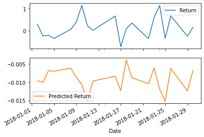
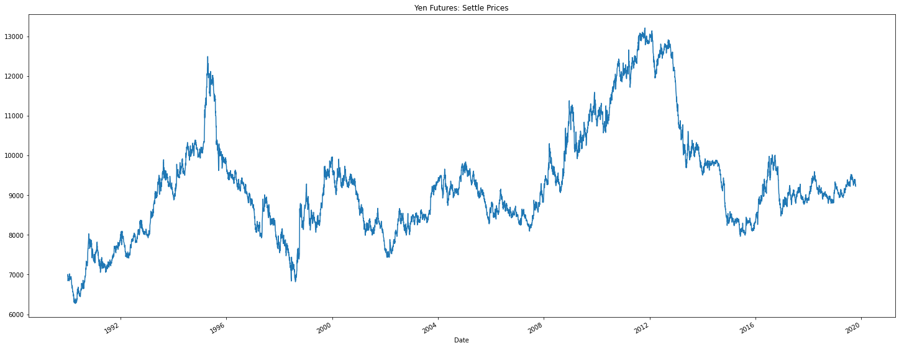
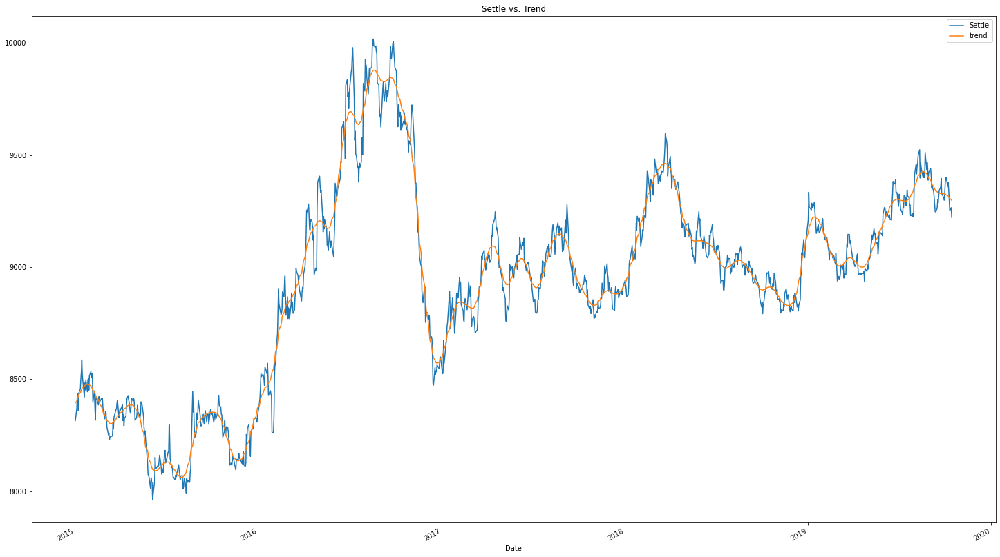
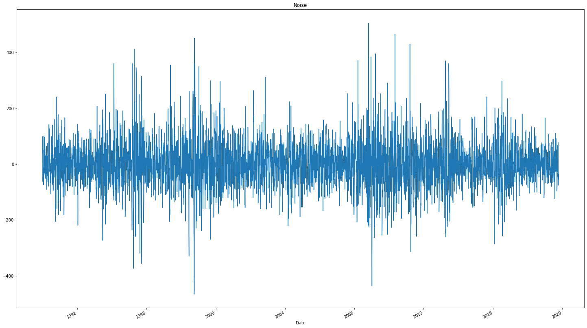
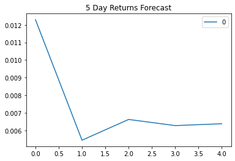
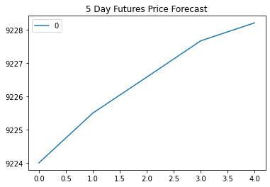
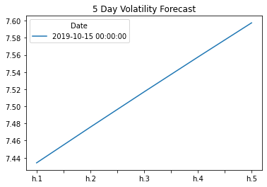

```python
import numpy as np
import pandas as pd
from pathlib import Path
%matplotlib inline
```

# Regression Analysis: Seasonal Effects with Sklearn Linear Regression
In this notebook, you will build a SKLearn linear regression model to predict Yen futures ("settle") returns with *lagged* Yen futures returns. 


```python
# Futures contract on the Yen-dollar exchange rate:
# This is the continuous chain of the futures contracts that are 1 month to expiration
yen_futures = pd.read_csv(
    Path("yen.csv"), index_col="Date", infer_datetime_format=True, parse_dates=True
)
yen_futures.head()
```


<div>
<style scoped>
    .dataframe tbody tr th:only-of-type {
        vertical-align: middle;
    }

    .dataframe tbody tr th {
        vertical-align: top;
    }

    .dataframe thead th {
        text-align: right;
    }
</style>
<table border="1" class="dataframe">
  <thead>
    <tr style="text-align: right;">
      <th></th>
      <th>Open</th>
      <th>High</th>
      <th>Low</th>
      <th>Last</th>
      <th>Change</th>
      <th>Settle</th>
      <th>Volume</th>
      <th>Previous Day Open Interest</th>
    </tr>
    <tr>
      <th>Date</th>
      <th></th>
      <th></th>
      <th></th>
      <th></th>
      <th></th>
      <th></th>
      <th></th>
      <th></th>
    </tr>
  </thead>
  <tbody>
    <tr>
      <th>1976-08-02</th>
      <td>3398.0</td>
      <td>3401.0</td>
      <td>3398.0</td>
      <td>3401.0</td>
      <td>NaN</td>
      <td>3401.0</td>
      <td>2.0</td>
      <td>1.0</td>
    </tr>
    <tr>
      <th>1976-08-03</th>
      <td>3401.0</td>
      <td>3401.0</td>
      <td>3401.0</td>
      <td>3401.0</td>
      <td>NaN</td>
      <td>3401.0</td>
      <td>0.0</td>
      <td>1.0</td>
    </tr>
    <tr>
      <th>1976-08-04</th>
      <td>3401.0</td>
      <td>3401.0</td>
      <td>3401.0</td>
      <td>3401.0</td>
      <td>NaN</td>
      <td>3401.0</td>
      <td>0.0</td>
      <td>1.0</td>
    </tr>
    <tr>
      <th>1976-08-05</th>
      <td>3401.0</td>
      <td>3401.0</td>
      <td>3401.0</td>
      <td>3401.0</td>
      <td>NaN</td>
      <td>3401.0</td>
      <td>0.0</td>
      <td>1.0</td>
    </tr>
    <tr>
      <th>1976-08-06</th>
      <td>3401.0</td>
      <td>3401.0</td>
      <td>3401.0</td>
      <td>3401.0</td>
      <td>NaN</td>
      <td>3401.0</td>
      <td>0.0</td>
      <td>1.0</td>
    </tr>
  </tbody>
</table>
</div>


```python
# Trim the dataset to begin on January 1st, 1990
yen_futures = yen_futures.loc["1990-01-01":, :]
yen_futures.head()
```


<div>
<style scoped>
    .dataframe tbody tr th:only-of-type {
        vertical-align: middle;
    }

    .dataframe tbody tr th {
        vertical-align: top;
    }

    .dataframe thead th {
        text-align: right;
    }
</style>
<table border="1" class="dataframe">
  <thead>
    <tr style="text-align: right;">
      <th></th>
      <th>Open</th>
      <th>High</th>
      <th>Low</th>
      <th>Last</th>
      <th>Change</th>
      <th>Settle</th>
      <th>Volume</th>
      <th>Previous Day Open Interest</th>
    </tr>
    <tr>
      <th>Date</th>
      <th></th>
      <th></th>
      <th></th>
      <th></th>
      <th></th>
      <th></th>
      <th></th>
      <th></th>
    </tr>
  </thead>
  <tbody>
    <tr>
      <th>1990-01-02</th>
      <td>6954.0</td>
      <td>6954.0</td>
      <td>6835.0</td>
      <td>6847.0</td>
      <td>NaN</td>
      <td>6847.0</td>
      <td>48336.0</td>
      <td>51473.0</td>
    </tr>
    <tr>
      <th>1990-01-03</th>
      <td>6877.0</td>
      <td>6910.0</td>
      <td>6865.0</td>
      <td>6887.0</td>
      <td>NaN</td>
      <td>6887.0</td>
      <td>38206.0</td>
      <td>53860.0</td>
    </tr>
    <tr>
      <th>1990-01-04</th>
      <td>6937.0</td>
      <td>7030.0</td>
      <td>6924.0</td>
      <td>7008.0</td>
      <td>NaN</td>
      <td>7008.0</td>
      <td>49649.0</td>
      <td>55699.0</td>
    </tr>
    <tr>
      <th>1990-01-05</th>
      <td>6952.0</td>
      <td>6985.0</td>
      <td>6942.0</td>
      <td>6950.0</td>
      <td>NaN</td>
      <td>6950.0</td>
      <td>29944.0</td>
      <td>53111.0</td>
    </tr>
    <tr>
      <th>1990-01-08</th>
      <td>6936.0</td>
      <td>6972.0</td>
      <td>6936.0</td>
      <td>6959.0</td>
      <td>NaN</td>
      <td>6959.0</td>
      <td>19763.0</td>
      <td>52072.0</td>
    </tr>
  </tbody>
</table>
</div>


# Data Preparation

### Returns


```python
# Create a series using "Settle" price percentage returns, drop any nan"s, and check the results:
# (Make sure to multiply the pct_change() results by 100)
# In this case, you may have to replace inf, -inf values with np.nan"s
yen_futures['Return'] = (yen_futures[["Settle"]].pct_change() * 100)
returns = yen_futures.replace(-np.inf, np.nan).dropna()
returns.head(10)
```


<div>
<style scoped>
    .dataframe tbody tr th:only-of-type {
        vertical-align: middle;
    }

    .dataframe tbody tr th {
        vertical-align: top;
    }

    .dataframe thead th {
        text-align: right;
    }
</style>
<table border="1" class="dataframe">
  <thead>
    <tr style="text-align: right;">
      <th></th>
      <th>Open</th>
      <th>High</th>
      <th>Low</th>
      <th>Last</th>
      <th>Change</th>
      <th>Settle</th>
      <th>Volume</th>
      <th>Previous Day Open Interest</th>
      <th>Return</th>
    </tr>
    <tr>
      <th>Date</th>
      <th></th>
      <th></th>
      <th></th>
      <th></th>
      <th></th>
      <th></th>
      <th></th>
      <th></th>
      <th></th>
    </tr>
  </thead>
  <tbody>
    <tr>
      <th>2014-02-18</th>
      <td>9831.0</td>
      <td>9865.0</td>
      <td>9734.0</td>
      <td>9775.0</td>
      <td>42.0</td>
      <td>9775.0</td>
      <td>203495.0</td>
      <td>196924.0</td>
      <td>-0.427829</td>
    </tr>
    <tr>
      <th>2014-02-19</th>
      <td>9768.0</td>
      <td>9825.0</td>
      <td>9760.0</td>
      <td>9773.0</td>
      <td>2.0</td>
      <td>9773.0</td>
      <td>129508.0</td>
      <td>197197.0</td>
      <td>-0.020460</td>
    </tr>
    <tr>
      <th>2014-02-20</th>
      <td>9774.0</td>
      <td>9837.0</td>
      <td>9765.0</td>
      <td>9775.0</td>
      <td>2.0</td>
      <td>9775.0</td>
      <td>160202.0</td>
      <td>198280.0</td>
      <td>0.020465</td>
    </tr>
    <tr>
      <th>2014-02-21</th>
      <td>9772.0</td>
      <td>9776.0</td>
      <td>9725.0</td>
      <td>9758.0</td>
      <td>20.0</td>
      <td>9755.0</td>
      <td>103091.0</td>
      <td>202990.0</td>
      <td>-0.204604</td>
    </tr>
    <tr>
      <th>2014-02-24</th>
      <td>9752.0</td>
      <td>9789.0</td>
      <td>9740.0</td>
      <td>9757.0</td>
      <td>2.0</td>
      <td>9757.0</td>
      <td>90654.0</td>
      <td>203114.0</td>
      <td>0.020502</td>
    </tr>
    <tr>
      <th>2014-02-25</th>
      <td>9760.0</td>
      <td>9808.0</td>
      <td>9744.0</td>
      <td>9789.0</td>
      <td>32.0</td>
      <td>9789.0</td>
      <td>105498.0</td>
      <td>201486.0</td>
      <td>0.327970</td>
    </tr>
    <tr>
      <th>2014-02-26</th>
      <td>9784.0</td>
      <td>9795.0</td>
      <td>9746.0</td>
      <td>9760.0</td>
      <td>29.0</td>
      <td>9760.0</td>
      <td>118559.0</td>
      <td>200105.0</td>
      <td>-0.296251</td>
    </tr>
    <tr>
      <th>2014-02-27</th>
      <td>9769.0</td>
      <td>9831.0</td>
      <td>9762.0</td>
      <td>9798.0</td>
      <td>38.0</td>
      <td>9798.0</td>
      <td>160638.0</td>
      <td>201246.0</td>
      <td>0.389344</td>
    </tr>
    <tr>
      <th>2014-02-28</th>
      <td>9787.0</td>
      <td>9848.0</td>
      <td>9776.0</td>
      <td>9825.0</td>
      <td>27.0</td>
      <td>9825.0</td>
      <td>169374.0</td>
      <td>200184.0</td>
      <td>0.275566</td>
    </tr>
    <tr>
      <th>2014-03-03</th>
      <td>9840.0</td>
      <td>9882.0</td>
      <td>9840.0</td>
      <td>9857.0</td>
      <td>34.0</td>
      <td>9859.0</td>
      <td>149003.0</td>
      <td>197621.0</td>
      <td>0.346056</td>
    </tr>
  </tbody>
</table>
</div>


### Lagged Returns 


```python
# Create a lagged return using the shift function
yen_futures['Lagged_Return'] = yen_futures["Return"].shift()
yen_futures = yen_futures.dropna()
yen_futures.head(10)
```


<div>
<style scoped>
    .dataframe tbody tr th:only-of-type {
        vertical-align: middle;
    }

    .dataframe tbody tr th {
        vertical-align: top;
    }

    .dataframe thead th {
        text-align: right;
    }
</style>
<table border="1" class="dataframe">
  <thead>
    <tr style="text-align: right;">
      <th></th>
      <th>Open</th>
      <th>High</th>
      <th>Low</th>
      <th>Last</th>
      <th>Change</th>
      <th>Settle</th>
      <th>Volume</th>
      <th>Previous Day Open Interest</th>
      <th>Return</th>
      <th>Lagged_Return</th>
    </tr>
    <tr>
      <th>Date</th>
      <th></th>
      <th></th>
      <th></th>
      <th></th>
      <th></th>
      <th></th>
      <th></th>
      <th></th>
      <th></th>
      <th></th>
    </tr>
  </thead>
  <tbody>
    <tr>
      <th>2014-02-18</th>
      <td>9831.0</td>
      <td>9865.0</td>
      <td>9734.0</td>
      <td>9775.0</td>
      <td>42.0</td>
      <td>9775.0</td>
      <td>203495.0</td>
      <td>196924.0</td>
      <td>-0.427829</td>
      <td>0.409123</td>
    </tr>
    <tr>
      <th>2014-02-19</th>
      <td>9768.0</td>
      <td>9825.0</td>
      <td>9760.0</td>
      <td>9773.0</td>
      <td>2.0</td>
      <td>9773.0</td>
      <td>129508.0</td>
      <td>197197.0</td>
      <td>-0.020460</td>
      <td>-0.427829</td>
    </tr>
    <tr>
      <th>2014-02-20</th>
      <td>9774.0</td>
      <td>9837.0</td>
      <td>9765.0</td>
      <td>9775.0</td>
      <td>2.0</td>
      <td>9775.0</td>
      <td>160202.0</td>
      <td>198280.0</td>
      <td>0.020465</td>
      <td>-0.020460</td>
    </tr>
    <tr>
      <th>2014-02-21</th>
      <td>9772.0</td>
      <td>9776.0</td>
      <td>9725.0</td>
      <td>9758.0</td>
      <td>20.0</td>
      <td>9755.0</td>
      <td>103091.0</td>
      <td>202990.0</td>
      <td>-0.204604</td>
      <td>0.020465</td>
    </tr>
    <tr>
      <th>2014-02-24</th>
      <td>9752.0</td>
      <td>9789.0</td>
      <td>9740.0</td>
      <td>9757.0</td>
      <td>2.0</td>
      <td>9757.0</td>
      <td>90654.0</td>
      <td>203114.0</td>
      <td>0.020502</td>
      <td>-0.204604</td>
    </tr>
    <tr>
      <th>2014-02-25</th>
      <td>9760.0</td>
      <td>9808.0</td>
      <td>9744.0</td>
      <td>9789.0</td>
      <td>32.0</td>
      <td>9789.0</td>
      <td>105498.0</td>
      <td>201486.0</td>
      <td>0.327970</td>
      <td>0.020502</td>
    </tr>
    <tr>
      <th>2014-02-26</th>
      <td>9784.0</td>
      <td>9795.0</td>
      <td>9746.0</td>
      <td>9760.0</td>
      <td>29.0</td>
      <td>9760.0</td>
      <td>118559.0</td>
      <td>200105.0</td>
      <td>-0.296251</td>
      <td>0.327970</td>
    </tr>
    <tr>
      <th>2014-02-27</th>
      <td>9769.0</td>
      <td>9831.0</td>
      <td>9762.0</td>
      <td>9798.0</td>
      <td>38.0</td>
      <td>9798.0</td>
      <td>160638.0</td>
      <td>201246.0</td>
      <td>0.389344</td>
      <td>-0.296251</td>
    </tr>
    <tr>
      <th>2014-02-28</th>
      <td>9787.0</td>
      <td>9848.0</td>
      <td>9776.0</td>
      <td>9825.0</td>
      <td>27.0</td>
      <td>9825.0</td>
      <td>169374.0</td>
      <td>200184.0</td>
      <td>0.275566</td>
      <td>0.389344</td>
    </tr>
    <tr>
      <th>2014-03-03</th>
      <td>9840.0</td>
      <td>9882.0</td>
      <td>9840.0</td>
      <td>9857.0</td>
      <td>34.0</td>
      <td>9859.0</td>
      <td>149003.0</td>
      <td>197621.0</td>
      <td>0.346056</td>
      <td>0.275566</td>
    </tr>
  </tbody>
</table>
</div>


### Train Test Split


```python
# Create a train/test split for the data using 2018-2019 for testing and the rest for training
train = yen_futures[:'2017']
test = yen_futures['2018':]
```


```python
# Create four dataframes:
# X_train (training set using just the independent variables), X_test (test set of of just the independent variables)
# Y_train (training set using just the "y" variable, i.e., "Futures Return"), Y_test (test set of just the "y" variable):
X_train = train["Lagged_Return"].to_frame()
y_train = train["Return"]
X_test = test["Lagged_Return"].to_frame()
y_test = test["Return"]
```


```python
X_train
```


<div>
<style scoped>
    .dataframe tbody tr th:only-of-type {
        vertical-align: middle;
    }

    .dataframe tbody tr th {
        vertical-align: top;
    }

    .dataframe thead th {
        text-align: right;
    }
</style>
<table border="1" class="dataframe">
  <thead>
    <tr style="text-align: right;">
      <th></th>
      <th>Lagged_Return</th>
    </tr>
    <tr>
      <th>Date</th>
      <th></th>
    </tr>
  </thead>
  <tbody>
    <tr>
      <th>2014-02-18</th>
      <td>0.409123</td>
    </tr>
    <tr>
      <th>2014-02-19</th>
      <td>-0.427829</td>
    </tr>
    <tr>
      <th>2014-02-20</th>
      <td>-0.020460</td>
    </tr>
    <tr>
      <th>2014-02-21</th>
      <td>0.020465</td>
    </tr>
    <tr>
      <th>2014-02-24</th>
      <td>-0.204604</td>
    </tr>
    <tr>
      <th>...</th>
      <td>...</td>
    </tr>
    <tr>
      <th>2017-12-22</th>
      <td>0.084621</td>
    </tr>
    <tr>
      <th>2017-12-26</th>
      <td>0.118370</td>
    </tr>
    <tr>
      <th>2017-12-27</th>
      <td>0.118230</td>
    </tr>
    <tr>
      <th>2017-12-28</th>
      <td>-0.151830</td>
    </tr>
    <tr>
      <th>2017-12-29</th>
      <td>0.180221</td>
    </tr>
  </tbody>
</table>
<p>967 rows × 1 columns</p>
</div>


# Linear Regression Model


```python
# Create a Linear Regression model and fit it to the training data
from sklearn.linear_model import LinearRegression

# Fit a SKLearn linear regression using just the training set (X_train, Y_train):
model = LinearRegression()
model.fit(X_train, y_train)
```


    LinearRegression()


# Make predictions using the Testing Data

Note: We want to evaluate the model using data that it has never seen before, in this case: X_test.


```python
# Make a prediction of "y" values using just the test dataset
predictions = model.predict(X_test)
```


```python
# Assemble actual y data (Y_test) with predicted y data (from just above) into two columns in a dataframe:
Results = y_test.to_frame()
Results["Predicted Return"] = predictions
Results.head(2)
```


<div>
<style scoped>
    .dataframe tbody tr th:only-of-type {
        vertical-align: middle;
    }

    .dataframe tbody tr th {
        vertical-align: top;
    }

    .dataframe thead th {
        text-align: right;
    }
</style>
<table border="1" class="dataframe">
  <thead>
    <tr style="text-align: right;">
      <th></th>
      <th>Return</th>
      <th>Predicted Return</th>
    </tr>
    <tr>
      <th>Date</th>
      <th></th>
      <th></th>
    </tr>
  </thead>
  <tbody>
    <tr>
      <th>2018-01-02</th>
      <td>0.297285</td>
      <td>-0.009599</td>
    </tr>
    <tr>
      <th>2018-01-03</th>
      <td>-0.240479</td>
      <td>-0.010033</td>
    </tr>
  </tbody>
</table>
</div>


```python
# Plot the first 20 predictions vs the true values
Results[:20].plot(subplots=True)
```


    array([<AxesSubplot:xlabel='Date'>, <AxesSubplot:xlabel='Date'>],
          dtype=object)


    

    


# Out-of-Sample Performance

Evaluate the model using "out-of-sample" data (X_test and y_test)


```python
from sklearn.metrics import mean_squared_error
# Calculate the mean_squared_error (MSE) on actual versus predicted test "y" 
mse = mean_squared_error(
    Results["Return"],
    Results["Predicted Return"]
)

# Using that mean-squared-error, calculate the root-mean-squared error (RMSE):
rmse = np.sqrt(mse)
print(f"Out-of-Sample Root Mean Squared Error (RMSE): {rmse}")
```

    Out-of-Sample Root Mean Squared Error (RMSE): 0.41545437184712763
    

# In-Sample Performance

Evaluate the model using in-sample data (X_train and y_train)


```python
# Construct a dataframe using just the "y" training data:
in_sample_results = y_train.to_frame()

# Add a column of "in-sample" predictions to that dataframe:  
in_sample_results["In-sample Predictions"] = model.predict(X_train)

# Calculate in-sample mean_squared_error (for comparison to out-of-sample)
in_sample_mse = mean_squared_error(
    in_sample_results["Return"],
    in_sample_results["In-sample Predictions"]
)

# Calculate in-sample root mean_squared_error (for comparison to out-of-sample)
in_sample_rmse = np.sqrt(in_sample_mse)
print(f"In-sample Root Mean Squared Error (RMSE): {in_sample_rmse}")
```

    In-sample Root Mean Squared Error (RMSE): 0.5962037920929946
    

# Conclusions

YOUR CONCLUSIONS HERE!


```python
print("The out-of-sample RMSE is lower than the in-sample RMSE. Usually, RMSE lower for training data, but it seems to be higher in this case.")


```

    The out-of-sample RMSE is lower than the in-sample RMSE. Usually, RMSE lower for training data, but it seems to be higher in this case.
    


```python
import numpy as np
import pandas as pd
from pathlib import Path
%matplotlib inline
```

# Return Forecasting: Read Historical Daily Yen Futures Data
In this notebook, you will load historical Dollar-Yen exchange rate futures data and apply time series analysis and modeling to determine whether there is any predictable behavior.


```python
# Futures contract on the Yen-dollar exchange rate:
# This is the continuous chain of the futures contracts that are 1 month to expiration
yen_futures = pd.read_csv(
    Path("yen.csv"), index_col="Date", infer_datetime_format=True, parse_dates=True
)
yen_futures.head()
```


<div>
<style scoped>
    .dataframe tbody tr th:only-of-type {
        vertical-align: middle;
    }

    .dataframe tbody tr th {
        vertical-align: top;
    }

    .dataframe thead th {
        text-align: right;
    }
</style>
<table border="1" class="dataframe">
  <thead>
    <tr style="text-align: right;">
      <th></th>
      <th>Open</th>
      <th>High</th>
      <th>Low</th>
      <th>Last</th>
      <th>Change</th>
      <th>Settle</th>
      <th>Volume</th>
      <th>Previous Day Open Interest</th>
    </tr>
    <tr>
      <th>Date</th>
      <th></th>
      <th></th>
      <th></th>
      <th></th>
      <th></th>
      <th></th>
      <th></th>
      <th></th>
    </tr>
  </thead>
  <tbody>
    <tr>
      <th>1976-08-02</th>
      <td>3398.0</td>
      <td>3401.0</td>
      <td>3398.0</td>
      <td>3401.0</td>
      <td>NaN</td>
      <td>3401.0</td>
      <td>2.0</td>
      <td>1.0</td>
    </tr>
    <tr>
      <th>1976-08-03</th>
      <td>3401.0</td>
      <td>3401.0</td>
      <td>3401.0</td>
      <td>3401.0</td>
      <td>NaN</td>
      <td>3401.0</td>
      <td>0.0</td>
      <td>1.0</td>
    </tr>
    <tr>
      <th>1976-08-04</th>
      <td>3401.0</td>
      <td>3401.0</td>
      <td>3401.0</td>
      <td>3401.0</td>
      <td>NaN</td>
      <td>3401.0</td>
      <td>0.0</td>
      <td>1.0</td>
    </tr>
    <tr>
      <th>1976-08-05</th>
      <td>3401.0</td>
      <td>3401.0</td>
      <td>3401.0</td>
      <td>3401.0</td>
      <td>NaN</td>
      <td>3401.0</td>
      <td>0.0</td>
      <td>1.0</td>
    </tr>
    <tr>
      <th>1976-08-06</th>
      <td>3401.0</td>
      <td>3401.0</td>
      <td>3401.0</td>
      <td>3401.0</td>
      <td>NaN</td>
      <td>3401.0</td>
      <td>0.0</td>
      <td>1.0</td>
    </tr>
  </tbody>
</table>
</div>


```python
# Trim the dataset to begin on January 1st, 1990
yen_futures = yen_futures.loc["1990-01-01":, :]
yen_futures.head()
```


<div>
<style scoped>
    .dataframe tbody tr th:only-of-type {
        vertical-align: middle;
    }

    .dataframe tbody tr th {
        vertical-align: top;
    }

    .dataframe thead th {
        text-align: right;
    }
</style>
<table border="1" class="dataframe">
  <thead>
    <tr style="text-align: right;">
      <th></th>
      <th>Open</th>
      <th>High</th>
      <th>Low</th>
      <th>Last</th>
      <th>Change</th>
      <th>Settle</th>
      <th>Volume</th>
      <th>Previous Day Open Interest</th>
    </tr>
    <tr>
      <th>Date</th>
      <th></th>
      <th></th>
      <th></th>
      <th></th>
      <th></th>
      <th></th>
      <th></th>
      <th></th>
    </tr>
  </thead>
  <tbody>
    <tr>
      <th>1990-01-02</th>
      <td>6954.0</td>
      <td>6954.0</td>
      <td>6835.0</td>
      <td>6847.0</td>
      <td>NaN</td>
      <td>6847.0</td>
      <td>48336.0</td>
      <td>51473.0</td>
    </tr>
    <tr>
      <th>1990-01-03</th>
      <td>6877.0</td>
      <td>6910.0</td>
      <td>6865.0</td>
      <td>6887.0</td>
      <td>NaN</td>
      <td>6887.0</td>
      <td>38206.0</td>
      <td>53860.0</td>
    </tr>
    <tr>
      <th>1990-01-04</th>
      <td>6937.0</td>
      <td>7030.0</td>
      <td>6924.0</td>
      <td>7008.0</td>
      <td>NaN</td>
      <td>7008.0</td>
      <td>49649.0</td>
      <td>55699.0</td>
    </tr>
    <tr>
      <th>1990-01-05</th>
      <td>6952.0</td>
      <td>6985.0</td>
      <td>6942.0</td>
      <td>6950.0</td>
      <td>NaN</td>
      <td>6950.0</td>
      <td>29944.0</td>
      <td>53111.0</td>
    </tr>
    <tr>
      <th>1990-01-08</th>
      <td>6936.0</td>
      <td>6972.0</td>
      <td>6936.0</td>
      <td>6959.0</td>
      <td>NaN</td>
      <td>6959.0</td>
      <td>19763.0</td>
      <td>52072.0</td>
    </tr>
  </tbody>
</table>
</div>


 # Return Forecasting: Initial Time-Series Plotting

 Start by plotting the "Settle" price. Do you see any patterns, long-term and/or short?


```python
# Plot just the "Settle" column from the dataframe:
yen_futures['Settle'].plot(title='Yen Futures: Settle Prices',figsize=(25,10));
```


    

    


graphic interpretation: since 1990 the value of Japanese Yen increased against the Dollar. There are some ups and downs on a monthly basis.

# Decomposition Using a Hodrick-Prescott Filter

 Using a Hodrick-Prescott Filter, decompose the Settle price into a trend and noise.


```python
import statsmodels.api as sm

# Apply the Hodrick-Prescott Filter by decomposing the "Settle" price into two separate series:
yen_noise, yen_trend = sm.tsa.filters.hpfilter(yen_futures['Settle'])
```


```python
# Create a dataframe of just the settle price, and add columns for "noise" and "trend" series from above:
yen_hp_data = yen_futures['Settle'].to_frame()
yen_hp_data['noise'] = yen_noise
yen_hp_data['trend'] = yen_trend
yen_hp_data.head()
```


<div>
<style scoped>
    .dataframe tbody tr th:only-of-type {
        vertical-align: middle;
    }

    .dataframe tbody tr th {
        vertical-align: top;
    }

    .dataframe thead th {
        text-align: right;
    }
</style>
<table border="1" class="dataframe">
  <thead>
    <tr style="text-align: right;">
      <th></th>
      <th>Settle</th>
      <th>noise</th>
      <th>trend</th>
    </tr>
    <tr>
      <th>Date</th>
      <th></th>
      <th></th>
      <th></th>
    </tr>
  </thead>
  <tbody>
    <tr>
      <th>1990-01-02</th>
      <td>6847.0</td>
      <td>-61.503967</td>
      <td>6908.503967</td>
    </tr>
    <tr>
      <th>1990-01-03</th>
      <td>6887.0</td>
      <td>-21.799756</td>
      <td>6908.799756</td>
    </tr>
    <tr>
      <th>1990-01-04</th>
      <td>7008.0</td>
      <td>98.942896</td>
      <td>6909.057104</td>
    </tr>
    <tr>
      <th>1990-01-05</th>
      <td>6950.0</td>
      <td>40.776052</td>
      <td>6909.223948</td>
    </tr>
    <tr>
      <th>1990-01-08</th>
      <td>6959.0</td>
      <td>49.689938</td>
      <td>6909.310062</td>
    </tr>
  </tbody>
</table>
</div>


```python
# Plot the Settle Price vs. the Trend for 2015 to the present
yen_hp_2015_data = yen_hp_data.loc["2015-01-01":, :]
yen_hp_2015_data.plot(y=['Settle','trend'],figsize=(25,15),title='Settle vs. Trend');
```


    

    


```python
# Plot the Settle Noise
yen_hp_data['noise'].plot(figsize=(25,15),title='Noise');
```


    

    


---

# Forecasting Returns using an ARMA Model

Using futures Settle *Returns*, estimate an ARMA model

1. ARMA: Create an ARMA model and fit it to the returns data. Note: Set the AR and MA ("p" and "q") parameters to p=2 and q=1: order=(2, 1).
2. Output the ARMA summary table and take note of the p-values of the lags. Based on the p-values, is the model a good fit (p < 0.05)?
3. Plot the 5-day forecast of the forecasted returns (the results forecast from ARMA model)


```python
# Create a series using "Settle" price percentage returns, drop any nan"s, and check the results:
# (Make sure to multiply the pct_change() results by 100)
# In this case, you may have to replace inf, -inf values with np.nan"s
returns = (yen_futures[["Settle"]].pct_change() * 100)
returns = returns.replace(-np.inf, np.nan).dropna()
returns.tail()
```


<div>
<style scoped>
    .dataframe tbody tr th:only-of-type {
        vertical-align: middle;
    }

    .dataframe tbody tr th {
        vertical-align: top;
    }

    .dataframe thead th {
        text-align: right;
    }
</style>
<table border="1" class="dataframe">
  <thead>
    <tr style="text-align: right;">
      <th></th>
      <th>Settle</th>
    </tr>
    <tr>
      <th>Date</th>
      <th></th>
    </tr>
  </thead>
  <tbody>
    <tr>
      <th>2019-10-09</th>
      <td>-0.410601</td>
    </tr>
    <tr>
      <th>2019-10-10</th>
      <td>-0.369458</td>
    </tr>
    <tr>
      <th>2019-10-11</th>
      <td>-0.564304</td>
    </tr>
    <tr>
      <th>2019-10-14</th>
      <td>0.151335</td>
    </tr>
    <tr>
      <th>2019-10-15</th>
      <td>-0.469509</td>
    </tr>
  </tbody>
</table>
</div>


```python
from statsmodels.tsa.arima_model import ARMA

# Estimate and ARMA model using statsmodels (use order=(2, 1))
model = ARMA(returns.values, order=(2,1))

# Fit the model and assign it to a variable called results
results = model.fit()
```

    C:\Users\offic\AppData\Roaming\Python\Python39\site-packages\statsmodels\tsa\arima_model.py:472: FutureWarning: 
    statsmodels.tsa.arima_model.ARMA and statsmodels.tsa.arima_model.ARIMA have
    been deprecated in favor of statsmodels.tsa.arima.model.ARIMA (note the .
    between arima and model) and
    statsmodels.tsa.SARIMAX. These will be removed after the 0.12 release.
    
    statsmodels.tsa.arima.model.ARIMA makes use of the statespace framework and
    is both well tested and maintained.
    
    To silence this warning and continue using ARMA and ARIMA until they are
    removed, use:
    
    import warnings
    warnings.filterwarnings('ignore', 'statsmodels.tsa.arima_model.ARMA',
                            FutureWarning)
    warnings.filterwarnings('ignore', 'statsmodels.tsa.arima_model.ARIMA',
                            FutureWarning)
    
      warnings.warn(ARIMA_DEPRECATION_WARN, FutureWarning)
    


```python
# Output model summary results:
results.summary()
```


<table class="simpletable">
<caption>ARMA Model Results</caption>
<tr>
  <th>Dep. Variable:</th>         <td>y</td>        <th>  No. Observations:  </th>   <td>7514</td>   
</tr>
<tr>
  <th>Model:</th>            <td>ARMA(2, 1)</td>    <th>  Log Likelihood     </th> <td>-7894.071</td>
</tr>
<tr>
  <th>Method:</th>             <td>css-mle</td>     <th>  S.D. of innovations</th>   <td>0.692</td>  
</tr>
<tr>
  <th>Date:</th>          <td>Thu, 27 May 2021</td> <th>  AIC                </th> <td>15798.142</td>
</tr>
<tr>
  <th>Time:</th>              <td>19:17:31</td>     <th>  BIC                </th> <td>15832.765</td>
</tr>
<tr>
  <th>Sample:</th>                <td>0</td>        <th>  HQIC               </th> <td>15810.030</td>
</tr>
<tr>
  <th></th>                       <td> </td>        <th>                     </th>     <td> </td>    
</tr>
</table>
<table class="simpletable">
<tr>
     <td></td>        <th>coef</th>     <th>std err</th>      <th>z</th>      <th>P>|z|</th>  <th>[0.025</th>    <th>0.975]</th>  
</tr>
<tr>
  <th>const</th>   <td>    0.0063</td> <td>    0.008</td> <td>    0.804</td> <td> 0.421</td> <td>   -0.009</td> <td>    0.022</td>
</tr>
<tr>
  <th>ar.L1.y</th> <td>   -0.3064</td> <td>    1.277</td> <td>   -0.240</td> <td> 0.810</td> <td>   -2.810</td> <td>    2.197</td>
</tr>
<tr>
  <th>ar.L2.y</th> <td>   -0.0019</td> <td>    0.019</td> <td>   -0.099</td> <td> 0.921</td> <td>   -0.040</td> <td>    0.036</td>
</tr>
<tr>
  <th>ma.L1.y</th> <td>    0.2948</td> <td>    1.277</td> <td>    0.231</td> <td> 0.817</td> <td>   -2.208</td> <td>    2.798</td>
</tr>
</table>
<table class="simpletable">
<caption>Roots</caption>
<tr>
    <td></td>   <th>            Real</th>  <th>         Imaginary</th> <th>         Modulus</th>  <th>        Frequency</th>
</tr>
<tr>
  <th>AR.1</th> <td>          -3.3328</td> <td>          +0.0000j</td> <td>           3.3328</td> <td>           0.5000</td>
</tr>
<tr>
  <th>AR.2</th> <td>        -157.1051</td> <td>          +0.0000j</td> <td>         157.1051</td> <td>           0.5000</td>
</tr>
<tr>
  <th>MA.1</th> <td>          -3.3916</td> <td>          +0.0000j</td> <td>           3.3916</td> <td>           0.5000</td>
</tr>
</table>


```python
# Plot the 5 Day Returns Forecast
pd.DataFrame(results.forecast(steps=5)[0]).plot(title="5 Day Returns Forecast");
```


    

    


---

# Forecasting the Settle Price using an ARIMA Model

 1. Using the *raw* Yen **Settle Price**, estimate an ARIMA model.
     1. Set P=5, D=1, and Q=1 in the model (e.g., ARIMA(df, order=(5,1,1))
     2. P= # of Auto-Regressive Lags, D= # of Differences (this is usually =1), Q= # of Moving Average Lags
 2. Output the ARIMA summary table and take note of the p-values of the lags. Based on the p-values, is the model a good fit (p < 0.05)?
 3. Construct a 5 day forecast for the Settle Price. What does the model forecast will happen to the Japanese Yen in the near term?


```python
from statsmodels.tsa.arima_model import ARIMA
# Estimate and ARIMA Model:
# Hint: ARIMA(df, order=(p, d, q))
model = ARIMA(yen_futures["Settle"].values, order=(5, 1, 1))

# Fit the model
results = model.fit()
```

    C:\Users\offic\AppData\Roaming\Python\Python39\site-packages\statsmodels\tsa\arima_model.py:472: FutureWarning: 
    statsmodels.tsa.arima_model.ARMA and statsmodels.tsa.arima_model.ARIMA have
    been deprecated in favor of statsmodels.tsa.arima.model.ARIMA (note the .
    between arima and model) and
    statsmodels.tsa.SARIMAX. These will be removed after the 0.12 release.
    
    statsmodels.tsa.arima.model.ARIMA makes use of the statespace framework and
    is both well tested and maintained.
    
    To silence this warning and continue using ARMA and ARIMA until they are
    removed, use:
    
    import warnings
    warnings.filterwarnings('ignore', 'statsmodels.tsa.arima_model.ARMA',
                            FutureWarning)
    warnings.filterwarnings('ignore', 'statsmodels.tsa.arima_model.ARIMA',
                            FutureWarning)
    
      warnings.warn(ARIMA_DEPRECATION_WARN, FutureWarning)
    C:\Users\offic\AppData\Roaming\Python\Python39\site-packages\statsmodels\tsa\arima_model.py:472: FutureWarning: 
    statsmodels.tsa.arima_model.ARMA and statsmodels.tsa.arima_model.ARIMA have
    been deprecated in favor of statsmodels.tsa.arima.model.ARIMA (note the .
    between arima and model) and
    statsmodels.tsa.SARIMAX. These will be removed after the 0.12 release.
    
    statsmodels.tsa.arima.model.ARIMA makes use of the statespace framework and
    is both well tested and maintained.
    
    To silence this warning and continue using ARMA and ARIMA until they are
    removed, use:
    
    import warnings
    warnings.filterwarnings('ignore', 'statsmodels.tsa.arima_model.ARMA',
                            FutureWarning)
    warnings.filterwarnings('ignore', 'statsmodels.tsa.arima_model.ARIMA',
                            FutureWarning)
    
      warnings.warn(ARIMA_DEPRECATION_WARN, FutureWarning)
    


```python
# Output model summary results:
results.summary()
```


<table class="simpletable">
<caption>ARIMA Model Results</caption>
<tr>
  <th>Dep. Variable:</th>        <td>D.y</td>       <th>  No. Observations:  </th>    <td>7514</td>   
</tr>
<tr>
  <th>Model:</th>          <td>ARIMA(5, 1, 1)</td>  <th>  Log Likelihood     </th> <td>-41944.619</td>
</tr>
<tr>
  <th>Method:</th>             <td>css-mle</td>     <th>  S.D. of innovations</th>   <td>64.281</td>  
</tr>
<tr>
  <th>Date:</th>          <td>Thu, 27 May 2021</td> <th>  AIC                </th>  <td>83905.238</td>
</tr>
<tr>
  <th>Time:</th>              <td>19:17:33</td>     <th>  BIC                </th>  <td>83960.635</td>
</tr>
<tr>
  <th>Sample:</th>                <td>1</td>        <th>  HQIC               </th>  <td>83924.259</td>
</tr>
<tr>
  <th></th>                       <td> </td>        <th>                     </th>      <td> </td>    
</tr>
</table>
<table class="simpletable">
<tr>
      <td></td>         <th>coef</th>     <th>std err</th>      <th>z</th>      <th>P>|z|</th>  <th>[0.025</th>    <th>0.975]</th>  
</tr>
<tr>
  <th>const</th>     <td>    0.3161</td> <td>    0.700</td> <td>    0.452</td> <td> 0.652</td> <td>   -1.056</td> <td>    1.688</td>
</tr>
<tr>
  <th>ar.L1.D.y</th> <td>    0.2820</td> <td>    0.699</td> <td>    0.403</td> <td> 0.687</td> <td>   -1.089</td> <td>    1.653</td>
</tr>
<tr>
  <th>ar.L2.D.y</th> <td>    0.0007</td> <td>    0.016</td> <td>    0.043</td> <td> 0.966</td> <td>   -0.030</td> <td>    0.032</td>
</tr>
<tr>
  <th>ar.L3.D.y</th> <td>   -0.0126</td> <td>    0.012</td> <td>   -1.032</td> <td> 0.302</td> <td>   -0.037</td> <td>    0.011</td>
</tr>
<tr>
  <th>ar.L4.D.y</th> <td>   -0.0137</td> <td>    0.015</td> <td>   -0.889</td> <td> 0.374</td> <td>   -0.044</td> <td>    0.016</td>
</tr>
<tr>
  <th>ar.L5.D.y</th> <td>   -0.0012</td> <td>    0.018</td> <td>   -0.064</td> <td> 0.949</td> <td>   -0.036</td> <td>    0.034</td>
</tr>
<tr>
  <th>ma.L1.D.y</th> <td>   -0.2970</td> <td>    0.699</td> <td>   -0.425</td> <td> 0.671</td> <td>   -1.667</td> <td>    1.073</td>
</tr>
</table>
<table class="simpletable">
<caption>Roots</caption>
<tr>
    <td></td>   <th>            Real</th>  <th>         Imaginary</th> <th>         Modulus</th>  <th>        Frequency</th>
</tr>
<tr>
  <th>AR.1</th> <td>           1.8915</td> <td>          -1.3787j</td> <td>           2.3406</td> <td>          -0.1002</td>
</tr>
<tr>
  <th>AR.2</th> <td>           1.8915</td> <td>          +1.3787j</td> <td>           2.3406</td> <td>           0.1002</td>
</tr>
<tr>
  <th>AR.3</th> <td>          -2.2688</td> <td>          -3.0214j</td> <td>           3.7784</td> <td>          -0.3525</td>
</tr>
<tr>
  <th>AR.4</th> <td>          -2.2688</td> <td>          +3.0214j</td> <td>           3.7784</td> <td>           0.3525</td>
</tr>
<tr>
  <th>AR.5</th> <td>         -11.0292</td> <td>          -0.0000j</td> <td>          11.0292</td> <td>          -0.5000</td>
</tr>
<tr>
  <th>MA.1</th> <td>           3.3667</td> <td>          +0.0000j</td> <td>           3.3667</td> <td>           0.0000</td>
</tr>
</table>


```python
# Plot the 5 Day Price Forecast
pd.DataFrame(results.forecast(steps=5)[0]).plot(title='5 Day Futures Price Forecast');
```


    

    


---

# Volatility Forecasting with GARCH

Rather than predicting returns, let's forecast near-term **volatility** of Japanese Yen futures returns. Being able to accurately predict volatility will be extremely useful if we want to trade in derivatives or quantify our maximum loss.
 
Using futures Settle *Returns*, estimate an GARCH model

1. GARCH: Create an GARCH model and fit it to the returns data. Note: Set the parameters to p=2 and q=1: order=(2, 1).
2. Output the GARCH summary table and take note of the p-values of the lags. Based on the p-values, is the model a good fit (p < 0.05)?
3. Plot the 5-day forecast of the volatility.


```python
from arch import arch_model
```


```python
# Estimate a GARCH model:
model = arch_model(returns, mean="Zero", vol="GARCH", p=1, q=1)

# Fit the model
results = model.fit(disp="off")
```


```python
# Summarize the model results
results.summary()
```


<table class="simpletable">
<caption>Zero Mean - GARCH Model Results</caption>
<tr>
  <th>Dep. Variable:</th>       <td>Settle</td>       <th>  R-squared:         </th>  <td>   0.000</td> 
</tr>
<tr>
  <th>Mean Model:</th>         <td>Zero Mean</td>     <th>  Adj. R-squared:    </th>  <td>   0.000</td> 
</tr>
<tr>
  <th>Vol Model:</th>            <td>GARCH</td>       <th>  Log-Likelihood:    </th> <td>  -7461.93</td>
</tr>
<tr>
  <th>Distribution:</th>        <td>Normal</td>       <th>  AIC:               </th> <td>   14929.9</td>
</tr>
<tr>
  <th>Method:</th>        <td>Maximum Likelihood</td> <th>  BIC:               </th> <td>   14950.6</td>
</tr>
<tr>
  <th></th>                        <td></td>          <th>  No. Observations:  </th>    <td>7514</td>   
</tr>
<tr>
  <th>Date:</th>           <td>Thu, May 27 2021</td>  <th>  Df Residuals:      </th>    <td>7514</td>   
</tr>
<tr>
  <th>Time:</th>               <td>19:17:33</td>      <th>  Df Model:          </th>      <td>0</td>    
</tr>
</table>
<table class="simpletable">
<caption>Volatility Model</caption>
<tr>
      <td></td>        <th>coef</th>     <th>std err</th>      <th>t</th>       <th>P>|t|</th>     <th>95.0% Conf. Int.</th>   
</tr>
<tr>
  <th>omega</th>    <td>4.2895e-03</td> <td>1.798e-03</td> <td>    2.385</td> <td>1.707e-02</td> <td>[7.646e-04,7.814e-03]</td>
</tr>
<tr>
  <th>alpha[1]</th> <td>    0.0381</td> <td>8.773e-03</td> <td>    4.341</td> <td>1.419e-05</td> <td>[2.089e-02,5.528e-02]</td>
</tr>
<tr>
  <th>beta[1]</th>  <td>    0.9536</td> <td>1.114e-02</td> <td>   85.623</td>   <td>0.000</td>     <td>[  0.932,  0.975]</td>  
</tr>
</table><br/><br/>Covariance estimator: robust


```python
# Find the last day of the dataset
last_day = returns.index.max().strftime('%Y-%m-%d')
last_day
```


    '2019-10-15'


```python
# Create a 5 day forecast of volatility
forecast_horizon = 5
# Start the forecast using the last_day calculated above
forecasts = results.forecast(start=last_day, horizon=forecast_horizon, reindex=True)
```


```python
# Annualize the forecast
intermediate = np.sqrt(forecasts.variance.dropna() * 252)
intermediate.head()
```


<div>
<style scoped>
    .dataframe tbody tr th:only-of-type {
        vertical-align: middle;
    }

    .dataframe tbody tr th {
        vertical-align: top;
    }

    .dataframe thead th {
        text-align: right;
    }
</style>
<table border="1" class="dataframe">
  <thead>
    <tr style="text-align: right;">
      <th></th>
      <th>h.1</th>
      <th>h.2</th>
      <th>h.3</th>
      <th>h.4</th>
      <th>h.5</th>
    </tr>
    <tr>
      <th>Date</th>
      <th></th>
      <th></th>
      <th></th>
      <th></th>
      <th></th>
    </tr>
  </thead>
  <tbody>
    <tr>
      <th>2019-10-15</th>
      <td>7.434026</td>
      <td>7.475721</td>
      <td>7.516842</td>
      <td>7.5574</td>
      <td>7.597407</td>
    </tr>
  </tbody>
</table>
</div>


```python
# Transpose the forecast so that it is easier to plot
final = intermediate.dropna().T
final.head()
```


<div>
<style scoped>
    .dataframe tbody tr th:only-of-type {
        vertical-align: middle;
    }

    .dataframe tbody tr th {
        vertical-align: top;
    }

    .dataframe thead th {
        text-align: right;
    }
</style>
<table border="1" class="dataframe">
  <thead>
    <tr style="text-align: right;">
      <th>Date</th>
      <th>2019-10-15</th>
    </tr>
  </thead>
  <tbody>
    <tr>
      <th>h.1</th>
      <td>7.434026</td>
    </tr>
    <tr>
      <th>h.2</th>
      <td>7.475721</td>
    </tr>
    <tr>
      <th>h.3</th>
      <td>7.516842</td>
    </tr>
    <tr>
      <th>h.4</th>
      <td>7.557400</td>
    </tr>
    <tr>
      <th>h.5</th>
      <td>7.597407</td>
    </tr>
  </tbody>
</table>
</div>


```python
# Plot the final forecast
final.plot(title='5 Day Volatility Forecast');
```


    

    


---

# Conclusions

Based on your time series analysis, would you buy the yen now?

Is the risk of the yen expected to increase or decrease?

Based on the model evaluation, would you feel confident in using these models for trading?

The projected returns on the yen seem to decrease => the value of the yen will decrease as well. Based off this projection, the risk will rise. Personally I believe it is not a good time to invest in yen.
