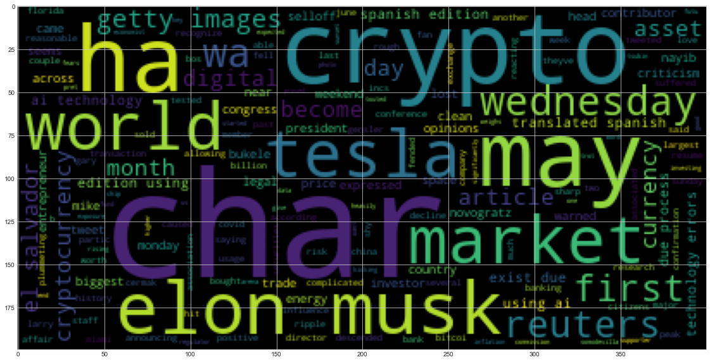
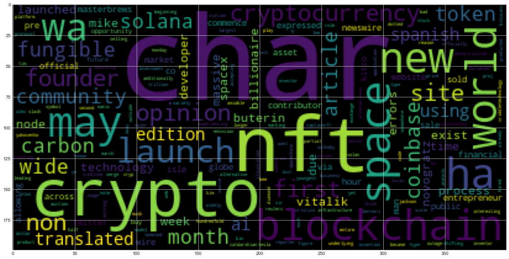

# Unit 12 - Tales from the Crypto

---


## 1. Sentiment Analysis

Use the [newsapi](https://newsapi.org/) to pull the latest news articles for Bitcoin and Ethereum and create a DataFrame of sentiment scores for each coin.

Use descriptive statistics to answer the following questions:
1. Which coin had the highest mean positive score?
2. Which coin had the highest negative score?
3. Which coin had the highest positive score?


```python
# Initial imports
import os
import pandas as pd
from newsapi import NewsApiClient
from dotenv import load_dotenv
import nltk as nltk
nltk.download(['vader_lexicon', 'stopwords', 'punkt', 'wordnet'])
from nltk.sentiment.vader import SentimentIntensityAnalyzer
analyzer = SentimentIntensityAnalyzer()

%matplotlib inline
```

    [nltk_data] Downloading package vader_lexicon to
    [nltk_data]     C:\Users\offic\AppData\Roaming\nltk_data...
    [nltk_data]   Package vader_lexicon is already up-to-date!
    [nltk_data] Downloading package stopwords to
    [nltk_data]     C:\Users\offic\AppData\Roaming\nltk_data...
    [nltk_data]   Package stopwords is already up-to-date!
    [nltk_data] Downloading package punkt to
    [nltk_data]     C:\Users\offic\AppData\Roaming\nltk_data...
    [nltk_data]   Package punkt is already up-to-date!
    [nltk_data] Downloading package wordnet to
    [nltk_data]     C:\Users\offic\AppData\Roaming\nltk_data...
    [nltk_data]   Package wordnet is already up-to-date!
    


```python
# Read your api key environment variable
load_dotenv('../../.env')
NEWS_API_KEY = os.getenv("NEWS_API_KEY")
```


```python
# Create a newsapi client
newsapi = NewsApiClient(api_key=NEWS_API_KEY)
```


```python
# Fetch the Bitcoin news articles
bitcoin_headlines = newsapi.get_everything(
    q="bitcoin AND BTC",
    language="en",
#    page_size=100
)
```


```python
# Fetch the Ethereum news articles
Ethereum_headlines = newsapi.get_everything(
    q="ethereum AND ETH",
    language="en",
#    page_size=100
)
```


```python
# Create the Bitcoin sentiment scores DataFrame
bitcoin_sentiments = []

for article in bitcoin_headlines["articles"]:
    try:
        sentiment = analyzer.polarity_scores(article['content'])

        bitcoin_sentiments.append({
            "Text": article["content"],
            "Compound": sentiment["compound"],
            "Positive": sentiment["pos"],
            "Negative": sentiment["neg"],
            "Neutral": sentiment["neu"]

        })

    except AttributeError:
        pass

# Create DataFrame
btc_df = pd.DataFrame(bitcoin_sentiments)

# Reorder DataFrame columns
cols =["Compound", "Negative", "Neutral", "Positive", "Text"]
btc_df = btc_df[cols]

btc_df.head()
```


<div>
<style scoped>
    .dataframe tbody tr th:only-of-type {
        vertical-align: middle;
    }

    .dataframe tbody tr th {
        vertical-align: top;
    }

    .dataframe thead th {
        text-align: right;
    }
</style>
<table border="1" class="dataframe">
  <thead>
    <tr style="text-align: right;">
      <th></th>
      <th>Compound</th>
      <th>Negative</th>
      <th>Neutral</th>
      <th>Positive</th>
      <th>Text</th>
    </tr>
  </thead>
  <tbody>
    <tr>
      <th>0</th>
      <td>0.6908</td>
      <td>0.0</td>
      <td>0.831</td>
      <td>0.169</td>
      <td>It's all about clean energy, it seems. \r\nElo...</td>
    </tr>
    <tr>
      <th>1</th>
      <td>0.5574</td>
      <td>0.0</td>
      <td>0.893</td>
      <td>0.107</td>
      <td>Several crypto fans that descended on Miami, F...</td>
    </tr>
    <tr>
      <th>2</th>
      <td>0.1280</td>
      <td>0.0</td>
      <td>0.957</td>
      <td>0.043</td>
      <td>El Salvador has become the first country in th...</td>
    </tr>
    <tr>
      <th>3</th>
      <td>0.7322</td>
      <td>0.0</td>
      <td>0.838</td>
      <td>0.162</td>
      <td>That love affair between Elon Musk and Bitcoin...</td>
    </tr>
    <tr>
      <th>4</th>
      <td>0.5859</td>
      <td>0.0</td>
      <td>0.866</td>
      <td>0.134</td>
      <td>By Reuters Staff\r\nJune 13 (Reuters) - Tesla ...</td>
    </tr>
  </tbody>
</table>
</div>


```python
# Create the Ethereum sentiment scores DataFrame
Ethereum_sentiments = []

for article in Ethereum_headlines["articles"]:
    try:
        sentiment = analyzer.polarity_scores(article['content'])

        Ethereum_sentiments.append({
            "Text": article["content"],
            "Compound": sentiment["compound"],
            "Positive": sentiment["pos"],
            "Negative": sentiment["neg"],
            "Neutral": sentiment["neu"]

        })

    except AttributeError:
        pass

# Create DataFrame
eth_df = pd.DataFrame(Ethereum_sentiments)

# Reorder DataFrame columns
cols =["Compound", "Negative", "Neutral", "Positive", "Text"]
eth_df = eth_df[cols]

eth_df.head()
```


<div>
<style scoped>
    .dataframe tbody tr th:only-of-type {
        vertical-align: middle;
    }

    .dataframe tbody tr th {
        vertical-align: top;
    }

    .dataframe thead th {
        text-align: right;
    }
</style>
<table border="1" class="dataframe">
  <thead>
    <tr style="text-align: right;">
      <th></th>
      <th>Compound</th>
      <th>Negative</th>
      <th>Neutral</th>
      <th>Positive</th>
      <th>Text</th>
    </tr>
  </thead>
  <tbody>
    <tr>
      <th>0</th>
      <td>0.0000</td>
      <td>0.000</td>
      <td>1.000</td>
      <td>0.000</td>
      <td>Illustration by Alex Castro / The Verge\r\n\n ...</td>
    </tr>
    <tr>
      <th>1</th>
      <td>0.5499</td>
      <td>0.000</td>
      <td>0.894</td>
      <td>0.106</td>
      <td>Solana isn’t known yet outside of the crypto c...</td>
    </tr>
    <tr>
      <th>2</th>
      <td>0.0000</td>
      <td>0.000</td>
      <td>1.000</td>
      <td>0.000</td>
      <td>By Cristina CriddleTechnology reporter\r\nimag...</td>
    </tr>
    <tr>
      <th>3</th>
      <td>-0.2732</td>
      <td>0.068</td>
      <td>0.932</td>
      <td>0.000</td>
      <td>Ethereum, the second largest cryptocurrency af...</td>
    </tr>
    <tr>
      <th>4</th>
      <td>-0.3400</td>
      <td>0.066</td>
      <td>0.934</td>
      <td>0.000</td>
      <td>This article was translated from our Spanish e...</td>
    </tr>
  </tbody>
</table>
</div>


```python
# Describe the Bitcoin Sentiment
btc_df.describe()
```


<div>
<style scoped>
    .dataframe tbody tr th:only-of-type {
        vertical-align: middle;
    }

    .dataframe tbody tr th {
        vertical-align: top;
    }

    .dataframe thead th {
        text-align: right;
    }
</style>
<table border="1" class="dataframe">
  <thead>
    <tr style="text-align: right;">
      <th></th>
      <th>Compound</th>
      <th>Negative</th>
      <th>Neutral</th>
      <th>Positive</th>
    </tr>
  </thead>
  <tbody>
    <tr>
      <th>count</th>
      <td>20.000000</td>
      <td>20.000000</td>
      <td>20.000000</td>
      <td>20.000000</td>
    </tr>
    <tr>
      <th>mean</th>
      <td>-0.045560</td>
      <td>0.062250</td>
      <td>0.885750</td>
      <td>0.052000</td>
    </tr>
    <tr>
      <th>std</th>
      <td>0.461336</td>
      <td>0.060652</td>
      <td>0.050046</td>
      <td>0.057695</td>
    </tr>
    <tr>
      <th>min</th>
      <td>-0.750600</td>
      <td>0.000000</td>
      <td>0.797000</td>
      <td>0.000000</td>
    </tr>
    <tr>
      <th>25%</th>
      <td>-0.361275</td>
      <td>0.000000</td>
      <td>0.857500</td>
      <td>0.000000</td>
    </tr>
    <tr>
      <th>50%</th>
      <td>0.000000</td>
      <td>0.063000</td>
      <td>0.883500</td>
      <td>0.044500</td>
    </tr>
    <tr>
      <th>75%</th>
      <td>0.207425</td>
      <td>0.083750</td>
      <td>0.928750</td>
      <td>0.083500</td>
    </tr>
    <tr>
      <th>max</th>
      <td>0.732200</td>
      <td>0.203000</td>
      <td>0.957000</td>
      <td>0.169000</td>
    </tr>
  </tbody>
</table>
</div>


```python
# Describe the Ethereum Sentiment
eth_df.describe()
```


<div>
<style scoped>
    .dataframe tbody tr th:only-of-type {
        vertical-align: middle;
    }

    .dataframe tbody tr th {
        vertical-align: top;
    }

    .dataframe thead th {
        text-align: right;
    }
</style>
<table border="1" class="dataframe">
  <thead>
    <tr style="text-align: right;">
      <th></th>
      <th>Compound</th>
      <th>Negative</th>
      <th>Neutral</th>
      <th>Positive</th>
    </tr>
  </thead>
  <tbody>
    <tr>
      <th>count</th>
      <td>20.000000</td>
      <td>20.000000</td>
      <td>20.000000</td>
      <td>20.000000</td>
    </tr>
    <tr>
      <th>mean</th>
      <td>0.083175</td>
      <td>0.027100</td>
      <td>0.925850</td>
      <td>0.047050</td>
    </tr>
    <tr>
      <th>std</th>
      <td>0.303126</td>
      <td>0.039806</td>
      <td>0.051741</td>
      <td>0.043576</td>
    </tr>
    <tr>
      <th>min</th>
      <td>-0.401900</td>
      <td>0.000000</td>
      <td>0.766000</td>
      <td>0.000000</td>
    </tr>
    <tr>
      <th>25%</th>
      <td>-0.195925</td>
      <td>0.000000</td>
      <td>0.917250</td>
      <td>0.000000</td>
    </tr>
    <tr>
      <th>50%</th>
      <td>0.089800</td>
      <td>0.000000</td>
      <td>0.929500</td>
      <td>0.055000</td>
    </tr>
    <tr>
      <th>75%</th>
      <td>0.342675</td>
      <td>0.066500</td>
      <td>0.940500</td>
      <td>0.078500</td>
    </tr>
    <tr>
      <th>max</th>
      <td>0.549900</td>
      <td>0.125000</td>
      <td>1.000000</td>
      <td>0.120000</td>
    </tr>
  </tbody>
</table>
</div>


### Questions:

Q: Which coin had the highest mean positive score?

A: *Bitcoin*

Q: Which coin had the highest compound score?

A: *Bitcoin*

Q. Which coin had the highest positive score?

A: *Bitcoin*

---

## 2. Natural Language Processing
---
###   Tokenizer

In this section, you will use NLTK and Python to tokenize the text for each coin. Be sure to:
1. Lowercase each word.
2. Remove Punctuation.
3. Remove Stopwords.


```python
from nltk.tokenize import word_tokenize, sent_tokenize
from nltk.corpus import stopwords
from nltk.stem import WordNetLemmatizer, PorterStemmer
from string import punctuation
import re
```


```python
# Instantiate the lemmatizer
lemmatizer = WordNetLemmatizer()

# Create a list of stopwords
sw = set(stopwords.words('english'))
sw_addons = {'https', 'http', 'btc', 'bitcoin', 'eth', 'ethereum'}
```


```python
# Complete the tokenizer function
def tokenizer(text):
    """Tokenizes text."""
    text_string = str(text)
    # Remove the punctuation from text
    regex = re.compile("[^a-zA-Z ]")
    letters_only = regex.sub(' ', text_string)

    # Create a tokenized list of the words
    words = word_tokenize(letters_only)

    # Lemmatize words into root words
    lm_words = [lemmatizer.lemmatize(word) for word in words]

    # Convert the words to lowercase
    lower_words = [word.lower() for word in lm_words]

    # Remove the stop words
    tokens = [word.lower() for word in lower_words if word.lower() not in sw.union(sw_addons)]

    return tokens
```


```python
# Create a new tokens column for Bitcoin
btc_tokens = []
[btc_tokens.append(tokenizer(text)) for text in btc_df.Text]
btc_df['Tokens'] = btc_tokens
btc_df.head()
```


<div>
<style scoped>
    .dataframe tbody tr th:only-of-type {
        vertical-align: middle;
    }

    .dataframe tbody tr th {
        vertical-align: top;
    }

    .dataframe thead th {
        text-align: right;
    }
</style>
<table border="1" class="dataframe">
  <thead>
    <tr style="text-align: right;">
      <th></th>
      <th>Compound</th>
      <th>Negative</th>
      <th>Neutral</th>
      <th>Positive</th>
      <th>Text</th>
      <th>Tokens</th>
    </tr>
  </thead>
  <tbody>
    <tr>
      <th>0</th>
      <td>0.6908</td>
      <td>0.0</td>
      <td>0.831</td>
      <td>0.169</td>
      <td>It's all about clean energy, it seems. \r\nElo...</td>
      <td>[clean, energy, seems, elon, musk, tesla, caus...</td>
    </tr>
    <tr>
      <th>1</th>
      <td>0.5574</td>
      <td>0.0</td>
      <td>0.893</td>
      <td>0.107</td>
      <td>Several crypto fans that descended on Miami, F...</td>
      <td>[several, crypto, fan, descended, miami, flori...</td>
    </tr>
    <tr>
      <th>2</th>
      <td>0.1280</td>
      <td>0.0</td>
      <td>0.957</td>
      <td>0.043</td>
      <td>El Salvador has become the first country in th...</td>
      <td>[el, salvador, ha, become, first, country, wor...</td>
    </tr>
    <tr>
      <th>3</th>
      <td>0.7322</td>
      <td>0.0</td>
      <td>0.838</td>
      <td>0.162</td>
      <td>That love affair between Elon Musk and Bitcoin...</td>
      <td>[love, affair, elon, musk, become, complicated...</td>
    </tr>
    <tr>
      <th>4</th>
      <td>0.5859</td>
      <td>0.0</td>
      <td>0.866</td>
      <td>0.134</td>
      <td>By Reuters Staff\r\nJune 13 (Reuters) - Tesla ...</td>
      <td>[reuters, staff, june, reuters, tesla, incs, e...</td>
    </tr>
  </tbody>
</table>
</div>


```python
# Create a new tokens column for Ethereum
eth_tokens = []
[eth_tokens.append(tokenizer(text)) for text in eth_df.Text]
eth_df['Tokens'] = eth_tokens
eth_df.head()
```


<div>
<style scoped>
    .dataframe tbody tr th:only-of-type {
        vertical-align: middle;
    }

    .dataframe tbody tr th {
        vertical-align: top;
    }

    .dataframe thead th {
        text-align: right;
    }
</style>
<table border="1" class="dataframe">
  <thead>
    <tr style="text-align: right;">
      <th></th>
      <th>Compound</th>
      <th>Negative</th>
      <th>Neutral</th>
      <th>Positive</th>
      <th>Text</th>
      <th>Tokens</th>
    </tr>
  </thead>
  <tbody>
    <tr>
      <th>0</th>
      <td>0.0000</td>
      <td>0.000</td>
      <td>1.000</td>
      <td>0.000</td>
      <td>Illustration by Alex Castro / The Verge\r\n\n ...</td>
      <td>[illustration, alex, castro, verge, cryptocurr...</td>
    </tr>
    <tr>
      <th>1</th>
      <td>0.5499</td>
      <td>0.000</td>
      <td>0.894</td>
      <td>0.106</td>
      <td>Solana isn’t known yet outside of the crypto c...</td>
      <td>[solana, known, yet, outside, crypto, communit...</td>
    </tr>
    <tr>
      <th>2</th>
      <td>0.0000</td>
      <td>0.000</td>
      <td>1.000</td>
      <td>0.000</td>
      <td>By Cristina CriddleTechnology reporter\r\nimag...</td>
      <td>[cristina, criddletechnology, reporter, image,...</td>
    </tr>
    <tr>
      <th>3</th>
      <td>-0.2732</td>
      <td>0.068</td>
      <td>0.932</td>
      <td>0.000</td>
      <td>Ethereum, the second largest cryptocurrency af...</td>
      <td>[second, largest, cryptocurrency, month, away,...</td>
    </tr>
    <tr>
      <th>4</th>
      <td>-0.3400</td>
      <td>0.066</td>
      <td>0.934</td>
      <td>0.000</td>
      <td>This article was translated from our Spanish e...</td>
      <td>[article, wa, translated, spanish, edition, us...</td>
    </tr>
  </tbody>
</table>
</div>


---

### NGrams and Frequency Analysis

In this section you will look at the ngrams and word frequency for each coin. 

1. Use NLTK to produce the n-grams for N = 2. 
2. List the top 10 words for each coin. 


```python
from collections import Counter
from nltk import ngrams
```


```python
# Generate the Bitcoin N-grams where N=2
btc_bigram_counts = [Counter(ngrams(tokens, n=2)) for tokens in btc_df.Tokens]
dict(btc_bigram_counts[0].most_common(10))
```


    {('clean', 'energy'): 1,
     ('energy', 'seems'): 1,
     ('seems', 'elon'): 1,
     ('elon', 'musk'): 1,
     ('musk', 'tesla'): 1,
     ('tesla', 'caused'): 1,
     ('caused', 'ripple'): 1,
     ('ripple', 'cryptocurrency'): 1,
     ('cryptocurrency', 'market'): 1,
     ('market', 'past'): 1}


```python
# Generate the Ethereum N-grams where N=2
eth_bigram_counts = [Counter(ngrams(tokens, n=2)) for tokens in eth_df.Tokens]
dict(eth_bigram_counts[0].most_common(10))
```


    {('illustration', 'alex'): 1,
     ('alex', 'castro'): 1,
     ('castro', 'verge'): 1,
     ('verge', 'cryptocurrency'): 1,
     ('cryptocurrency', 'exchange'): 1,
     ('exchange', 'coinbase'): 1,
     ('coinbase', 'experiencing'): 1,
     ('experiencing', 'partial'): 1,
     ('partial', 'outage'): 1,
     ('outage', 'morning'): 1}


```python
# Function token_count generates the top 10 words for a given coin
def token_count(tokens, N=10):
    """Returns the top N tokens from the frequency count"""
    return Counter(tokens).most_common(N)
```


```python
# Use token_count to get the top 10 words for Bitcoin
btc_tokens = []
for tokens in btc_df.Tokens:
    btc_tokens += tokens
btc_token_count = token_count(btc_tokens)
btc_token_count
```


    [('char', 20),
     ('crypto', 7),
     ('elon', 6),
     ('musk', 6),
     ('ha', 6),
     ('may', 6),
     ('tesla', 5),
     ('market', 5),
     ('world', 5),
     ('wednesday', 5)]


```python
# Use token_count to get the top 10 words for Ethereum
eth_tokens = []
for tokens in eth_df.Tokens:
    eth_tokens += tokens
eth_tokens_count = token_count(eth_tokens)
eth_tokens_count
```


    [('char', 20),
     ('crypto', 5),
     ('blockchain', 5),
     ('ha', 5),
     ('may', 5),
     ('world', 5),
     ('nft', 5),
     ('space', 5),
     ('wa', 4),
     ('launch', 4)]


---

### Word Clouds

In this section, you will generate word clouds for each coin to summarize the news for each coin


```python
from wordcloud import WordCloud
import matplotlib.pyplot as plt
plt.style.use('seaborn-whitegrid')
import matplotlib as mpl
mpl.rcParams['figure.figsize'] = [20.0, 10.0]
```


```python
# Generate the Bitcoin word cloud
flat_list = []
for sublist in btc_df['Tokens']:
    for item in sublist:
        flat_list.append(item)

big_string = ' '.join(flat_list)

wc = WordCloud().generate(big_string)
plt.imshow(wc)
```


    <matplotlib.image.AxesImage at 0x2d130ecd910>





```python
# Generate the Ethereum word cloud
flat_list = []
for sublist in eth_df['Tokens']:
    for item in sublist:
        flat_list.append(item)

big_string = ' '.join(flat_list)

wc = WordCloud().generate(big_string)
plt.imshow(wc)
```


    <matplotlib.image.AxesImage at 0x2d130f52d00>





---
## 3. Named Entity Recognition

In this section, you will build a named entity recognition model for both Bitcoin and Ethereum, then visualize the tags using SpaCy.


```python
import spacy
from spacy import displacy
```


```python
# Download the language model for SpaCy
# !python -m spacy download en_core_web_sm
```


```python
# Load the spaCy model
nlp = spacy.load('en_core_web_sm')
```

---
### Bitcoin NER


```python
# Concatenate all of the Bitcoin text together
bitcoin_text = ' '.join(btc_df['Text'])
bitcoin_text
```


    "It's all about clean energy, it seems.\xa0\r\nElon Musk and Tesla caused ripples in the cryptocurrency market in the past few months, first by announcing that Tesla had bought $1.5 billion worth of bitcoi… [+2508 chars] Several crypto fans that descended on Miami, Florida, last weekend for the largest bitcoin conference in history are now saying theyve tested positive for covid-19. \r\nLarry Cermak, research director … [+2389 chars] El Salvador has become the first country in the world to recognize the cryptocurrency bitcoin as legal currency, according to President Nayib Bukele in a tweet on Wednesday. Citizens will be able to … [+3840 chars] That love affair between Elon Musk and Bitcoin? It's just become complicated.\xa0\r\nIt's been a rough couple of days in crypto world, with prices of most major crypto assets plummeting Bitcoin, in partic… [+6347 chars] By Reuters Staff\r\nJune 13 (Reuters) - Tesla Incs Elon Musk tweeted on Sunday that the company will resume allowing bitcoin transactions when there is confirmation of reasonable clean energy usage by … [+288 chars] The price of Bitcoin fell as much as 29% Wednesday after the China Banking Association warned member banks of risks associated with digital currencies. Other digital currencies suffered sharp decline… [+7859 chars] Bitcoin hit a two-week peak just shy of $40,000 on Monday, after another weekend reacting to tweets from Tesla boss Elon Musk, who fended off criticism over his market influence and said Tesla sold b… [+2409 chars] Gary Gensler heads the Securities and Exchange Commission.\r\nPhoto by Chip Somodevilla/Getty Images\r\nThe US market regulator has warned investors about investing in funds with exposure to bitcoin futu… [+1978 chars] This article was translated from our Spanish edition using AI technologies. Errors may exist due to this process.\r\nOnce again, Elon Musk proved that his word weighs heavily in the crypto arena. This … [+2527 chars] May has not been a good month for bitcoin and now that we’re at the end of it, it seems May wants to give bitcoin one more kicking before it trots off into the sunset. Bitcoin started May off on pret… [+1623 chars] R.Tsubin/Getty Images\r\nFears of rising inflation came to a head on Wednesday when key data came in significantly higher than economists expected. Bitcoin, touted by some of its biggest supporters as … [+2476 chars] Getty Images\r\nIn a supermajority vote by its Congress, El Salvador has become the first country to adopt bitcoin as legal tender. On Wednesday morning, President Nayib Bukele sent the bill to Congres… [+831 chars] Bitcoin has tumbled in recent days after criticism from Elon Musk.\r\nDado Ruvic/Getty Images\r\nBitcoin options traders have piled into bets that the world's biggest cryptocurrency will fall below $40,0… [+2349 chars] Mike Novogratz is a leading figure in the bitcoin investment community.\r\nLucas Jackson/Reuters\r\nBillionaire crypto investor Mike Novogratz has predicted bitcoin will be stuck somewhere between $40,00… [+2315 chars] This article was translated from our Spanish edition using AI technologies. Errors may exist due to this process.\r\nThe Congress of El Salvador approved in the early hours of this Wednesday a law that… [+3013 chars] (Kitco News) It is red across the board in the crypto space as digital assets see a massive selloff, with bitcoin tumbling to near $30,000 for the first time since late January.\r\nBitcoin touched a lo… [+2219 chars] Bitcoin dropped by more than 8% to trade under $36,000 during Friday's session, slumping alongside other cryptocurrencies as the market starts wrapping up a month rocked by regulatory threats and Tes… [+1973 chars] This article was translated from our Spanish edition using AI technologies. Errors may exist due to this process.\r\nOpinions expressed by Entrepreneur contributors are their own.\r\nThe world of cryptoc… [+2351 chars] Opinions expressed by Entrepreneur contributors are their own.\r\nIt was a manic Monday in the crypto world as\xa0markets lost over half a trillion dollars across the asset space. Bitcoin was already on t… [+1282 chars] By Thyagaraju Adinarayan and Stanley White\r\nLONDON/TOKYO (Reuters) - Bitcoin regained some lost ground to trade near $40,000 on Thursday, a day after a brutal selloff on concerns over tighter regulat… [+4456 chars]"


```python
# Run the NER processor on all of the text
bitcoin_doc = nlp(bitcoin_text)

# Add a title to the document
bitcoin_doc.user_data["title"] = "Bitcoin NER"
```


```python
# Render the visualization
displacy.render(bitcoin_doc, style='ent')
```


<span class="tex2jax_ignore"><h2 style="margin: 0">Bitcoin NER</h2>

<div class="entities" style="line-height: 2.5; direction: ltr">It's all about clean energy, it seems. 
</br>
<mark class="entity" style="background: #aa9cfc; padding: 0.45em 0.6em; margin: 0 0.25em; line-height: 1; border-radius: 0.35em;">
    Elon Musk
    <span style="font-size: 0.8em; font-weight: bold; line-height: 1; border-radius: 0.35em; vertical-align: middle; margin-left: 0.5rem">PERSON</span>
</mark>
 and 
<mark class="entity" style="background: #aa9cfc; padding: 0.45em 0.6em; margin: 0 0.25em; line-height: 1; border-radius: 0.35em;">
    Tesla
    <span style="font-size: 0.8em; font-weight: bold; line-height: 1; border-radius: 0.35em; vertical-align: middle; margin-left: 0.5rem">PERSON</span>
</mark>
 caused ripples in the cryptocurrency market in 
<mark class="entity" style="background: #bfe1d9; padding: 0.45em 0.6em; margin: 0 0.25em; line-height: 1; border-radius: 0.35em;">
    the past few months
    <span style="font-size: 0.8em; font-weight: bold; line-height: 1; border-radius: 0.35em; vertical-align: middle; margin-left: 0.5rem">DATE</span>
</mark>
, 
<mark class="entity" style="background: #e4e7d2; padding: 0.45em 0.6em; margin: 0 0.25em; line-height: 1; border-radius: 0.35em;">
    first
    <span style="font-size: 0.8em; font-weight: bold; line-height: 1; border-radius: 0.35em; vertical-align: middle; margin-left: 0.5rem">ORDINAL</span>
</mark>
 by announcing that 
<mark class="entity" style="background: #7aecec; padding: 0.45em 0.6em; margin: 0 0.25em; line-height: 1; border-radius: 0.35em;">
    Tesla
    <span style="font-size: 0.8em; font-weight: bold; line-height: 1; border-radius: 0.35em; vertical-align: middle; margin-left: 0.5rem">ORG</span>
</mark>
 had bought 
<mark class="entity" style="background: #e4e7d2; padding: 0.45em 0.6em; margin: 0 0.25em; line-height: 1; border-radius: 0.35em;">
    $1.5 billion
    <span style="font-size: 0.8em; font-weight: bold; line-height: 1; border-radius: 0.35em; vertical-align: middle; margin-left: 0.5rem">MONEY</span>
</mark>
 worth of bitcoi… [+2508 chars] Several crypto fans that descended on 
<mark class="entity" style="background: #feca74; padding: 0.45em 0.6em; margin: 0 0.25em; line-height: 1; border-radius: 0.35em;">
    Miami
    <span style="font-size: 0.8em; font-weight: bold; line-height: 1; border-radius: 0.35em; vertical-align: middle; margin-left: 0.5rem">GPE</span>
</mark>
, 
<mark class="entity" style="background: #feca74; padding: 0.45em 0.6em; margin: 0 0.25em; line-height: 1; border-radius: 0.35em;">
    Florida
    <span style="font-size: 0.8em; font-weight: bold; line-height: 1; border-radius: 0.35em; vertical-align: middle; margin-left: 0.5rem">GPE</span>
</mark>
, 
<mark class="entity" style="background: #bfe1d9; padding: 0.45em 0.6em; margin: 0 0.25em; line-height: 1; border-radius: 0.35em;">
    last weekend
    <span style="font-size: 0.8em; font-weight: bold; line-height: 1; border-radius: 0.35em; vertical-align: middle; margin-left: 0.5rem">DATE</span>
</mark>
 for the largest bitcoin conference in history are now saying theyve tested positive for 
<mark class="entity" style="background: #aa9cfc; padding: 0.45em 0.6em; margin: 0 0.25em; line-height: 1; border-radius: 0.35em;">
    covid-19
    <span style="font-size: 0.8em; font-weight: bold; line-height: 1; border-radius: 0.35em; vertical-align: middle; margin-left: 0.5rem">PERSON</span>
</mark>
. 
</br>
<mark class="entity" style="background: #aa9cfc; padding: 0.45em 0.6em; margin: 0 0.25em; line-height: 1; border-radius: 0.35em;">
    Larry Cermak
    <span style="font-size: 0.8em; font-weight: bold; line-height: 1; border-radius: 0.35em; vertical-align: middle; margin-left: 0.5rem">PERSON</span>
</mark>
, research director … [+2389 chars] 
<mark class="entity" style="background: #feca74; padding: 0.45em 0.6em; margin: 0 0.25em; line-height: 1; border-radius: 0.35em;">
    El Salvador
    <span style="font-size: 0.8em; font-weight: bold; line-height: 1; border-radius: 0.35em; vertical-align: middle; margin-left: 0.5rem">GPE</span>
</mark>
 has become the 
<mark class="entity" style="background: #e4e7d2; padding: 0.45em 0.6em; margin: 0 0.25em; line-height: 1; border-radius: 0.35em;">
    first
    <span style="font-size: 0.8em; font-weight: bold; line-height: 1; border-radius: 0.35em; vertical-align: middle; margin-left: 0.5rem">ORDINAL</span>
</mark>
 country in the world to recognize the cryptocurrency bitcoin as legal currency, according to President 
<mark class="entity" style="background: #aa9cfc; padding: 0.45em 0.6em; margin: 0 0.25em; line-height: 1; border-radius: 0.35em;">
    Nayib Bukele
    <span style="font-size: 0.8em; font-weight: bold; line-height: 1; border-radius: 0.35em; vertical-align: middle; margin-left: 0.5rem">PERSON</span>
</mark>
 in a tweet on 
<mark class="entity" style="background: #bfe1d9; padding: 0.45em 0.6em; margin: 0 0.25em; line-height: 1; border-radius: 0.35em;">
    Wednesday
    <span style="font-size: 0.8em; font-weight: bold; line-height: 1; border-radius: 0.35em; vertical-align: middle; margin-left: 0.5rem">DATE</span>
</mark>
. 
<mark class="entity" style="background: #7aecec; padding: 0.45em 0.6em; margin: 0 0.25em; line-height: 1; border-radius: 0.35em;">
    Citizens
    <span style="font-size: 0.8em; font-weight: bold; line-height: 1; border-radius: 0.35em; vertical-align: middle; margin-left: 0.5rem">ORG</span>
</mark>
 will be able to … [+3840 chars] That love affair between 
<mark class="entity" style="background: #aa9cfc; padding: 0.45em 0.6em; margin: 0 0.25em; line-height: 1; border-radius: 0.35em;">
    Elon Musk
    <span style="font-size: 0.8em; font-weight: bold; line-height: 1; border-radius: 0.35em; vertical-align: middle; margin-left: 0.5rem">PERSON</span>
</mark>
 and 
<mark class="entity" style="background: #aa9cfc; padding: 0.45em 0.6em; margin: 0 0.25em; line-height: 1; border-radius: 0.35em;">
    Bitcoin
    <span style="font-size: 0.8em; font-weight: bold; line-height: 1; border-radius: 0.35em; vertical-align: middle; margin-left: 0.5rem">PERSON</span>
</mark>
? It's just become complicated. 
</br>It's been a rough couple of days in crypto world, with prices of most major crypto assets plummeting 
<mark class="entity" style="background: #aa9cfc; padding: 0.45em 0.6em; margin: 0 0.25em; line-height: 1; border-radius: 0.35em;">
    Bitcoin
    <span style="font-size: 0.8em; font-weight: bold; line-height: 1; border-radius: 0.35em; vertical-align: middle; margin-left: 0.5rem">PERSON</span>
</mark>
, in partic… [+6347 chars] By 
<mark class="entity" style="background: #7aecec; padding: 0.45em 0.6em; margin: 0 0.25em; line-height: 1; border-radius: 0.35em;">
    Reuters
    <span style="font-size: 0.8em; font-weight: bold; line-height: 1; border-radius: 0.35em; vertical-align: middle; margin-left: 0.5rem">ORG</span>
</mark>
 Staff
</br>
<mark class="entity" style="background: #bfe1d9; padding: 0.45em 0.6em; margin: 0 0.25em; line-height: 1; border-radius: 0.35em;">
    June 13
    <span style="font-size: 0.8em; font-weight: bold; line-height: 1; border-radius: 0.35em; vertical-align: middle; margin-left: 0.5rem">DATE</span>
</mark>
 (
<mark class="entity" style="background: #7aecec; padding: 0.45em 0.6em; margin: 0 0.25em; line-height: 1; border-radius: 0.35em;">
    Reuters
    <span style="font-size: 0.8em; font-weight: bold; line-height: 1; border-radius: 0.35em; vertical-align: middle; margin-left: 0.5rem">ORG</span>
</mark>
) - Tesla Incs Elon Musk tweeted on 
<mark class="entity" style="background: #bfe1d9; padding: 0.45em 0.6em; margin: 0 0.25em; line-height: 1; border-radius: 0.35em;">
    Sunday
    <span style="font-size: 0.8em; font-weight: bold; line-height: 1; border-radius: 0.35em; vertical-align: middle; margin-left: 0.5rem">DATE</span>
</mark>
 that the company will resume allowing bitcoin transactions when there is confirmation of reasonable clean energy usage by … [+288 chars] The price of 
<mark class="entity" style="background: #7aecec; padding: 0.45em 0.6em; margin: 0 0.25em; line-height: 1; border-radius: 0.35em;">
    Bitcoin
    <span style="font-size: 0.8em; font-weight: bold; line-height: 1; border-radius: 0.35em; vertical-align: middle; margin-left: 0.5rem">ORG</span>
</mark>
 fell 
<mark class="entity" style="background: #e4e7d2; padding: 0.45em 0.6em; margin: 0 0.25em; line-height: 1; border-radius: 0.35em;">
    as much as 29%
    <span style="font-size: 0.8em; font-weight: bold; line-height: 1; border-radius: 0.35em; vertical-align: middle; margin-left: 0.5rem">PERCENT</span>
</mark>

<mark class="entity" style="background: #bfe1d9; padding: 0.45em 0.6em; margin: 0 0.25em; line-height: 1; border-radius: 0.35em;">
    Wednesday
    <span style="font-size: 0.8em; font-weight: bold; line-height: 1; border-radius: 0.35em; vertical-align: middle; margin-left: 0.5rem">DATE</span>
</mark>
 after 
<mark class="entity" style="background: #7aecec; padding: 0.45em 0.6em; margin: 0 0.25em; line-height: 1; border-radius: 0.35em;">
    the China Banking Association
    <span style="font-size: 0.8em; font-weight: bold; line-height: 1; border-radius: 0.35em; vertical-align: middle; margin-left: 0.5rem">ORG</span>
</mark>
 warned member banks of risks associated with digital currencies. Other digital currencies suffered sharp decline… [+7859 chars] Bitcoin hit a 
<mark class="entity" style="background: #bfe1d9; padding: 0.45em 0.6em; margin: 0 0.25em; line-height: 1; border-radius: 0.35em;">
    two-week
    <span style="font-size: 0.8em; font-weight: bold; line-height: 1; border-radius: 0.35em; vertical-align: middle; margin-left: 0.5rem">DATE</span>
</mark>
 peak just shy of $
<mark class="entity" style="background: #e4e7d2; padding: 0.45em 0.6em; margin: 0 0.25em; line-height: 1; border-radius: 0.35em;">
    40,000
    <span style="font-size: 0.8em; font-weight: bold; line-height: 1; border-radius: 0.35em; vertical-align: middle; margin-left: 0.5rem">MONEY</span>
</mark>
 on 
<mark class="entity" style="background: #bfe1d9; padding: 0.45em 0.6em; margin: 0 0.25em; line-height: 1; border-radius: 0.35em;">
    Monday
    <span style="font-size: 0.8em; font-weight: bold; line-height: 1; border-radius: 0.35em; vertical-align: middle; margin-left: 0.5rem">DATE</span>
</mark>
, after another weekend reacting to tweets from Tesla boss 
<mark class="entity" style="background: #aa9cfc; padding: 0.45em 0.6em; margin: 0 0.25em; line-height: 1; border-radius: 0.35em;">
    Elon Musk
    <span style="font-size: 0.8em; font-weight: bold; line-height: 1; border-radius: 0.35em; vertical-align: middle; margin-left: 0.5rem">PERSON</span>
</mark>
, who fended off criticism over his market influence and said Tesla sold b… [+2409 chars] 
<mark class="entity" style="background: #aa9cfc; padding: 0.45em 0.6em; margin: 0 0.25em; line-height: 1; border-radius: 0.35em;">
    Gary Gensler
    <span style="font-size: 0.8em; font-weight: bold; line-height: 1; border-radius: 0.35em; vertical-align: middle; margin-left: 0.5rem">PERSON</span>
</mark>
 heads 
<mark class="entity" style="background: #7aecec; padding: 0.45em 0.6em; margin: 0 0.25em; line-height: 1; border-radius: 0.35em;">
    the Securities and Exchange Commission
    <span style="font-size: 0.8em; font-weight: bold; line-height: 1; border-radius: 0.35em; vertical-align: middle; margin-left: 0.5rem">ORG</span>
</mark>
.
</br>
<mark class="entity" style="background: #aa9cfc; padding: 0.45em 0.6em; margin: 0 0.25em; line-height: 1; border-radius: 0.35em;">
    Photo
    <span style="font-size: 0.8em; font-weight: bold; line-height: 1; border-radius: 0.35em; vertical-align: middle; margin-left: 0.5rem">PERSON</span>
</mark>
 by 
<mark class="entity" style="background: #7aecec; padding: 0.45em 0.6em; margin: 0 0.25em; line-height: 1; border-radius: 0.35em;">
    Chip Somodevilla/Getty Images
    <span style="font-size: 0.8em; font-weight: bold; line-height: 1; border-radius: 0.35em; vertical-align: middle; margin-left: 0.5rem">ORG</span>
</mark>

</br>The 
<mark class="entity" style="background: #feca74; padding: 0.45em 0.6em; margin: 0 0.25em; line-height: 1; border-radius: 0.35em;">
    US
    <span style="font-size: 0.8em; font-weight: bold; line-height: 1; border-radius: 0.35em; vertical-align: middle; margin-left: 0.5rem">GPE</span>
</mark>
 market regulator has warned investors about investing in funds with exposure to bitcoin futu… [+1978 chars] This article was translated from our 
<mark class="entity" style="background: #c887fb; padding: 0.45em 0.6em; margin: 0 0.25em; line-height: 1; border-radius: 0.35em;">
    Spanish
    <span style="font-size: 0.8em; font-weight: bold; line-height: 1; border-radius: 0.35em; vertical-align: middle; margin-left: 0.5rem">NORP</span>
</mark>
 edition using 
<mark class="entity" style="background: #7aecec; padding: 0.45em 0.6em; margin: 0 0.25em; line-height: 1; border-radius: 0.35em;">
    AI
    <span style="font-size: 0.8em; font-weight: bold; line-height: 1; border-radius: 0.35em; vertical-align: middle; margin-left: 0.5rem">ORG</span>
</mark>
 technologies. Errors may exist due to this process.
</br>Once again, 
<mark class="entity" style="background: #aa9cfc; padding: 0.45em 0.6em; margin: 0 0.25em; line-height: 1; border-radius: 0.35em;">
    Elon Musk
    <span style="font-size: 0.8em; font-weight: bold; line-height: 1; border-radius: 0.35em; vertical-align: middle; margin-left: 0.5rem">PERSON</span>
</mark>
 proved that his word weighs heavily in the crypto arena. This … [+2527 chars] May has not been 
<mark class="entity" style="background: #bfe1d9; padding: 0.45em 0.6em; margin: 0 0.25em; line-height: 1; border-radius: 0.35em;">
    a good month
    <span style="font-size: 0.8em; font-weight: bold; line-height: 1; border-radius: 0.35em; vertical-align: middle; margin-left: 0.5rem">DATE</span>
</mark>
 for bitcoin and now that we’re at the end of it, it seems 
<mark class="entity" style="background: #bfe1d9; padding: 0.45em 0.6em; margin: 0 0.25em; line-height: 1; border-radius: 0.35em;">
    May
    <span style="font-size: 0.8em; font-weight: bold; line-height: 1; border-radius: 0.35em; vertical-align: middle; margin-left: 0.5rem">DATE</span>
</mark>
 wants to give bitcoin 
<mark class="entity" style="background: #e4e7d2; padding: 0.45em 0.6em; margin: 0 0.25em; line-height: 1; border-radius: 0.35em;">
    one
    <span style="font-size: 0.8em; font-weight: bold; line-height: 1; border-radius: 0.35em; vertical-align: middle; margin-left: 0.5rem">CARDINAL</span>
</mark>
 more kicking before it trots off into the sunset. 
<mark class="entity" style="background: #aa9cfc; padding: 0.45em 0.6em; margin: 0 0.25em; line-height: 1; border-radius: 0.35em;">
    Bitcoin
    <span style="font-size: 0.8em; font-weight: bold; line-height: 1; border-radius: 0.35em; vertical-align: middle; margin-left: 0.5rem">PERSON</span>
</mark>
 started 
<mark class="entity" style="background: #bfe1d9; padding: 0.45em 0.6em; margin: 0 0.25em; line-height: 1; border-radius: 0.35em;">
    May
    <span style="font-size: 0.8em; font-weight: bold; line-height: 1; border-radius: 0.35em; vertical-align: middle; margin-left: 0.5rem">DATE</span>
</mark>
 off on pret… [+1623 chars] R.Tsubin/Getty Images
</br>Fears of rising inflation came to a head on 
<mark class="entity" style="background: #bfe1d9; padding: 0.45em 0.6em; margin: 0 0.25em; line-height: 1; border-radius: 0.35em;">
    Wednesday
    <span style="font-size: 0.8em; font-weight: bold; line-height: 1; border-radius: 0.35em; vertical-align: middle; margin-left: 0.5rem">DATE</span>
</mark>
 when key data came in significantly higher than economists expected. Bitcoin, touted by some of its biggest supporters as … [+2476 chars] 
<mark class="entity" style="background: #7aecec; padding: 0.45em 0.6em; margin: 0 0.25em; line-height: 1; border-radius: 0.35em;">
    Getty Images
    <span style="font-size: 0.8em; font-weight: bold; line-height: 1; border-radius: 0.35em; vertical-align: middle; margin-left: 0.5rem">ORG</span>
</mark>

</br>In a supermajority vote by its 
<mark class="entity" style="background: #7aecec; padding: 0.45em 0.6em; margin: 0 0.25em; line-height: 1; border-radius: 0.35em;">
    Congress
    <span style="font-size: 0.8em; font-weight: bold; line-height: 1; border-radius: 0.35em; vertical-align: middle; margin-left: 0.5rem">ORG</span>
</mark>
, 
<mark class="entity" style="background: #feca74; padding: 0.45em 0.6em; margin: 0 0.25em; line-height: 1; border-radius: 0.35em;">
    El Salvador
    <span style="font-size: 0.8em; font-weight: bold; line-height: 1; border-radius: 0.35em; vertical-align: middle; margin-left: 0.5rem">GPE</span>
</mark>
 has become the 
<mark class="entity" style="background: #e4e7d2; padding: 0.45em 0.6em; margin: 0 0.25em; line-height: 1; border-radius: 0.35em;">
    first
    <span style="font-size: 0.8em; font-weight: bold; line-height: 1; border-radius: 0.35em; vertical-align: middle; margin-left: 0.5rem">ORDINAL</span>
</mark>
 country to adopt bitcoin as legal tender. On 
<mark class="entity" style="background: #bfe1d9; padding: 0.45em 0.6em; margin: 0 0.25em; line-height: 1; border-radius: 0.35em;">
    Wednesday
    <span style="font-size: 0.8em; font-weight: bold; line-height: 1; border-radius: 0.35em; vertical-align: middle; margin-left: 0.5rem">DATE</span>
</mark>

<mark class="entity" style="background: #bfe1d9; padding: 0.45em 0.6em; margin: 0 0.25em; line-height: 1; border-radius: 0.35em;">
    morning
    <span style="font-size: 0.8em; font-weight: bold; line-height: 1; border-radius: 0.35em; vertical-align: middle; margin-left: 0.5rem">TIME</span>
</mark>
, President 
<mark class="entity" style="background: #aa9cfc; padding: 0.45em 0.6em; margin: 0 0.25em; line-height: 1; border-radius: 0.35em;">
    Nayib Bukele
    <span style="font-size: 0.8em; font-weight: bold; line-height: 1; border-radius: 0.35em; vertical-align: middle; margin-left: 0.5rem">PERSON</span>
</mark>
 sent the bill to Congres… [+831 chars] Bitcoin has tumbled in 
<mark class="entity" style="background: #bfe1d9; padding: 0.45em 0.6em; margin: 0 0.25em; line-height: 1; border-radius: 0.35em;">
    recent days
    <span style="font-size: 0.8em; font-weight: bold; line-height: 1; border-radius: 0.35em; vertical-align: middle; margin-left: 0.5rem">DATE</span>
</mark>
 after criticism from 
<mark class="entity" style="background: #aa9cfc; padding: 0.45em 0.6em; margin: 0 0.25em; line-height: 1; border-radius: 0.35em;">
    Elon Musk
    <span style="font-size: 0.8em; font-weight: bold; line-height: 1; border-radius: 0.35em; vertical-align: middle; margin-left: 0.5rem">PERSON</span>
</mark>
.
</br>
<mark class="entity" style="background: #aa9cfc; padding: 0.45em 0.6em; margin: 0 0.25em; line-height: 1; border-radius: 0.35em;">
    Dado Ruvic
    <span style="font-size: 0.8em; font-weight: bold; line-height: 1; border-radius: 0.35em; vertical-align: middle; margin-left: 0.5rem">PERSON</span>
</mark>
/Getty Images
</br>Bitcoin options traders have piled into bets that the world's biggest cryptocurrency will fall below $
<mark class="entity" style="background: #e4e7d2; padding: 0.45em 0.6em; margin: 0 0.25em; line-height: 1; border-radius: 0.35em;">
    40,0
    <span style="font-size: 0.8em; font-weight: bold; line-height: 1; border-radius: 0.35em; vertical-align: middle; margin-left: 0.5rem">MONEY</span>
</mark>
… [+2349 chars] 
<mark class="entity" style="background: #aa9cfc; padding: 0.45em 0.6em; margin: 0 0.25em; line-height: 1; border-radius: 0.35em;">
    Mike Novogratz
    <span style="font-size: 0.8em; font-weight: bold; line-height: 1; border-radius: 0.35em; vertical-align: middle; margin-left: 0.5rem">PERSON</span>
</mark>
 is a leading figure in the bitcoin investment community.
</br>
<mark class="entity" style="background: #aa9cfc; padding: 0.45em 0.6em; margin: 0 0.25em; line-height: 1; border-radius: 0.35em;">
    Lucas Jackson
    <span style="font-size: 0.8em; font-weight: bold; line-height: 1; border-radius: 0.35em; vertical-align: middle; margin-left: 0.5rem">PERSON</span>
</mark>
/
<mark class="entity" style="background: #7aecec; padding: 0.45em 0.6em; margin: 0 0.25em; line-height: 1; border-radius: 0.35em;">
    Reuters
    <span style="font-size: 0.8em; font-weight: bold; line-height: 1; border-radius: 0.35em; vertical-align: middle; margin-left: 0.5rem">ORG</span>
</mark>

</br>
<mark class="entity" style="background: #aa9cfc; padding: 0.45em 0.6em; margin: 0 0.25em; line-height: 1; border-radius: 0.35em;">
    Billionaire
    <span style="font-size: 0.8em; font-weight: bold; line-height: 1; border-radius: 0.35em; vertical-align: middle; margin-left: 0.5rem">PERSON</span>
</mark>
 crypto investor 
<mark class="entity" style="background: #aa9cfc; padding: 0.45em 0.6em; margin: 0 0.25em; line-height: 1; border-radius: 0.35em;">
    Mike Novogratz
    <span style="font-size: 0.8em; font-weight: bold; line-height: 1; border-radius: 0.35em; vertical-align: middle; margin-left: 0.5rem">PERSON</span>
</mark>
 has predicted bitcoin will be stuck somewhere 
<mark class="entity" style="background: #e4e7d2; padding: 0.45em 0.6em; margin: 0 0.25em; line-height: 1; border-radius: 0.35em;">
    between $40,00…
    <span style="font-size: 0.8em; font-weight: bold; line-height: 1; border-radius: 0.35em; vertical-align: middle; margin-left: 0.5rem">MONEY</span>
</mark>
 [+2315 chars] This article was translated from our 
<mark class="entity" style="background: #c887fb; padding: 0.45em 0.6em; margin: 0 0.25em; line-height: 1; border-radius: 0.35em;">
    Spanish
    <span style="font-size: 0.8em; font-weight: bold; line-height: 1; border-radius: 0.35em; vertical-align: middle; margin-left: 0.5rem">NORP</span>
</mark>
 edition using 
<mark class="entity" style="background: #7aecec; padding: 0.45em 0.6em; margin: 0 0.25em; line-height: 1; border-radius: 0.35em;">
    AI
    <span style="font-size: 0.8em; font-weight: bold; line-height: 1; border-radius: 0.35em; vertical-align: middle; margin-left: 0.5rem">ORG</span>
</mark>
 technologies. Errors may exist due to this process.
</br>The 
<mark class="entity" style="background: #7aecec; padding: 0.45em 0.6em; margin: 0 0.25em; line-height: 1; border-radius: 0.35em;">
    Congress
    <span style="font-size: 0.8em; font-weight: bold; line-height: 1; border-radius: 0.35em; vertical-align: middle; margin-left: 0.5rem">ORG</span>
</mark>
 of 
<mark class="entity" style="background: #feca74; padding: 0.45em 0.6em; margin: 0 0.25em; line-height: 1; border-radius: 0.35em;">
    El Salvador
    <span style="font-size: 0.8em; font-weight: bold; line-height: 1; border-radius: 0.35em; vertical-align: middle; margin-left: 0.5rem">GPE</span>
</mark>
 approved in 
<mark class="entity" style="background: #bfe1d9; padding: 0.45em 0.6em; margin: 0 0.25em; line-height: 1; border-radius: 0.35em;">
    the early hours
    <span style="font-size: 0.8em; font-weight: bold; line-height: 1; border-radius: 0.35em; vertical-align: middle; margin-left: 0.5rem">TIME</span>
</mark>
 of this Wednesday a law that… [+3013 chars] (
<mark class="entity" style="background: #7aecec; padding: 0.45em 0.6em; margin: 0 0.25em; line-height: 1; border-radius: 0.35em;">
    Kitco News
    <span style="font-size: 0.8em; font-weight: bold; line-height: 1; border-radius: 0.35em; vertical-align: middle; margin-left: 0.5rem">ORG</span>
</mark>
) It is red across the board in the crypto space as digital assets see a massive selloff, with bitcoin tumbling to near $
<mark class="entity" style="background: #e4e7d2; padding: 0.45em 0.6em; margin: 0 0.25em; line-height: 1; border-radius: 0.35em;">
    30,000
    <span style="font-size: 0.8em; font-weight: bold; line-height: 1; border-radius: 0.35em; vertical-align: middle; margin-left: 0.5rem">MONEY</span>
</mark>
 for the 
<mark class="entity" style="background: #e4e7d2; padding: 0.45em 0.6em; margin: 0 0.25em; line-height: 1; border-radius: 0.35em;">
    first
    <span style="font-size: 0.8em; font-weight: bold; line-height: 1; border-radius: 0.35em; vertical-align: middle; margin-left: 0.5rem">ORDINAL</span>
</mark>
 time since 
<mark class="entity" style="background: #bfe1d9; padding: 0.45em 0.6em; margin: 0 0.25em; line-height: 1; border-radius: 0.35em;">
    late January
    <span style="font-size: 0.8em; font-weight: bold; line-height: 1; border-radius: 0.35em; vertical-align: middle; margin-left: 0.5rem">DATE</span>
</mark>
.
</br>
<mark class="entity" style="background: #aa9cfc; padding: 0.45em 0.6em; margin: 0 0.25em; line-height: 1; border-radius: 0.35em;">
    Bitcoin
    <span style="font-size: 0.8em; font-weight: bold; line-height: 1; border-radius: 0.35em; vertical-align: middle; margin-left: 0.5rem">PERSON</span>
</mark>
 touched a lo… [+2219 chars] Bitcoin dropped by 
<mark class="entity" style="background: #e4e7d2; padding: 0.45em 0.6em; margin: 0 0.25em; line-height: 1; border-radius: 0.35em;">
    more than 8%
    <span style="font-size: 0.8em; font-weight: bold; line-height: 1; border-radius: 0.35em; vertical-align: middle; margin-left: 0.5rem">PERCENT</span>
</mark>
 to trade 
<mark class="entity" style="background: #e4e7d2; padding: 0.45em 0.6em; margin: 0 0.25em; line-height: 1; border-radius: 0.35em;">
    under $36,000
    <span style="font-size: 0.8em; font-weight: bold; line-height: 1; border-radius: 0.35em; vertical-align: middle; margin-left: 0.5rem">MONEY</span>
</mark>
 during 
<mark class="entity" style="background: #bfe1d9; padding: 0.45em 0.6em; margin: 0 0.25em; line-height: 1; border-radius: 0.35em;">
    Friday
    <span style="font-size: 0.8em; font-weight: bold; line-height: 1; border-radius: 0.35em; vertical-align: middle; margin-left: 0.5rem">DATE</span>
</mark>
's session, slumping alongside other cryptocurrencies as the market starts wrapping up 
<mark class="entity" style="background: #bfe1d9; padding: 0.45em 0.6em; margin: 0 0.25em; line-height: 1; border-radius: 0.35em;">
    a month
    <span style="font-size: 0.8em; font-weight: bold; line-height: 1; border-radius: 0.35em; vertical-align: middle; margin-left: 0.5rem">DATE</span>
</mark>
 rocked by regulatory threats and 
<mark class="entity" style="background: #aa9cfc; padding: 0.45em 0.6em; margin: 0 0.25em; line-height: 1; border-radius: 0.35em;">
    Tes
    <span style="font-size: 0.8em; font-weight: bold; line-height: 1; border-radius: 0.35em; vertical-align: middle; margin-left: 0.5rem">PERSON</span>
</mark>
… [+1973 chars] This article was translated from our 
<mark class="entity" style="background: #c887fb; padding: 0.45em 0.6em; margin: 0 0.25em; line-height: 1; border-radius: 0.35em;">
    Spanish
    <span style="font-size: 0.8em; font-weight: bold; line-height: 1; border-radius: 0.35em; vertical-align: middle; margin-left: 0.5rem">NORP</span>
</mark>
 edition using 
<mark class="entity" style="background: #7aecec; padding: 0.45em 0.6em; margin: 0 0.25em; line-height: 1; border-radius: 0.35em;">
    AI
    <span style="font-size: 0.8em; font-weight: bold; line-height: 1; border-radius: 0.35em; vertical-align: middle; margin-left: 0.5rem">ORG</span>
</mark>
 technologies. Errors may exist due to this process.
</br>Opinions expressed by 
<mark class="entity" style="background: #7aecec; padding: 0.45em 0.6em; margin: 0 0.25em; line-height: 1; border-radius: 0.35em;">
    Entrepreneur
    <span style="font-size: 0.8em; font-weight: bold; line-height: 1; border-radius: 0.35em; vertical-align: middle; margin-left: 0.5rem">ORG</span>
</mark>
 contributors are their own.
</br>The world of cryptoc… [+2351 chars] Opinions expressed by 
<mark class="entity" style="background: #7aecec; padding: 0.45em 0.6em; margin: 0 0.25em; line-height: 1; border-radius: 0.35em;">
    Entrepreneur
    <span style="font-size: 0.8em; font-weight: bold; line-height: 1; border-radius: 0.35em; vertical-align: middle; margin-left: 0.5rem">ORG</span>
</mark>
 contributors are their own.
</br>It was 
<mark class="entity" style="background: #bfe1d9; padding: 0.45em 0.6em; margin: 0 0.25em; line-height: 1; border-radius: 0.35em;">
    a manic Monday
    <span style="font-size: 0.8em; font-weight: bold; line-height: 1; border-radius: 0.35em; vertical-align: middle; margin-left: 0.5rem">DATE</span>
</mark>
 in the crypto world as markets lost over 
<mark class="entity" style="background: #e4e7d2; padding: 0.45em 0.6em; margin: 0 0.25em; line-height: 1; border-radius: 0.35em;">
    half a trillion dollars
    <span style="font-size: 0.8em; font-weight: bold; line-height: 1; border-radius: 0.35em; vertical-align: middle; margin-left: 0.5rem">MONEY</span>
</mark>
 across the asset space. 
<mark class="entity" style="background: #aa9cfc; padding: 0.45em 0.6em; margin: 0 0.25em; line-height: 1; border-radius: 0.35em;">
    Bitcoin
    <span style="font-size: 0.8em; font-weight: bold; line-height: 1; border-radius: 0.35em; vertical-align: middle; margin-left: 0.5rem">PERSON</span>
</mark>
 was already on t… [+1282 chars] By Thyagaraju Adinarayan and Stanley White
</br>
<mark class="entity" style="background: #feca74; padding: 0.45em 0.6em; margin: 0 0.25em; line-height: 1; border-radius: 0.35em;">
    LONDON
    <span style="font-size: 0.8em; font-weight: bold; line-height: 1; border-radius: 0.35em; vertical-align: middle; margin-left: 0.5rem">GPE</span>
</mark>
/TOKYO (
<mark class="entity" style="background: #7aecec; padding: 0.45em 0.6em; margin: 0 0.25em; line-height: 1; border-radius: 0.35em;">
    Reuters
    <span style="font-size: 0.8em; font-weight: bold; line-height: 1; border-radius: 0.35em; vertical-align: middle; margin-left: 0.5rem">ORG</span>
</mark>
) - Bitcoin regained some lost ground to trade near $
<mark class="entity" style="background: #e4e7d2; padding: 0.45em 0.6em; margin: 0 0.25em; line-height: 1; border-radius: 0.35em;">
    40,000
    <span style="font-size: 0.8em; font-weight: bold; line-height: 1; border-radius: 0.35em; vertical-align: middle; margin-left: 0.5rem">MONEY</span>
</mark>
 on 
<mark class="entity" style="background: #bfe1d9; padding: 0.45em 0.6em; margin: 0 0.25em; line-height: 1; border-radius: 0.35em;">
    Thursday
    <span style="font-size: 0.8em; font-weight: bold; line-height: 1; border-radius: 0.35em; vertical-align: middle; margin-left: 0.5rem">DATE</span>
</mark>
, 
<mark class="entity" style="background: #bfe1d9; padding: 0.45em 0.6em; margin: 0 0.25em; line-height: 1; border-radius: 0.35em;">
    a day
    <span style="font-size: 0.8em; font-weight: bold; line-height: 1; border-radius: 0.35em; vertical-align: middle; margin-left: 0.5rem">DATE</span>
</mark>
 after a brutal selloff on concerns over tighter regulat… [+4456 chars]</div></span>


```python
# List all Entities
for ent in bitcoin_doc.ents:
    print(ent.text + ' ' + ent.label_)
```

    Elon Musk PERSON
    Tesla PERSON
    the past few months DATE
    first ORDINAL
    Tesla ORG
    $1.5 billion MONEY
    Miami GPE
    Florida GPE
    last weekend DATE
    covid-19 PERSON
    Larry Cermak PERSON
    El Salvador GPE
    first ORDINAL
    Nayib Bukele PERSON
    Wednesday DATE
    Citizens ORG
    Elon Musk PERSON
    Bitcoin PERSON
    Bitcoin PERSON
    Reuters ORG
    June 13 DATE
    Reuters ORG
    Sunday DATE
    Bitcoin ORG
    as much as 29% PERCENT
    Wednesday DATE
    the China Banking Association ORG
    two-week DATE
    40,000 MONEY
    Monday DATE
    Elon Musk PERSON
    Gary Gensler PERSON
    the Securities and Exchange Commission ORG
    Photo PERSON
    Chip Somodevilla/Getty Images ORG
    US GPE
    Spanish NORP
    AI ORG
    Elon Musk PERSON
    a good month DATE
    May DATE
    one CARDINAL
    Bitcoin PERSON
    May DATE
    Wednesday DATE
    Getty Images ORG
    Congress ORG
    El Salvador GPE
    first ORDINAL
    Wednesday DATE
    morning TIME
    Nayib Bukele PERSON
    recent days DATE
    Elon Musk PERSON
    Dado Ruvic PERSON
    40,0 MONEY
    Mike Novogratz PERSON
    Lucas Jackson PERSON
    Reuters ORG
    Billionaire PERSON
    Mike Novogratz PERSON
    between $40,00… MONEY
    Spanish NORP
    AI ORG
    Congress ORG
    El Salvador GPE
    the early hours TIME
    Kitco News ORG
    30,000 MONEY
    first ORDINAL
    late January DATE
    Bitcoin PERSON
    more than 8% PERCENT
    under $36,000 MONEY
    Friday DATE
    a month DATE
    Tes PERSON
    Spanish NORP
    AI ORG
    Entrepreneur ORG
    Entrepreneur ORG
    a manic Monday DATE
    half a trillion dollars MONEY
    Bitcoin PERSON
    LONDON GPE
    Reuters ORG
    40,000 MONEY
    Thursday DATE
    a day DATE
    

---

### Ethereum NER


```python
# Concatenate all of the Ethereum text together
ethereum_text = ' '.join(eth_df['Text'])
ethereum_text
```


    "Illustration by Alex Castro / The Verge\r\n\n \n\n Cryptocurrency exchange Coinbase is experiencing a “partial” outage this morning for its entire site and application. Additionally, both Coinbase and Bin… [+1307 chars] Solana isn’t known yet outside of the crypto community. But insiders think the blockchain platform is interesting for a wide variety of reasons, beginning with its amiable founder, Anatoly Yakovenko,… [+7156 chars] By Cristina CriddleTechnology reporter\r\nimage captionNFT Kim Catdarshian's fur is dotted with diamonds, the symbol for cryptocurrency Ethereum\r\nThe hype surrounding NFTs (non-fungible tokens) has bee… [+6387 chars] Ethereum, the second largest cryptocurrency after bitcoin, is just months away from shifting its underlying infrastructure to a new model that would slash its carbon emissions a hundredfold, the proj… [+3301 chars] This article was translated from our Spanish edition using AI technologies. Errors may exist due to this process.\r\nLast May, VitaliK Buterin became the youngest billionaire in the world at just 27 ye… [+2422 chars] In March 2020, blockchain protocol solana officially launched as an alternative for businesses and developers that want to launch decentralized products of massive scale.\xa0\r\nSince launching, the solan… [+6750 chars] Sir Tim Berners-Lee, credited as the inventor of the World Wide Web, is selling the source code for his invention as an NFT at a Sotheby's auction.\xa0\r\nThe NFT, or non-fungible token, is a type of cryp… [+2698 chars] Mike Novogratz is a leading figure in the bitcoin investment community.\r\nLucas Jackson/Reuters\r\nBillionaire crypto investor Mike Novogratz has predicted bitcoin will be stuck somewhere between $40,00… [+2315 chars] This week, SpaceX will launch an Ethereum (ETH) node to the International Space Station (ISS), marking the first time an ETH node has been launched into space.\r\nSpaceX has been hired by SpaceChain to… [+2513 chars] It has been a bad week for the crypto space. Elon Musk is widely believed to play a major role in crashing Bitcoins price by $12k when he tweeted that Tesla will no longer be accepting Bitcoin. He fr… [+9580 chars] Opinions expressed by Entrepreneur contributors are their own.\r\nIt was a manic Monday in the crypto world as\xa0markets lost over half a trillion dollars across the asset space. Bitcoin was already on t… [+1282 chars] Editor's Note: With so much market volatility, stay on top of daily news! Get caught up in minutes with our speedy summary of today's must-read news and expert opinions. Sign up here! \r\n(Kitco News) … [+2004 chars] Neither the author, Kai Morris, nor this website, The Tokenist, provide financial advice. Please consult our\xa0website policy\xa0prior to making financial decisions.\r\nVitalik Buterin, co-founder of Ethere… [+4154 chars] (Kitco News) It is red across the board in the crypto space as digital assets see a massive selloff, with bitcoin tumbling to near $30,000 for the first time since late January.\r\nBitcoin touched a lo… [+2219 chars] This article was translated from our Spanish edition using AI technologies. Errors may exist due to this process.\r\nOpinions expressed by Entrepreneur contributors are their own.\r\nThe world of cryptoc… [+2351 chars] Users and developers of the worlds most-used blockchain have been wrangling with its carbon-footprint problem for as long as its been around. Now, they say, several recent breakthroughs will finally … [+6497 chars] TL;DR: Ethereum will use at least ~99.95% less energy post merge.\r\nEthereum will be completing the transition to Proof-of-Stake in the upcoming months, which brings a myriad of improvements that have… [+4764 chars] In February 2021, Figma CEO Dylan Fields sold a piece of NFT art for $7.5 million. Similarly, Twitter co-founder Jack Dorsey sold his first tweet on Twitter as an NFT for $2,915,835.47.\r\nAn NFT (non-… [+24897 chars] Isle of Man, May 24, 2021 (GLOBE NEWSWIRE) (via Blockchain Wire)\xa0MasterBrews official site launch will commence with a 72-hour public pre-sale, allowing an opportunity to buy into the future of funct… [+3091 chars] Isle of Man, May 24, 2021 (GLOBE NEWSWIRE) -- (via Blockchain Wire)\xa0MasterBrews' official site launch will commence with a 72-hour public pre-sale, allowing an opportunity to buy into the future of f… [+3095 chars]"


```python
# Run the NER processor on all of the text
ethereum_doc = nlp(ethereum_text)

# Add a title to the document
ethereum_doc.user_data["title"] = "Ethereum NER"
```


```python
# Render the visualization
displacy.render(ethereum_doc, style='ent')
```


<span class="tex2jax_ignore"><h2 style="margin: 0">Ethereum NER</h2>

<div class="entities" style="line-height: 2.5; direction: ltr">Illustration by 
<mark class="entity" style="background: #aa9cfc; padding: 0.45em 0.6em; margin: 0 0.25em; line-height: 1; border-radius: 0.35em;">
    Alex Castro
    <span style="font-size: 0.8em; font-weight: bold; line-height: 1; border-radius: 0.35em; vertical-align: middle; margin-left: 0.5rem">PERSON</span>
</mark>
 / 
<mark class="entity" style="background: #7aecec; padding: 0.45em 0.6em; margin: 0 0.25em; line-height: 1; border-radius: 0.35em;">
    The Verge


 Cryptocurrency
    <span style="font-size: 0.8em; font-weight: bold; line-height: 1; border-radius: 0.35em; vertical-align: middle; margin-left: 0.5rem">ORG</span>
</mark>
 exchange 
<mark class="entity" style="background: #aa9cfc; padding: 0.45em 0.6em; margin: 0 0.25em; line-height: 1; border-radius: 0.35em;">
    Coinbase
    <span style="font-size: 0.8em; font-weight: bold; line-height: 1; border-radius: 0.35em; vertical-align: middle; margin-left: 0.5rem">PERSON</span>
</mark>
 is experiencing a “partial” outage 
<mark class="entity" style="background: #bfe1d9; padding: 0.45em 0.6em; margin: 0 0.25em; line-height: 1; border-radius: 0.35em;">
    this morning
    <span style="font-size: 0.8em; font-weight: bold; line-height: 1; border-radius: 0.35em; vertical-align: middle; margin-left: 0.5rem">TIME</span>
</mark>
 for its entire site and application. Additionally, both 
<mark class="entity" style="background: #aa9cfc; padding: 0.45em 0.6em; margin: 0 0.25em; line-height: 1; border-radius: 0.35em;">
    Coinbase
    <span style="font-size: 0.8em; font-weight: bold; line-height: 1; border-radius: 0.35em; vertical-align: middle; margin-left: 0.5rem">PERSON</span>
</mark>
 and 
<mark class="entity" style="background: #aa9cfc; padding: 0.45em 0.6em; margin: 0 0.25em; line-height: 1; border-radius: 0.35em;">
    Bin
    <span style="font-size: 0.8em; font-weight: bold; line-height: 1; border-radius: 0.35em; vertical-align: middle; margin-left: 0.5rem">PERSON</span>
</mark>
… [+1307 chars] 
<mark class="entity" style="background: #aa9cfc; padding: 0.45em 0.6em; margin: 0 0.25em; line-height: 1; border-radius: 0.35em;">
    Solana
    <span style="font-size: 0.8em; font-weight: bold; line-height: 1; border-radius: 0.35em; vertical-align: middle; margin-left: 0.5rem">PERSON</span>
</mark>
 isn’t known yet outside of the crypto community. But insiders think the blockchain platform is interesting for a wide variety of reasons, beginning with its amiable founder, 
<mark class="entity" style="background: #aa9cfc; padding: 0.45em 0.6em; margin: 0 0.25em; line-height: 1; border-radius: 0.35em;">
    Anatoly Yakovenko
    <span style="font-size: 0.8em; font-weight: bold; line-height: 1; border-radius: 0.35em; vertical-align: middle; margin-left: 0.5rem">PERSON</span>
</mark>
,… [+7156 chars] By Cristina 
<mark class="entity" style="background: #7aecec; padding: 0.45em 0.6em; margin: 0 0.25em; line-height: 1; border-radius: 0.35em;">
    CriddleTechnology
    <span style="font-size: 0.8em; font-weight: bold; line-height: 1; border-radius: 0.35em; vertical-align: middle; margin-left: 0.5rem">ORG</span>
</mark>
 reporter
</br>image captionNFT 
<mark class="entity" style="background: #aa9cfc; padding: 0.45em 0.6em; margin: 0 0.25em; line-height: 1; border-radius: 0.35em;">
    Kim Catdarshian
    <span style="font-size: 0.8em; font-weight: bold; line-height: 1; border-radius: 0.35em; vertical-align: middle; margin-left: 0.5rem">PERSON</span>
</mark>
's fur is dotted with diamonds, the symbol for cryptocurrency 
<mark class="entity" style="background: #7aecec; padding: 0.45em 0.6em; margin: 0 0.25em; line-height: 1; border-radius: 0.35em;">
    Ethereum
    <span style="font-size: 0.8em; font-weight: bold; line-height: 1; border-radius: 0.35em; vertical-align: middle; margin-left: 0.5rem">ORG</span>
</mark>

</br>The hype surrounding NFTs (non-fungible tokens) has bee… [+6387 chars] Ethereum, the 
<mark class="entity" style="background: #e4e7d2; padding: 0.45em 0.6em; margin: 0 0.25em; line-height: 1; border-radius: 0.35em;">
    second
    <span style="font-size: 0.8em; font-weight: bold; line-height: 1; border-radius: 0.35em; vertical-align: middle; margin-left: 0.5rem">ORDINAL</span>
</mark>
 largest cryptocurrency after bitcoin, is 
<mark class="entity" style="background: #bfe1d9; padding: 0.45em 0.6em; margin: 0 0.25em; line-height: 1; border-radius: 0.35em;">
    just months
    <span style="font-size: 0.8em; font-weight: bold; line-height: 1; border-radius: 0.35em; vertical-align: middle; margin-left: 0.5rem">DATE</span>
</mark>
 away from shifting its underlying infrastructure to a new model that would slash its carbon emissions a hundredfold, the proj… [+3301 chars] This article was translated from our 
<mark class="entity" style="background: #c887fb; padding: 0.45em 0.6em; margin: 0 0.25em; line-height: 1; border-radius: 0.35em;">
    Spanish
    <span style="font-size: 0.8em; font-weight: bold; line-height: 1; border-radius: 0.35em; vertical-align: middle; margin-left: 0.5rem">NORP</span>
</mark>
 edition using 
<mark class="entity" style="background: #7aecec; padding: 0.45em 0.6em; margin: 0 0.25em; line-height: 1; border-radius: 0.35em;">
    AI
    <span style="font-size: 0.8em; font-weight: bold; line-height: 1; border-radius: 0.35em; vertical-align: middle; margin-left: 0.5rem">ORG</span>
</mark>
 technologies. Errors may exist due to this process.
</br>
<mark class="entity" style="background: #bfe1d9; padding: 0.45em 0.6em; margin: 0 0.25em; line-height: 1; border-radius: 0.35em;">
    Last May
    <span style="font-size: 0.8em; font-weight: bold; line-height: 1; border-radius: 0.35em; vertical-align: middle; margin-left: 0.5rem">DATE</span>
</mark>
, VitaliK 
<mark class="entity" style="background: #aa9cfc; padding: 0.45em 0.6em; margin: 0 0.25em; line-height: 1; border-radius: 0.35em;">
    Buterin
    <span style="font-size: 0.8em; font-weight: bold; line-height: 1; border-radius: 0.35em; vertical-align: middle; margin-left: 0.5rem">PERSON</span>
</mark>
 became the youngest billionaire in the world at just 
<mark class="entity" style="background: #e4e7d2; padding: 0.45em 0.6em; margin: 0 0.25em; line-height: 1; border-radius: 0.35em;">
    27
    <span style="font-size: 0.8em; font-weight: bold; line-height: 1; border-radius: 0.35em; vertical-align: middle; margin-left: 0.5rem">CARDINAL</span>
</mark>
 ye… [+2422 chars] In 
<mark class="entity" style="background: #bfe1d9; padding: 0.45em 0.6em; margin: 0 0.25em; line-height: 1; border-radius: 0.35em;">
    March 2020
    <span style="font-size: 0.8em; font-weight: bold; line-height: 1; border-radius: 0.35em; vertical-align: middle; margin-left: 0.5rem">DATE</span>
</mark>
, blockchain protocol solana officially launched as an alternative for businesses and developers that want to launch decentralized products of massive scale. 
</br>Since launching, the solan… [+6750 chars] Sir 
<mark class="entity" style="background: #aa9cfc; padding: 0.45em 0.6em; margin: 0 0.25em; line-height: 1; border-radius: 0.35em;">
    Tim Berners-Lee
    <span style="font-size: 0.8em; font-weight: bold; line-height: 1; border-radius: 0.35em; vertical-align: middle; margin-left: 0.5rem">PERSON</span>
</mark>
, credited as the inventor of the World Wide Web, is selling the source code for his invention as an 
<mark class="entity" style="background: #7aecec; padding: 0.45em 0.6em; margin: 0 0.25em; line-height: 1; border-radius: 0.35em;">
    NFT
    <span style="font-size: 0.8em; font-weight: bold; line-height: 1; border-radius: 0.35em; vertical-align: middle; margin-left: 0.5rem">ORG</span>
</mark>
 at a 
<mark class="entity" style="background: #7aecec; padding: 0.45em 0.6em; margin: 0 0.25em; line-height: 1; border-radius: 0.35em;">
    Sotheby's
    <span style="font-size: 0.8em; font-weight: bold; line-height: 1; border-radius: 0.35em; vertical-align: middle; margin-left: 0.5rem">ORG</span>
</mark>
 auction. 
</br>The 
<mark class="entity" style="background: #7aecec; padding: 0.45em 0.6em; margin: 0 0.25em; line-height: 1; border-radius: 0.35em;">
    NFT
    <span style="font-size: 0.8em; font-weight: bold; line-height: 1; border-radius: 0.35em; vertical-align: middle; margin-left: 0.5rem">ORG</span>
</mark>
, or non-fungible token, is a type of cryp… [+2698 chars] 
<mark class="entity" style="background: #aa9cfc; padding: 0.45em 0.6em; margin: 0 0.25em; line-height: 1; border-radius: 0.35em;">
    Mike Novogratz
    <span style="font-size: 0.8em; font-weight: bold; line-height: 1; border-radius: 0.35em; vertical-align: middle; margin-left: 0.5rem">PERSON</span>
</mark>
 is a leading figure in the bitcoin investment community.
</br>
<mark class="entity" style="background: #aa9cfc; padding: 0.45em 0.6em; margin: 0 0.25em; line-height: 1; border-radius: 0.35em;">
    Lucas Jackson
    <span style="font-size: 0.8em; font-weight: bold; line-height: 1; border-radius: 0.35em; vertical-align: middle; margin-left: 0.5rem">PERSON</span>
</mark>
/
<mark class="entity" style="background: #7aecec; padding: 0.45em 0.6em; margin: 0 0.25em; line-height: 1; border-radius: 0.35em;">
    Reuters
    <span style="font-size: 0.8em; font-weight: bold; line-height: 1; border-radius: 0.35em; vertical-align: middle; margin-left: 0.5rem">ORG</span>
</mark>

</br>
<mark class="entity" style="background: #aa9cfc; padding: 0.45em 0.6em; margin: 0 0.25em; line-height: 1; border-radius: 0.35em;">
    Billionaire
    <span style="font-size: 0.8em; font-weight: bold; line-height: 1; border-radius: 0.35em; vertical-align: middle; margin-left: 0.5rem">PERSON</span>
</mark>
 crypto investor 
<mark class="entity" style="background: #aa9cfc; padding: 0.45em 0.6em; margin: 0 0.25em; line-height: 1; border-radius: 0.35em;">
    Mike Novogratz
    <span style="font-size: 0.8em; font-weight: bold; line-height: 1; border-radius: 0.35em; vertical-align: middle; margin-left: 0.5rem">PERSON</span>
</mark>
 has predicted bitcoin will be stuck somewhere 
<mark class="entity" style="background: #e4e7d2; padding: 0.45em 0.6em; margin: 0 0.25em; line-height: 1; border-radius: 0.35em;">
    between $40,00…
    <span style="font-size: 0.8em; font-weight: bold; line-height: 1; border-radius: 0.35em; vertical-align: middle; margin-left: 0.5rem">MONEY</span>
</mark>
 [+2315 chars] 
<mark class="entity" style="background: #bfe1d9; padding: 0.45em 0.6em; margin: 0 0.25em; line-height: 1; border-radius: 0.35em;">
    This week
    <span style="font-size: 0.8em; font-weight: bold; line-height: 1; border-radius: 0.35em; vertical-align: middle; margin-left: 0.5rem">DATE</span>
</mark>
, SpaceX will launch an 
<mark class="entity" style="background: #7aecec; padding: 0.45em 0.6em; margin: 0 0.25em; line-height: 1; border-radius: 0.35em;">
    Ethereum (ETH
    <span style="font-size: 0.8em; font-weight: bold; line-height: 1; border-radius: 0.35em; vertical-align: middle; margin-left: 0.5rem">ORG</span>
</mark>
) node to 
<mark class="entity" style="background: #7aecec; padding: 0.45em 0.6em; margin: 0 0.25em; line-height: 1; border-radius: 0.35em;">
    the International Space Station (ISS
    <span style="font-size: 0.8em; font-weight: bold; line-height: 1; border-radius: 0.35em; vertical-align: middle; margin-left: 0.5rem">ORG</span>
</mark>
), marking the 
<mark class="entity" style="background: #e4e7d2; padding: 0.45em 0.6em; margin: 0 0.25em; line-height: 1; border-radius: 0.35em;">
    first
    <span style="font-size: 0.8em; font-weight: bold; line-height: 1; border-radius: 0.35em; vertical-align: middle; margin-left: 0.5rem">ORDINAL</span>
</mark>
 time an 
<mark class="entity" style="background: #7aecec; padding: 0.45em 0.6em; margin: 0 0.25em; line-height: 1; border-radius: 0.35em;">
    ETH
    <span style="font-size: 0.8em; font-weight: bold; line-height: 1; border-radius: 0.35em; vertical-align: middle; margin-left: 0.5rem">ORG</span>
</mark>
 node has been launched into space.
</br>SpaceX has been hired by SpaceChain to… [+2513 chars] It has been 
<mark class="entity" style="background: #bfe1d9; padding: 0.45em 0.6em; margin: 0 0.25em; line-height: 1; border-radius: 0.35em;">
    a bad week
    <span style="font-size: 0.8em; font-weight: bold; line-height: 1; border-radius: 0.35em; vertical-align: middle; margin-left: 0.5rem">DATE</span>
</mark>
 for the crypto space. 
<mark class="entity" style="background: #aa9cfc; padding: 0.45em 0.6em; margin: 0 0.25em; line-height: 1; border-radius: 0.35em;">
    Elon Musk
    <span style="font-size: 0.8em; font-weight: bold; line-height: 1; border-radius: 0.35em; vertical-align: middle; margin-left: 0.5rem">PERSON</span>
</mark>
 is widely believed to play a major role in crashing 
<mark class="entity" style="background: #aa9cfc; padding: 0.45em 0.6em; margin: 0 0.25em; line-height: 1; border-radius: 0.35em;">
    Bitcoins
    <span style="font-size: 0.8em; font-weight: bold; line-height: 1; border-radius: 0.35em; vertical-align: middle; margin-left: 0.5rem">PERSON</span>
</mark>
 price by $
<mark class="entity" style="background: #e4e7d2; padding: 0.45em 0.6em; margin: 0 0.25em; line-height: 1; border-radius: 0.35em;">
    12k
    <span style="font-size: 0.8em; font-weight: bold; line-height: 1; border-radius: 0.35em; vertical-align: middle; margin-left: 0.5rem">MONEY</span>
</mark>
 when he tweeted that 
<mark class="entity" style="background: #7aecec; padding: 0.45em 0.6em; margin: 0 0.25em; line-height: 1; border-radius: 0.35em;">
    Tesla
    <span style="font-size: 0.8em; font-weight: bold; line-height: 1; border-radius: 0.35em; vertical-align: middle; margin-left: 0.5rem">ORG</span>
</mark>
 will no longer be accepting 
<mark class="entity" style="background: #aa9cfc; padding: 0.45em 0.6em; margin: 0 0.25em; line-height: 1; border-radius: 0.35em;">
    Bitcoin
    <span style="font-size: 0.8em; font-weight: bold; line-height: 1; border-radius: 0.35em; vertical-align: middle; margin-left: 0.5rem">PERSON</span>
</mark>
. He fr… [+9580 chars] Opinions expressed by 
<mark class="entity" style="background: #7aecec; padding: 0.45em 0.6em; margin: 0 0.25em; line-height: 1; border-radius: 0.35em;">
    Entrepreneur
    <span style="font-size: 0.8em; font-weight: bold; line-height: 1; border-radius: 0.35em; vertical-align: middle; margin-left: 0.5rem">ORG</span>
</mark>
 contributors are their own.
</br>It was 
<mark class="entity" style="background: #bfe1d9; padding: 0.45em 0.6em; margin: 0 0.25em; line-height: 1; border-radius: 0.35em;">
    a manic Monday
    <span style="font-size: 0.8em; font-weight: bold; line-height: 1; border-radius: 0.35em; vertical-align: middle; margin-left: 0.5rem">DATE</span>
</mark>
 in the crypto world as markets lost over 
<mark class="entity" style="background: #e4e7d2; padding: 0.45em 0.6em; margin: 0 0.25em; line-height: 1; border-radius: 0.35em;">
    half a trillion dollars
    <span style="font-size: 0.8em; font-weight: bold; line-height: 1; border-radius: 0.35em; vertical-align: middle; margin-left: 0.5rem">MONEY</span>
</mark>
 across the asset space. 
<mark class="entity" style="background: #aa9cfc; padding: 0.45em 0.6em; margin: 0 0.25em; line-height: 1; border-radius: 0.35em;">
    Bitcoin
    <span style="font-size: 0.8em; font-weight: bold; line-height: 1; border-radius: 0.35em; vertical-align: middle; margin-left: 0.5rem">PERSON</span>
</mark>
 was already on t… [+1282 chars] Editor's Note: With so much market volatility, stay on top of 
<mark class="entity" style="background: #bfe1d9; padding: 0.45em 0.6em; margin: 0 0.25em; line-height: 1; border-radius: 0.35em;">
    daily
    <span style="font-size: 0.8em; font-weight: bold; line-height: 1; border-radius: 0.35em; vertical-align: middle; margin-left: 0.5rem">DATE</span>
</mark>
 news! Get caught up in minutes with our speedy summary of 
<mark class="entity" style="background: #bfe1d9; padding: 0.45em 0.6em; margin: 0 0.25em; line-height: 1; border-radius: 0.35em;">
    today
    <span style="font-size: 0.8em; font-weight: bold; line-height: 1; border-radius: 0.35em; vertical-align: middle; margin-left: 0.5rem">DATE</span>
</mark>
's must-read news and expert opinions. Sign up here! 
</br>(
<mark class="entity" style="background: #7aecec; padding: 0.45em 0.6em; margin: 0 0.25em; line-height: 1; border-radius: 0.35em;">
    Kitco News
    <span style="font-size: 0.8em; font-weight: bold; line-height: 1; border-radius: 0.35em; vertical-align: middle; margin-left: 0.5rem">ORG</span>
</mark>
) … [+2004 chars] Neither the author, 
<mark class="entity" style="background: #7aecec; padding: 0.45em 0.6em; margin: 0 0.25em; line-height: 1; border-radius: 0.35em;">
    Kai Morris
    <span style="font-size: 0.8em; font-weight: bold; line-height: 1; border-radius: 0.35em; vertical-align: middle; margin-left: 0.5rem">ORG</span>
</mark>
, nor this website, The Tokenist, provide financial advice. Please consult our website policy prior to making financial decisions.
</br>
<mark class="entity" style="background: #aa9cfc; padding: 0.45em 0.6em; margin: 0 0.25em; line-height: 1; border-radius: 0.35em;">
    Vitalik Buterin
    <span style="font-size: 0.8em; font-weight: bold; line-height: 1; border-radius: 0.35em; vertical-align: middle; margin-left: 0.5rem">PERSON</span>
</mark>
, co-founder of Ethere… [+4154 chars] (
<mark class="entity" style="background: #7aecec; padding: 0.45em 0.6em; margin: 0 0.25em; line-height: 1; border-radius: 0.35em;">
    Kitco News
    <span style="font-size: 0.8em; font-weight: bold; line-height: 1; border-radius: 0.35em; vertical-align: middle; margin-left: 0.5rem">ORG</span>
</mark>
) It is red across the board in the crypto space as digital assets see a massive selloff, with bitcoin tumbling to near $
<mark class="entity" style="background: #e4e7d2; padding: 0.45em 0.6em; margin: 0 0.25em; line-height: 1; border-radius: 0.35em;">
    30,000
    <span style="font-size: 0.8em; font-weight: bold; line-height: 1; border-radius: 0.35em; vertical-align: middle; margin-left: 0.5rem">MONEY</span>
</mark>
 for the 
<mark class="entity" style="background: #e4e7d2; padding: 0.45em 0.6em; margin: 0 0.25em; line-height: 1; border-radius: 0.35em;">
    first
    <span style="font-size: 0.8em; font-weight: bold; line-height: 1; border-radius: 0.35em; vertical-align: middle; margin-left: 0.5rem">ORDINAL</span>
</mark>
 time since 
<mark class="entity" style="background: #bfe1d9; padding: 0.45em 0.6em; margin: 0 0.25em; line-height: 1; border-radius: 0.35em;">
    late January
    <span style="font-size: 0.8em; font-weight: bold; line-height: 1; border-radius: 0.35em; vertical-align: middle; margin-left: 0.5rem">DATE</span>
</mark>
.
</br>
<mark class="entity" style="background: #aa9cfc; padding: 0.45em 0.6em; margin: 0 0.25em; line-height: 1; border-radius: 0.35em;">
    Bitcoin
    <span style="font-size: 0.8em; font-weight: bold; line-height: 1; border-radius: 0.35em; vertical-align: middle; margin-left: 0.5rem">PERSON</span>
</mark>
 touched a lo… [+2219 chars] This article was translated from our 
<mark class="entity" style="background: #c887fb; padding: 0.45em 0.6em; margin: 0 0.25em; line-height: 1; border-radius: 0.35em;">
    Spanish
    <span style="font-size: 0.8em; font-weight: bold; line-height: 1; border-radius: 0.35em; vertical-align: middle; margin-left: 0.5rem">NORP</span>
</mark>
 edition using 
<mark class="entity" style="background: #7aecec; padding: 0.45em 0.6em; margin: 0 0.25em; line-height: 1; border-radius: 0.35em;">
    AI
    <span style="font-size: 0.8em; font-weight: bold; line-height: 1; border-radius: 0.35em; vertical-align: middle; margin-left: 0.5rem">ORG</span>
</mark>
 technologies. Errors may exist due to this process.
</br>Opinions expressed by 
<mark class="entity" style="background: #7aecec; padding: 0.45em 0.6em; margin: 0 0.25em; line-height: 1; border-radius: 0.35em;">
    Entrepreneur
    <span style="font-size: 0.8em; font-weight: bold; line-height: 1; border-radius: 0.35em; vertical-align: middle; margin-left: 0.5rem">ORG</span>
</mark>
 contributors are their own.
</br>The world of cryptoc… [+2351 chars] Users and developers of the worlds most-used blockchain have been wrangling with its carbon-footprint problem for as long as its been around. Now, they say, several recent breakthroughs will finally … [+6497 chars] TL;DR: Ethereum will use 
<mark class="entity" style="background: #e4e7d2; padding: 0.45em 0.6em; margin: 0 0.25em; line-height: 1; border-radius: 0.35em;">
    at least ~99.95%
    <span style="font-size: 0.8em; font-weight: bold; line-height: 1; border-radius: 0.35em; vertical-align: middle; margin-left: 0.5rem">PERCENT</span>
</mark>
 less energy post merge.
</br>Ethereum will be completing the transition to Proof-of-Stake in 
<mark class="entity" style="background: #bfe1d9; padding: 0.45em 0.6em; margin: 0 0.25em; line-height: 1; border-radius: 0.35em;">
    the upcoming months
    <span style="font-size: 0.8em; font-weight: bold; line-height: 1; border-radius: 0.35em; vertical-align: middle; margin-left: 0.5rem">DATE</span>
</mark>
, which brings a myriad of improvements that have… [+4764 chars] In 
<mark class="entity" style="background: #bfe1d9; padding: 0.45em 0.6em; margin: 0 0.25em; line-height: 1; border-radius: 0.35em;">
    February 2021
    <span style="font-size: 0.8em; font-weight: bold; line-height: 1; border-radius: 0.35em; vertical-align: middle; margin-left: 0.5rem">DATE</span>
</mark>
, 
<mark class="entity" style="background: #7aecec; padding: 0.45em 0.6em; margin: 0 0.25em; line-height: 1; border-radius: 0.35em;">
    Figma
    <span style="font-size: 0.8em; font-weight: bold; line-height: 1; border-radius: 0.35em; vertical-align: middle; margin-left: 0.5rem">ORG</span>
</mark>
 CEO 
<mark class="entity" style="background: #aa9cfc; padding: 0.45em 0.6em; margin: 0 0.25em; line-height: 1; border-radius: 0.35em;">
    Dylan Fields
    <span style="font-size: 0.8em; font-weight: bold; line-height: 1; border-radius: 0.35em; vertical-align: middle; margin-left: 0.5rem">PERSON</span>
</mark>
 sold a piece of 
<mark class="entity" style="background: #7aecec; padding: 0.45em 0.6em; margin: 0 0.25em; line-height: 1; border-radius: 0.35em;">
    NFT
    <span style="font-size: 0.8em; font-weight: bold; line-height: 1; border-radius: 0.35em; vertical-align: middle; margin-left: 0.5rem">ORG</span>
</mark>
 art for 
<mark class="entity" style="background: #e4e7d2; padding: 0.45em 0.6em; margin: 0 0.25em; line-height: 1; border-radius: 0.35em;">
    $7.5 million
    <span style="font-size: 0.8em; font-weight: bold; line-height: 1; border-radius: 0.35em; vertical-align: middle; margin-left: 0.5rem">MONEY</span>
</mark>
. Similarly, Twitter co-founder 
<mark class="entity" style="background: #aa9cfc; padding: 0.45em 0.6em; margin: 0 0.25em; line-height: 1; border-radius: 0.35em;">
    Jack Dorsey
    <span style="font-size: 0.8em; font-weight: bold; line-height: 1; border-radius: 0.35em; vertical-align: middle; margin-left: 0.5rem">PERSON</span>
</mark>
 sold his 
<mark class="entity" style="background: #e4e7d2; padding: 0.45em 0.6em; margin: 0 0.25em; line-height: 1; border-radius: 0.35em;">
    first
    <span style="font-size: 0.8em; font-weight: bold; line-height: 1; border-radius: 0.35em; vertical-align: middle; margin-left: 0.5rem">ORDINAL</span>
</mark>
 tweet on 
<mark class="entity" style="background: #bfeeb7; padding: 0.45em 0.6em; margin: 0 0.25em; line-height: 1; border-radius: 0.35em;">
    Twitter
    <span style="font-size: 0.8em; font-weight: bold; line-height: 1; border-radius: 0.35em; vertical-align: middle; margin-left: 0.5rem">PRODUCT</span>
</mark>
 as an 
<mark class="entity" style="background: #7aecec; padding: 0.45em 0.6em; margin: 0 0.25em; line-height: 1; border-radius: 0.35em;">
    NFT
    <span style="font-size: 0.8em; font-weight: bold; line-height: 1; border-radius: 0.35em; vertical-align: middle; margin-left: 0.5rem">ORG</span>
</mark>
 for $
<mark class="entity" style="background: #e4e7d2; padding: 0.45em 0.6em; margin: 0 0.25em; line-height: 1; border-radius: 0.35em;">
    2,915,835.47
    <span style="font-size: 0.8em; font-weight: bold; line-height: 1; border-radius: 0.35em; vertical-align: middle; margin-left: 0.5rem">MONEY</span>
</mark>
.
</br>An 
<mark class="entity" style="background: #7aecec; padding: 0.45em 0.6em; margin: 0 0.25em; line-height: 1; border-radius: 0.35em;">
    NFT
    <span style="font-size: 0.8em; font-weight: bold; line-height: 1; border-radius: 0.35em; vertical-align: middle; margin-left: 0.5rem">ORG</span>
</mark>
 (non-… [+24897 chars] Isle of Man, 
<mark class="entity" style="background: #bfe1d9; padding: 0.45em 0.6em; margin: 0 0.25em; line-height: 1; border-radius: 0.35em;">
    May 24, 2021
    <span style="font-size: 0.8em; font-weight: bold; line-height: 1; border-radius: 0.35em; vertical-align: middle; margin-left: 0.5rem">DATE</span>
</mark>
 (
<mark class="entity" style="background: #7aecec; padding: 0.45em 0.6em; margin: 0 0.25em; line-height: 1; border-radius: 0.35em;">
    GLOBE NEWSWIRE
    <span style="font-size: 0.8em; font-weight: bold; line-height: 1; border-radius: 0.35em; vertical-align: middle; margin-left: 0.5rem">ORG</span>
</mark>
) (via 
<mark class="entity" style="background: #aa9cfc; padding: 0.45em 0.6em; margin: 0 0.25em; line-height: 1; border-radius: 0.35em;">
    Blockchain Wire
    <span style="font-size: 0.8em; font-weight: bold; line-height: 1; border-radius: 0.35em; vertical-align: middle; margin-left: 0.5rem">PERSON</span>
</mark>
) MasterBrews official site launch will commence with a 
<mark class="entity" style="background: #bfe1d9; padding: 0.45em 0.6em; margin: 0 0.25em; line-height: 1; border-radius: 0.35em;">
    72-hour
    <span style="font-size: 0.8em; font-weight: bold; line-height: 1; border-radius: 0.35em; vertical-align: middle; margin-left: 0.5rem">TIME</span>
</mark>
 public pre-sale, allowing an opportunity to buy into the future of funct… [+3091 chars] Isle of Man, 
<mark class="entity" style="background: #bfe1d9; padding: 0.45em 0.6em; margin: 0 0.25em; line-height: 1; border-radius: 0.35em;">
    May 24, 2021
    <span style="font-size: 0.8em; font-weight: bold; line-height: 1; border-radius: 0.35em; vertical-align: middle; margin-left: 0.5rem">DATE</span>
</mark>
 (
<mark class="entity" style="background: #7aecec; padding: 0.45em 0.6em; margin: 0 0.25em; line-height: 1; border-radius: 0.35em;">
    GLOBE NEWSWIRE
    <span style="font-size: 0.8em; font-weight: bold; line-height: 1; border-radius: 0.35em; vertical-align: middle; margin-left: 0.5rem">ORG</span>
</mark>
) -- (via 
<mark class="entity" style="background: #aa9cfc; padding: 0.45em 0.6em; margin: 0 0.25em; line-height: 1; border-radius: 0.35em;">
    Blockchain Wire
    <span style="font-size: 0.8em; font-weight: bold; line-height: 1; border-radius: 0.35em; vertical-align: middle; margin-left: 0.5rem">PERSON</span>
</mark>
) MasterBrews' official site launch will commence with a 
<mark class="entity" style="background: #bfe1d9; padding: 0.45em 0.6em; margin: 0 0.25em; line-height: 1; border-radius: 0.35em;">
    72-hour
    <span style="font-size: 0.8em; font-weight: bold; line-height: 1; border-radius: 0.35em; vertical-align: middle; margin-left: 0.5rem">TIME</span>
</mark>
 public pre-sale, allowing an opportunity to buy into the future of f… [+3095 chars]</div></span>


```python
# List all Entities
for ent in bitcoin_doc.ents:
    print(ent.text + ' ' + ent.label_)

```

    Elon Musk PERSON
    Tesla PERSON
    the past few months DATE
    first ORDINAL
    Tesla ORG
    $1.5 billion MONEY
    Miami GPE
    Florida GPE
    last weekend DATE
    covid-19 PERSON
    Larry Cermak PERSON
    El Salvador GPE
    first ORDINAL
    Nayib Bukele PERSON
    Wednesday DATE
    Citizens ORG
    Elon Musk PERSON
    Bitcoin PERSON
    Bitcoin PERSON
    Reuters ORG
    June 13 DATE
    Reuters ORG
    Sunday DATE
    Bitcoin ORG
    as much as 29% PERCENT
    Wednesday DATE
    the China Banking Association ORG
    two-week DATE
    40,000 MONEY
    Monday DATE
    Elon Musk PERSON
    Gary Gensler PERSON
    the Securities and Exchange Commission ORG
    Photo PERSON
    Chip Somodevilla/Getty Images ORG
    US GPE
    Spanish NORP
    AI ORG
    Elon Musk PERSON
    a good month DATE
    May DATE
    one CARDINAL
    Bitcoin PERSON
    May DATE
    Wednesday DATE
    Getty Images ORG
    Congress ORG
    El Salvador GPE
    first ORDINAL
    Wednesday DATE
    morning TIME
    Nayib Bukele PERSON
    recent days DATE
    Elon Musk PERSON
    Dado Ruvic PERSON
    40,0 MONEY
    Mike Novogratz PERSON
    Lucas Jackson PERSON
    Reuters ORG
    Billionaire PERSON
    Mike Novogratz PERSON
    between $40,00… MONEY
    Spanish NORP
    AI ORG
    Congress ORG
    El Salvador GPE
    the early hours TIME
    Kitco News ORG
    30,000 MONEY
    first ORDINAL
    late January DATE
    Bitcoin PERSON
    more than 8% PERCENT
    under $36,000 MONEY
    Friday DATE
    a month DATE
    Tes PERSON
    Spanish NORP
    AI ORG
    Entrepreneur ORG
    Entrepreneur ORG
    a manic Monday DATE
    half a trillion dollars MONEY
    Bitcoin PERSON
    LONDON GPE
    Reuters ORG
    40,000 MONEY
    Thursday DATE
    a day DATE
    

---
