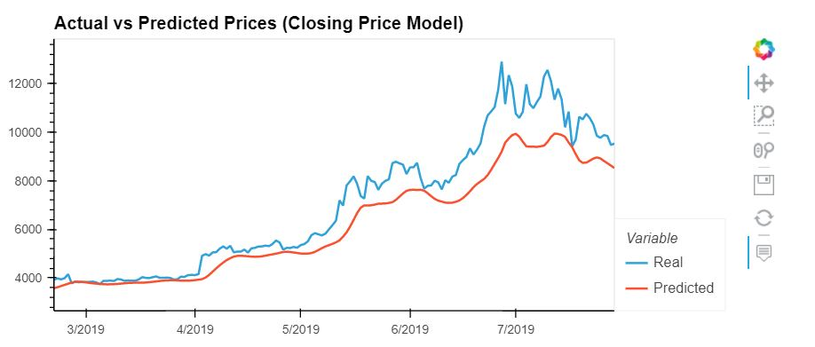
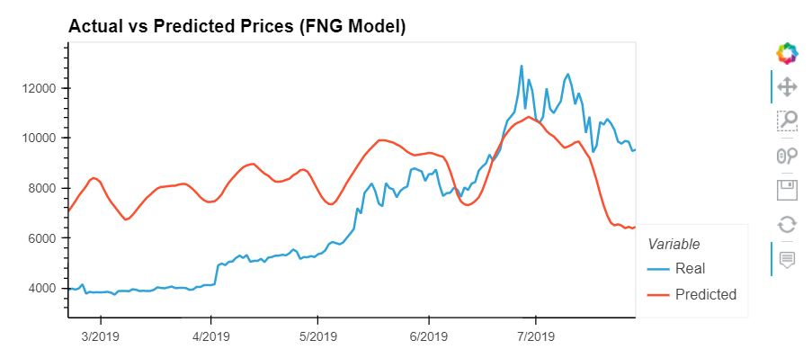

# LSTM Stock Predictor Using Closing Prices

In this notebook, you will build and train a custom LSTM RNN that uses a 10 day window of Bitcoin closing prices to predict the 11th day closing price. 

You will need to:

1. Prepare the data for training and testing
2. Build and train a custom LSTM RNN
3. Evaluate the performance of the model

## Data Preparation

In this section, you will need to prepare the training and testing data for the model. The model will use a rolling 10 day window to predict the 11th day closing price.

You will need to:
1. Use the `window_data` function to generate the X and y values for the model.
2. Split the data into 70% training and 30% testing
3. Apply the MinMaxScaler to the X and y values
4. Reshape the X_train and X_test data for the model. Note: The required input format for the LSTM is:

```python
reshape((X_train.shape[0], X_train.shape[1], 1))
```


```python
import numpy as np
import pandas as pd
import hvplot.pandas
```


```python
# Set the random seed for reproducibility
# Note: This is for the homework solution, but it is good practice to comment this out and run multiple experiments to evaluate your model
from numpy.random import seed
seed(1)
from tensorflow import random
random.set_seed(2)
```


```python
# Load the fear and greed sentiment data for Bitcoin
df = pd.read_csv('btc_sentiment.csv', index_col="date", infer_datetime_format=True, parse_dates=True)
df = df.drop(columns="fng_classification")
df.head()
```


<div>
<table border="1" class="dataframe">
  <thead>
    <tr style="text-align: right;">
      <th></th>
      <th>fng_value</th>
    </tr>
    <tr>
      <th>date</th>
      <th></th>
    </tr>
  </thead>
  <tbody>
    <tr>
      <th>2019-07-29</th>
      <td>19</td>
    </tr>
    <tr>
      <th>2019-07-28</th>
      <td>16</td>
    </tr>
    <tr>
      <th>2019-07-27</th>
      <td>47</td>
    </tr>
    <tr>
      <th>2019-07-26</th>
      <td>24</td>
    </tr>
    <tr>
      <th>2019-07-25</th>
      <td>42</td>
    </tr>
  </tbody>
</table>
</div>


```python
# Load the historical closing prices for Bitcoin
df2 = pd.read_csv('btc_historic.csv', index_col="Date", infer_datetime_format=True, parse_dates=True)['Close']
df2 = df2.sort_index()
df2.tail()
```


    Date
    2019-07-25    9882.429688
    2019-07-26    9847.450195
    2019-07-27    9478.320313
    2019-07-28    9531.769531
    2019-07-29    9529.889648
    Name: Close, dtype: float64


```python
# Join the data into a single DataFrame
df = df.join(df2, how="inner")
df.tail()
```


<div>
<table border="1" class="dataframe">
  <thead>
    <tr style="text-align: right;">
      <th></th>
      <th>fng_value</th>
      <th>Close</th>
    </tr>
  </thead>
  <tbody>
    <tr>
      <th>2019-07-25</th>
      <td>42</td>
      <td>9882.429688</td>
    </tr>
    <tr>
      <th>2019-07-26</th>
      <td>24</td>
      <td>9847.450195</td>
    </tr>
    <tr>
      <th>2019-07-27</th>
      <td>47</td>
      <td>9478.320313</td>
    </tr>
    <tr>
      <th>2019-07-28</th>
      <td>16</td>
      <td>9531.769531</td>
    </tr>
    <tr>
      <th>2019-07-29</th>
      <td>19</td>
      <td>9529.889648</td>
    </tr>
  </tbody>
</table>
</div>


```python
df.head()
```


<div>
<table border="1" class="dataframe">
  <thead>
    <tr style="text-align: right;">
      <th></th>
      <th>fng_value</th>
      <th>Close</th>
    </tr>
  </thead>
  <tbody>
    <tr>
      <th>2018-02-01</th>
      <td>30</td>
      <td>9114.719727</td>
    </tr>
    <tr>
      <th>2018-02-02</th>
      <td>15</td>
      <td>8870.820313</td>
    </tr>
    <tr>
      <th>2018-02-03</th>
      <td>40</td>
      <td>9251.269531</td>
    </tr>
    <tr>
      <th>2018-02-04</th>
      <td>24</td>
      <td>8218.049805</td>
    </tr>
    <tr>
      <th>2018-02-05</th>
      <td>11</td>
      <td>6937.080078</td>
    </tr>
  </tbody>
</table>
</div>


```python
# This function accepts the column number for the features (X) and the target (y)
# It chunks the data up with a rolling window of Xt-n to predict Xt
# It returns a numpy array of X any y
def window_data(df, window, feature_col_number, target_col_number):
    X = []
    y = []
    for i in range(len(df) - window - 1):
        features = df.iloc[i:(i + window), feature_col_number]
        target = df.iloc[(i + window), target_col_number]
        X.append(features)
        y.append(target)
    return np.array(X), np.array(y).reshape(-1, 1)
```


```python
# Predict Closing Prices using a 10 day window of previous closing prices
# Then, experiment with window sizes anywhere from 1 to 10 and see how the model performance changes
window_size = 10

# Column index 0 is the 'fng_value' column
# Column index 1 is the `Close` column
feature_column = 1
target_column = 1
X, y = window_data(df, window_size, feature_column, target_column)
```


```python
# Use 70% of the data for training and the remaineder for testing
split = int(0.70*len(X))
X_train = X[:split-1]
X_test = X[split:]
y_train = y[:split-1]
y_test = y[split:]
```


```python
from sklearn.preprocessing import MinMaxScaler
# Use the MinMaxScaler to scale data between 0 and 1.

scaler = MinMaxScaler().fit(X_train)
X_train = scaler.transform(X_train)
X_test = scaler.transform(X_test)

scaler = MinMaxScaler().fit(y_train)
y_train = scaler.transform(y_train)
y_test = scaler.transform(y_test)

```


```python
print (f" Feature Scaled X sample values:\n{X_train[:3]} \n")
print (f" Target Scaled y sample values:\n{y_train[:3]}")
print(f"Original X_train dimensions: {X_train.shape}")
```

     Feature Scaled X sample values:
    [[0.7111066  0.68162134 0.72761425 0.60270722 0.44784942 0.54023074
      0.52711046 0.60786209 0.66058747 0.64516902]
     [0.68162134 0.72761425 0.60270722 0.44784942 0.54023074 0.52711046
      0.60786209 0.66058747 0.64516902 0.58657552]
     [0.72761425 0.60270722 0.44784942 0.54023074 0.52711046 0.60786209
      0.66058747 0.64516902 0.58657552 0.68651129]] 
    
     Target Scaled y sample values:
    [[0.58657552]
     [0.68651129]
     [0.64219515]]
    Original X_train dimensions: (371, 10)
    


```python
# Reshape the features for the model
X_train = X_train.reshape((X_train.shape[0],X_train.shape[1],1))
X_test = X_test.reshape((X_test.shape[0],X_test.shape[1],1))

print(f"Reshaped featyres for the model: {X_train.shape}")
```

    Reshaped featyres for the model: (371, 10, 1)
    

---

## Build and Train the LSTM RNN

In this section, you will design a custom LSTM RNN and fit (train) it using the training data.

You will need to:
1. Define the model architecture
2. Compile the model
3. Fit the model to the training data

### Hints:
You will want to use the same model architecture and random seed for both notebooks. This is necessary to accurately compare the performance of the FNG model vs the closing price model. 


```python
from tensorflow.keras.models import Sequential
from tensorflow.keras.layers import LSTM, Dense, Dropout
```


```python
# Build the LSTM model. 
# The return sequences need to be set to True if you are adding additional LSTM layers, but 
# You don't have to do this for the final layer. 
# Note: The dropouts help prevent overfitting
# Note: The input shape is the number of time steps and the number of indicators
# Note: Batching inputs has a different input shape of Samples/TimeSteps/Features

# YOUR CODE HERE!
number_units = 30
drop_out_franction = 20/100 # 20% of neurons will be randomly droped during each epoch

model = Sequential()

#1 layer
model.add(LSTM(units = number_units,
               return_sequences = True,
               input_shape = (X_train.shape[1],1)
          ))
model.add(Dropout(drop_out_franction))
#2 layer
model.add(LSTM(units = number_units, return_sequences=True))
model.add(Dropout(drop_out_franction))
#3 layer
model.add(LSTM(units = number_units))
model.add(Dropout(drop_out_franction))

#final layer
model.add(Dense(units=1))
```


```python
# Compile the model
model.compile(loss='mean_squared_error', optimizer = 'adam', metrics=['mse'])
```


```python
# Summarize the model
model.summary()
```

    Model: "sequential"
    _________________________________________________________________
    Layer (type)                 Output Shape              Param #   
    =================================================================
    lstm (LSTM)                  (None, 10, 30)            3840      
    _________________________________________________________________
    dropout (Dropout)            (None, 10, 30)            0         
    _________________________________________________________________
    lstm_1 (LSTM)                (None, 10, 30)            7320      
    _________________________________________________________________
    dropout_1 (Dropout)          (None, 10, 30)            0         
    _________________________________________________________________
    lstm_2 (LSTM)                (None, 30)                7320      
    _________________________________________________________________
    dropout_2 (Dropout)          (None, 30)                0         
    _________________________________________________________________
    dense (Dense)                (None, 1)                 31        
    =================================================================
    Total params: 18,511
    Trainable params: 18,511
    Non-trainable params: 0
    _________________________________________________________________
    


```python
# Train the model
# Use at least 10 epochs
# Do not shuffle the data
# Experiement with the batch size, but a smaller batch size is recommended
model.fit(X_train,y_train, epochs =50, batch_size=10, verbose = 0, shuffle=False)
```


    <tensorflow.python.keras.callbacks.History at 0x2273f015a00>


---

## Model Performance

In this section, you will evaluate the model using the test data. 

You will need to:
1. Evaluate the model using the `X_test` and `y_test` data.
2. Use the X_test data to make predictions
3. Create a DataFrame of Real (y_test) vs predicted values. 
4. Plot the Real vs predicted values as a line chart

### Hints
Remember to apply the `inverse_transform` function to the predicted and y_test values to recover the actual closing prices.


```python
# Evaluate the model
model.evaluate(X_test,y_test)
```

    5/5 [==============================] - 1s 3ms/step - loss: 0.0185 - mse: 0.0185    
    


    [0.018475139513611794, 0.018475139513611794]


```python
# Make some predictions
predicted = model.predict(X_test)
```


```python
# Recover the original prices instead of the scaled version
predicted_prices = scaler.inverse_transform(predicted)
real_prices = scaler.inverse_transform(y_test.reshape(-1, 1))
```


```python
# Create a DataFrame of Real and Predicted values
stocks = pd.DataFrame({
    "Real": real_prices.ravel(),
    "Predicted": predicted_prices.ravel()
}, index = df.index[-len(real_prices): ]) 
stocks.head()
```


<div>
<table border="1" class="dataframe">
  <thead>
    <tr style="text-align: right;">
      <th></th>
      <th>Real</th>
      <th>Predicted</th>
    </tr>
  </thead>
  <tbody>
    <tr>
      <th>2019-02-20</th>
      <td>3924.239990</td>
      <td>3576.484375</td>
    </tr>
    <tr>
      <th>2019-02-21</th>
      <td>3974.050049</td>
      <td>3612.496338</td>
    </tr>
    <tr>
      <th>2019-02-22</th>
      <td>3937.040039</td>
      <td>3660.170898</td>
    </tr>
    <tr>
      <th>2019-02-23</th>
      <td>3983.530029</td>
      <td>3708.915527</td>
    </tr>
    <tr>
      <th>2019-02-24</th>
      <td>4149.089844</td>
      <td>3754.602295</td>
    </tr>
  </tbody>
</table>
</div>


```python
# Plot the real vs predicted values as a line chart
plot = stocks.hvplot(title = 'Actual vs Predicted Prices (Closing Price Model)')
plot
```


# LSTM Stock Predictor Using Fear and Greed Index

In this notebook, you will build and train a custom LSTM RNN that uses a 10 day window of Bitcoin fear and greed index values to predict the 11th day closing price. 

You will need to:

1. Prepare the data for training and testing
2. Build and train a custom LSTM RNN
3. Evaluate the performance of the model

## Data Preparation

In this section, you will need to prepare the training and testing data for the model. The model will use a rolling 10 day window to predict the 11th day closing price.

You will need to:
1. Use the `window_data` function to generate the X and y values for the model.
2. Split the data into 70% training and 30% testing
3. Apply the MinMaxScaler to the X and y values
4. Reshape the X_train and X_test data for the model. Note: The required input format for the LSTM is:

```python
reshape((X_train.shape[0], X_train.shape[1], 1))
```


```python
import numpy as np
import pandas as pd
import hvplot.pandas
```


```python
# Set the random seed for reproducibility
# Note: This is for the homework solution, but it is good practice to comment this out and run multiple experiments to evaluate your model
from numpy.random import seed
seed(1)
from tensorflow import random
random.set_seed(2)
```


```python
# Load the fear and greed sentiment data for Bitcoin
df = pd.read_csv('btc_sentiment.csv', index_col="date", infer_datetime_format=True, parse_dates=True)
df = df.drop(columns="fng_classification")
df.head()
```


<div>
<table border="1" class="dataframe">
  <thead>
    <tr style="text-align: right;">
      <th></th>
      <th>fng_value</th>
    </tr>
    <tr>
      <th>date</th>
      <th></th>
    </tr>
  </thead>
  <tbody>
    <tr>
      <th>2019-07-29</th>
      <td>19</td>
    </tr>
    <tr>
      <th>2019-07-28</th>
      <td>16</td>
    </tr>
    <tr>
      <th>2019-07-27</th>
      <td>47</td>
    </tr>
    <tr>
      <th>2019-07-26</th>
      <td>24</td>
    </tr>
    <tr>
      <th>2019-07-25</th>
      <td>42</td>
    </tr>
  </tbody>
</table>
</div>


```python
# Load the historical closing prices for Bitcoin
df2 = pd.read_csv('btc_historic.csv', index_col="Date", infer_datetime_format=True, parse_dates=True)['Close']
df2 = df2.sort_index()
df2.tail()
```


    Date
    2019-07-25    9882.429688
    2019-07-26    9847.450195
    2019-07-27    9478.320313
    2019-07-28    9531.769531
    2019-07-29    9529.889648
    Name: Close, dtype: float64


```python
# Join the data into a single DataFrame
df = df.join(df2, how="inner")
df.tail()
```


<div>
<table border="1" class="dataframe">
  <thead>
    <tr style="text-align: right;">
      <th></th>
      <th>fng_value</th>
      <th>Close</th>
    </tr>
  </thead>
  <tbody>
    <tr>
      <th>2019-07-25</th>
      <td>42</td>
      <td>9882.429688</td>
    </tr>
    <tr>
      <th>2019-07-26</th>
      <td>24</td>
      <td>9847.450195</td>
    </tr>
    <tr>
      <th>2019-07-27</th>
      <td>47</td>
      <td>9478.320313</td>
    </tr>
    <tr>
      <th>2019-07-28</th>
      <td>16</td>
      <td>9531.769531</td>
    </tr>
    <tr>
      <th>2019-07-29</th>
      <td>19</td>
      <td>9529.889648</td>
    </tr>
  </tbody>
</table>
</div>


```python
df.head()
```


<div>
<table border="1" class="dataframe">
  <thead>
    <tr style="text-align: right;">
      <th></th>
      <th>fng_value</th>
      <th>Close</th>
    </tr>
  </thead>
  <tbody>
    <tr>
      <th>2018-02-01</th>
      <td>30</td>
      <td>9114.719727</td>
    </tr>
    <tr>
      <th>2018-02-02</th>
      <td>15</td>
      <td>8870.820313</td>
    </tr>
    <tr>
      <th>2018-02-03</th>
      <td>40</td>
      <td>9251.269531</td>
    </tr>
    <tr>
      <th>2018-02-04</th>
      <td>24</td>
      <td>8218.049805</td>
    </tr>
    <tr>
      <th>2018-02-05</th>
      <td>11</td>
      <td>6937.080078</td>
    </tr>
  </tbody>
</table>
</div>


```python
# This function accepts the column number for the features (X) and the target (y)
# It chunks the data up with a rolling window of Xt-n to predict Xt
# It returns a numpy array of X any y
def window_data(df, window, feature_col_number, target_col_number):
    X = []
    y = []
    for i in range(len(df) - window - 1):
        features = df.iloc[i:(i + window), feature_col_number]
        target = df.iloc[(i + window), target_col_number]
        X.append(features)
        y.append(target)
    return np.array(X), np.array(y).reshape(-1, 1)
```


```python
# Predict Closing Prices using a 10 day window of previous fng values
# Then, experiment with window sizes anywhere from 1 to 10 and see how the model performance changes
window_size = 10

# Column index 0 is the 'fng_value' column
# Column index 1 is the `Close` column
feature_column = 0
target_column = 1
X, y = window_data(df, window_size, feature_column, target_column)
```


```python
# Use 70% of the data for training and the remaineder for testing
split = int(70/100*len(X))
X_train = X[:split-1]
X_test = X[split:]
y_train = y[:split-1]
y_test = y[split:]
```


```python
from sklearn.preprocessing import MinMaxScaler
# Use the MinMaxScaler to scale data between 0 and 1.
scaler = MinMaxScaler().fit(X_train)
X_train = scaler.transform(X_train)
X_test = scaler.transform(X_test)
scaler = MinMaxScaler().fit(y_train)
y_train = scaler.transform(y_train)
y_test = scaler.transform(y_test)

```


```python
# Reshape the features for the model
X_train = X_train.reshape((X_train.shape[0], X_train.shape[1],1))
X_test = X_test.reshape((X_test.shape[0], X_test.shape[1],1))
```

---

## Build and Train the LSTM RNN

In this section, you will design a custom LSTM RNN and fit (train) it using the training data.

You will need to:
1. Define the model architecture
2. Compile the model
3. Fit the model to the training data

### Hints:
You will want to use the same model architecture and random seed for both notebooks. This is necessary to accurately compare the performance of the FNG model vs the closing price model. 


```python
from tensorflow.keras.models import Sequential
from tensorflow.keras.layers import LSTM, Dense, Dropout
```


```python
# Build the LSTM model. 
# The return sequences need to be set to True if you are adding additional LSTM layers, but 
# You don't have to do this for the final layer. 
# Note: The dropouts help prevent overfitting
# Note: The input shape is the number of time steps and the number of indicators
# Note: Batching inputs has a different input shape of Samples/TimeSteps/Features

number_units = 30
drop_out_franction = 20/100

model = Sequential()

#1 layer
model.add(LSTM(units = number_units,
               return_sequences = True,
               input_shape = (X_train.shape[1],1)
          ))
model.add(Dropout(drop_out_franction))
#2 layer
model.add(LSTM(units = number_units, return_sequences=True))
model.add(Dropout(drop_out_franction))
#3 layer
model.add(LSTM(units = number_units))
model.add(Dropout(drop_out_franction))
#final layer
model.add(Dense(units=1))
```


```python
# Compile the model
model.compile(loss='mean_squared_error', optimizer='adam', metrics=['mse'])
```


```python
# Summarize the model
model.summary()
```

    Model: "sequential"
    _________________________________________________________________
    Layer (type)                 Output Shape              Param #   
    =================================================================
    lstm (LSTM)                  (None, 10, 30)            3840      
    _________________________________________________________________
    dropout (Dropout)            (None, 10, 30)            0         
    _________________________________________________________________
    lstm_1 (LSTM)                (None, 10, 30)            7320      
    _________________________________________________________________
    dropout_1 (Dropout)          (None, 10, 30)            0         
    _________________________________________________________________
    lstm_2 (LSTM)                (None, 30)                7320      
    _________________________________________________________________
    dropout_2 (Dropout)          (None, 30)                0         
    _________________________________________________________________
    dense (Dense)                (None, 1)                 31        
    =================================================================
    Total params: 18,511
    Trainable params: 18,511
    Non-trainable params: 0
    _________________________________________________________________
    


```python
# Train the model
# Use at least 10 epochs
# Do not shuffle the data
# Experiement with the batch size, but a smaller batch size is recommended
model.fit(X_train,y_train, epochs =50, batch_size=10, verbose = 0, shuffle=False)
```

    Epoch 1/10
    371/371 [==============================] - 2s 5ms/step - loss: 0.0323
    Epoch 2/10
    371/371 [==============================] - 2s 5ms/step - loss: 0.0341
    Epoch 3/10
    371/371 [==============================] - 2s 5ms/step - loss: 0.0345
    Epoch 4/10
    371/371 [==============================] - 2s 5ms/step - loss: 0.0359
    Epoch 5/10
    371/371 [==============================] - 2s 5ms/step - loss: 0.0359
    Epoch 6/10
    371/371 [==============================] - 2s 5ms/step - loss: 0.0349
    Epoch 7/10
    371/371 [==============================] - 2s 5ms/step - loss: 0.0348
    Epoch 8/10
    371/371 [==============================] - 2s 5ms/step - loss: 0.0342
    Epoch 9/10
    371/371 [==============================] - 2s 5ms/step - loss: 0.0371
    Epoch 10/10
    371/371 [==============================] - 2s 5ms/step - loss: 0.0406
    


    <tensorflow.python.keras.callbacks.History at 0x1e87ce4f408>


---

## Model Performance

In this section, you will evaluate the model using the test data. 

You will need to:
1. Evaluate the model using the `X_test` and `y_test` data.
2. Use the X_test data to make predictions
3. Create a DataFrame of Real (y_test) vs predicted values. 
4. Plot the Real vs predicted values as a line chart

### Hints
Remember to apply the `inverse_transform` function to the predicted and y_test values to recover the actual closing prices.


```python
# Evaluate the model
model.evaluate(X_test, y_test)
```

    5/5 [==============================] - 0s 2ms/step - loss: 0.1911
    


    0.19111095368862152


```python
# Make some predictions
predicted = model.predict(X_test)
```


```python
# Recover the original prices instead of the scaled version
predicted_prices = scaler.inverse_transform(predicted)
real_prices = scaler.inverse_transform(y_test.reshape(-1, 1))
```


```python
# Create a DataFrame of Real and Predicted values
stocks = pd.DataFrame({
    "Real": real_prices.ravel(),
    "Predicted": predicted_prices.ravel()
}, index = df.index[-len(real_prices): ]) 
stocks.head()
```


<div>
<table border="1" class="dataframe">
  <thead>
    <tr style="text-align: right;">
      <th></th>
      <th>Real</th>
      <th>Predicted</th>
    </tr>
  </thead>
  <tbody>
    <tr>
      <th>2019-02-20</th>
      <td>3924.239990</td>
      <td>4106.430664</td>
    </tr>
    <tr>
      <th>2019-02-21</th>
      <td>3974.050049</td>
      <td>4104.131348</td>
    </tr>
    <tr>
      <th>2019-02-22</th>
      <td>3937.040039</td>
      <td>4105.453125</td>
    </tr>
    <tr>
      <th>2019-02-23</th>
      <td>3983.530029</td>
      <td>4101.010254</td>
    </tr>
    <tr>
      <th>2019-02-24</th>
      <td>4149.089844</td>
      <td>4102.781738</td>
    </tr>
  </tbody>
</table>
</div>


```python
# Plot the real vs predicted values as a line chart
plot = stocks.hvplot(title = 'Actual vs Predicted Prices (FNG Model)')
plot
```

```python

```

