## Instructions

### Setup the custom out-of-the-box blockchain

* Create a new project directory for your new network. Call it whatever you want!

* Create a "Screenshots" folder inside of the project directory.

* Create accounts for two (or more) nodes for the network with a separate `datadir` for each using `geth`.

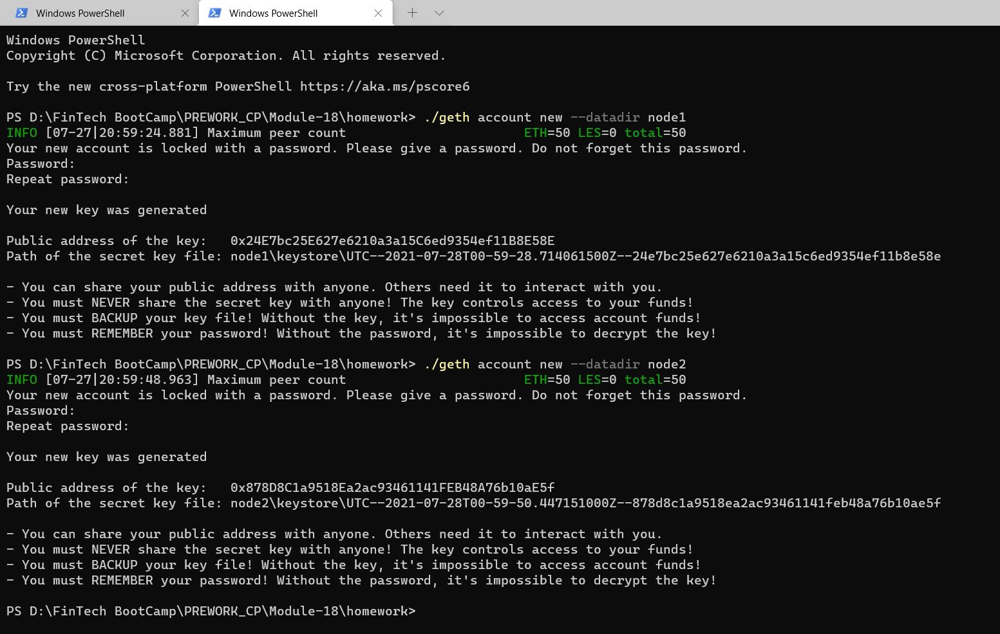

* Run `puppeth`, name your network, and select the option to configure a new genesis block.

* Choose the `Clique (Proof of Authority)` consensus algorithm.

* Paste both account addresses from the first step one at a time into the list of accounts to seal.

* Paste them again in the list of accounts to pre-fund. There are no block rewards in PoA, so you'll need to pre-fund.

* You can choose `no` for pre-funding the pre-compiled accounts (0x1 .. 0xff) with wei. This keeps the genesis cleaner.

* Complete the rest of the prompts, and when you are back at the main menu, choose the "Manage existing genesis" option.

* Export genesis configurations. This will fail to create two of the files, but you only need `networkname.json`.

* You can delete the `networkname-harmony.json` file.

* Screenshot the `puppeth` configuration once complete and save it to the Screenshots folder.


* Initialize each node with the new `networkname.json` with `geth`.

* Run the first node, unlock the account, enable mining, and the RPC flag. Only one node needs RPC enabled.


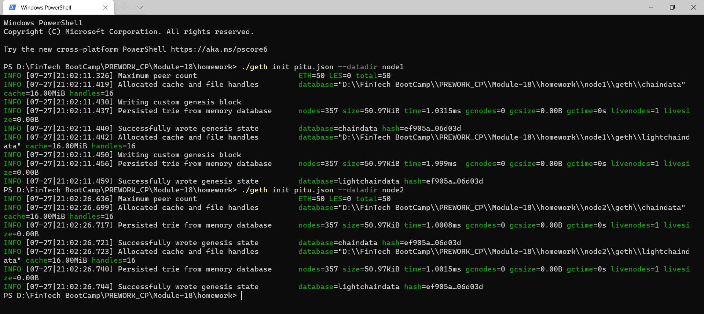


* Set a different peer port for the second node and use the first node's `enode` address as the `bootnode` flag.

* Be sure to unlock the account and enable mining on the second node!

* You should now see both nodes producing new blocks, congratulations!

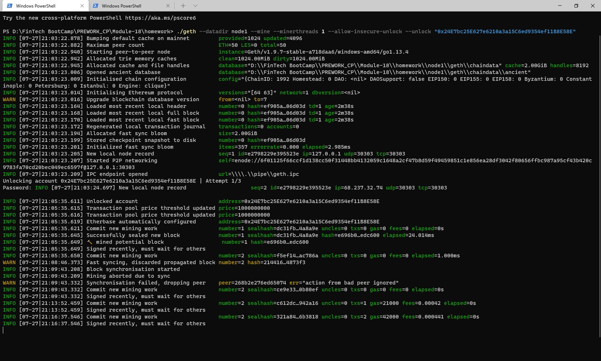

### Send a test transaction

* Use the MyCrypto GUI wallet to connect to the node with the exposed RPC port.

* You will need to use a custom network, and include the chain ID, and use ETH as the currency.


* Import the keystore file from the `node1/keystore` directory into MyCrypto. This will import the private key.

* Send a transaction from the `node1` account to the `node2` account.


* Copy the transaction hash and paste it into the "TX Status" section of the app, or click "TX Status" in the popup.

* Screenshot the transaction metadata (status, tx hash, block number, etc) and save it to your Screenshots folder.

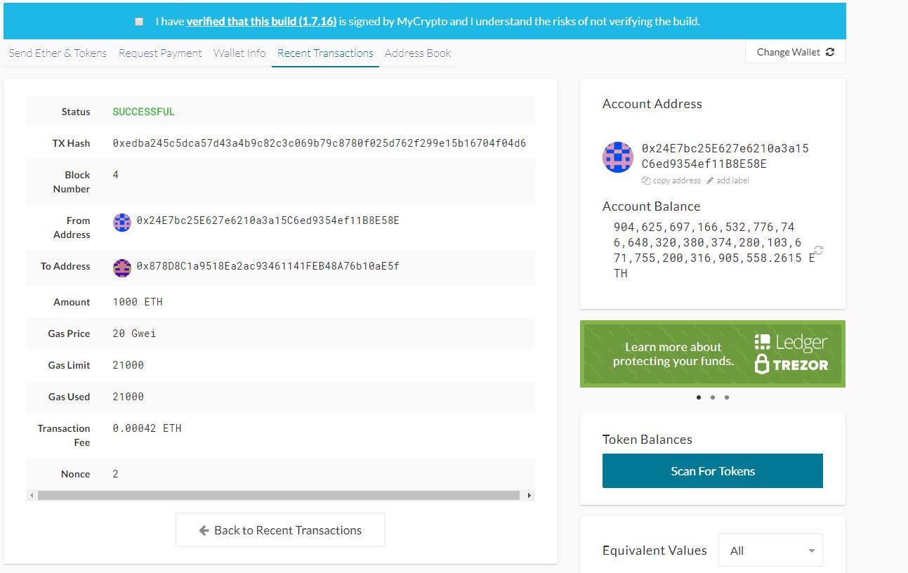

# Multi-Blockchain Wallet in Python


## Background

Your new startup is focusing on building a portfolio management system that supports not only traditional assets
like gold, silver, stocks, etc, but crypto-assets as well! The problem is, there are so many coins out there! It's
a good thing you understand how HD wallets work, since you'll need to build out a system that can create them.

You're in a race to get to the market. There aren't as many tools available in Python for this sort of thing, yet.
Thankfully, you've found a command line tool, `hd-wallet-derive` that supports not only BIP32, BIP39, and BIP44, but
also supports non-standard derivation paths for the most popular wallets out there today! However, you need to integrate
the script into your backend with your dear old friend, Python.

Once you've integrated this "universal" wallet, you can begin to manage billions of addresses across 300+ coins, giving
you a serious edge against the competition.

In this assignment, however, you will only need to get 2 coins working: Ethereum and Bitcoin Testnet.
Ethereum keys are the same format on any network, so the Ethereum keys should work with your custom networks or testnets.

## Instructions

### 1. Project setup

- Create a project directory called `wallet` and `cd` into it.

- Clone the `hd-wallet-derive` tool into this folder and install it using the HD Wallet Derive Installation Guide

- Create a symlink called `derive` for the `hd-wallet-derive/hd-wallet-derive.php` script. This will clean up the command needed to run the script in our code, as we can call `./derive` instead of `./hd-wallet-derive/hd-wallet-derive.php`: 

  - Make sure you are in the top level project directory - in this case the directory named `wallet`. 
  
  - **Mac Users:** Run the following command: `ln -s hd-wallet-derive/hd-wallet-derive.php derive`. 
  
  - **Windows Users:** Creating symlinks is not supported by default on Windows, only reading them, so Windows users must perform the following steps:

    - Open up Git-Bash as an administrator (right-click on Git-Bash in the start menu).

    - Within `bash`, run the command `export MSYS=winsymlinks:nativestrict`.
    
    - Run the following command: `ln -s hd-wallet-derive/hd-wallet-derive.php derive`. 

  - Test that you can run the `./derive` script properly, by running the following command.  

    - ```
      ./derive --key=xprv9zbB6Xchu2zRkf6jSEnH9vuy7tpBuq2njDRr9efSGBXSYr1QtN8QHRur28QLQvKRqFThCxopdS1UD61a5q6jGyuJPGLDV9XfYHQto72DAE8 --cols=path,address --coin=ZEC --numderive=3 -g
      ```
  - The output should match what you see below:
    - ```
      +------+-------------------------------------+
      | path | address                             |
      +------+-------------------------------------+
      | m/0  | t1V1Qp41kbHn159hvVXZL5M1MmVDRe6EdpA |
      | m/1  | t1Tw6iqFY1g9dKeAqPDAncaUjha8cn9SZqX |
      | m/2  | t1VGTPzBSSYd27GF8p9rGKGdFuWekKRhug4 |
      +------+-------------------------------------+
      ```

- Create a file called `wallet.py` -- this will be your universal wallet script. You can use [this starter code](Starter-Code/wallet.py) as a starting point.


### 2. Setup constants

- In a separate file, `constants.py`, set the following constants:
  - `BTC = 'btc'`
  - `ETH = 'eth'`
  - `BTCTEST = 'btc-test'`

- In `wallet.py`, import all constants: `from constants import *`

- Use these anytime you reference these strings, both in function calls, and in setting object keys.

### 3. Generate a Mnemonic

- Generate a **new** 12 word mnemonic using `hd-wallet-derive` or by using [this tool](https://iancoleman.io/bip39/).

- Set this mnemonic as an environment variable by storing it a an `.env` file and importing it into your `wallet.py`.

### 4. Derive the wallet keys

- Create a function called `derive_wallets` that does the following:

  - Use the `subprocess` library to create a shell command that calls the `./derive` script from Python. Make sure to properly wait for the process. **Windows Users** may need to prepend the `php` command in front of `./derive` like so: `php ./derive`.

  - The following flags must be passed into the shell command as variables:
    - Mnemonic (`--mnemonic`) must be set from an environment variable, or default to a test mnemonic
    - Coin (`--coin`)
    - Numderive (`--numderive`) to set number of child keys generated
    - Format (`--format=json`) to parse the output into a JSON object using `json.loads(output)`

- Create a dictionary object called `coins` that uses the `derive_wallets` function to derive `ETH` and `BTCTEST` wallets.

- When done properly, the final object should look something like this (there are only 3 children each in this image):

  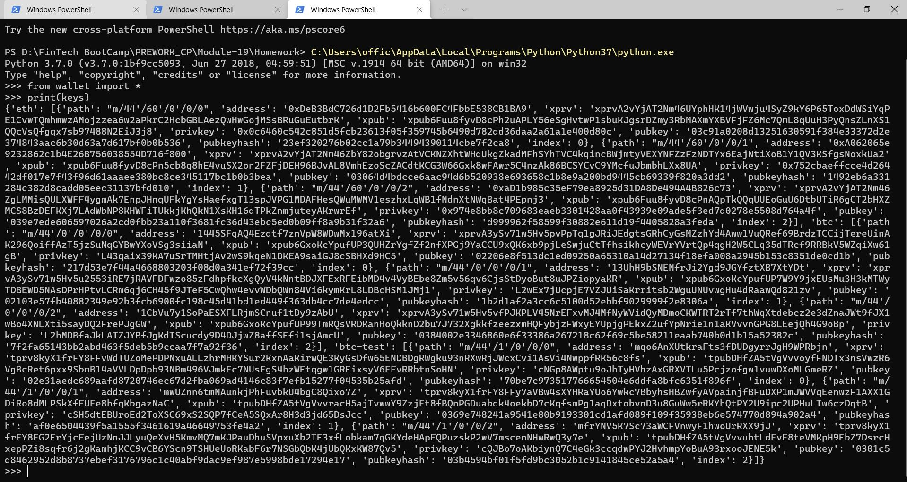

- You should now be able to select child accounts (and thus, private keys) by accessing items in the `coins` dictionary like so: `coins[COINTYPE][INDEX]['privkey']`.

### 5. Linking the transaction signing libraries

- Use `bit` and `web3.py` to leverage the keys stored in the `coins` object by creating three more functions:

  - `priv_key_to_account`:
  
    - This function will convert the `privkey` string in a child key to an account object that `bit` or `web3.py` can use to transact.
    - This function needs the following parameters:

      - `coin` -- the coin type (defined in `constants.py`).
      - `priv_key` -- the `privkey` string will be passed through here.

    - You will need to check the coin type, then return one of the following functions based on the library:

      - For `ETH`, return `Account.privateKeyToAccount(priv_key)`
          - This function returns an account object from the private key string. You can read more about this object [here](https://web3js.readthedocs.io/en/v1.2.0/web3-eth-accounts.html#privatekeytoaccount).
      - For `BTCTEST`, return `PrivateKeyTestnet(priv_key)`
          - This is a function from the `bit` libarary that converts the private key string into a WIF (Wallet Import Format) object. WIF is a special format bitcoin uses to designate the types of keys it generates. 
          - You can read more about this function [here](https://ofek.dev/bit/dev/api.html).

  - `create_tx`: 
    - This function will create the raw, unsigned transaction that contains all metadata needed to transact.
    - This function needs the following parameters:

      - `coin` -- the coin type (defined in `constants.py`).
      - `account` -- the account object from `priv_key_to_account`.
      - `to` -- the recipient address.
      - `amount` -- the amount of the coin to send.

    - You will need to check the coin type, then return one of the following functions based on the library:

      - For `ETH`, return an object containing `to`, `from`, `value`, `gas`, `gasPrice`, `nonce`, and `chainID`.
        Make sure to calculate all of these values properly using `web3.py`!
      - For `BTCTEST`, return `PrivateKeyTestnet.prepare_transaction(account.address, [(to, amount, BTC)])`

- `send_tx`:
  - This function will call `create_tx`, sign the transaction, then send it to the designated network.
  - This function needs the following parameters:

    - `coin` -- the coin type (defined in `constants.py`).
    - `account` -- the account object from `priv_key_to_account`.
    - `to` -- the recipient address.
    - `amount` -- the amount of the coin to send.

  - You may notice these are the exact same parameters as `create_tx`. `send_tx` will call `create_tx`, so it needs all of this information available.

  - You will need to check the coin, then create a `raw_tx` object by calling `create_tx`. Then, you will need to sign the `raw_tx` using `bit` or `web3.py` (hint: the account objects have a sign transaction function within).

  - Once you've signed the transaction, you will need to send it to the designated blockchain network.

    - For `ETH`, return `w3.eth.sendRawTransaction(signed.rawTransaction)`
    - For `BTCTEST`, return `NetworkAPI.broadcast_tx_testnet(signed)`

### 6. Send some transactions!

- Now, you should be able to fund these wallets using testnet faucets. 
- Open up a new terminal window inside of `wallet`.
- Then run the command `python` to open the Python shell. 
- Within the Python shell, run the command `from wallet import *`. This will allow you to access the functions in `wallet.py` interactively.
- You'll need to set the account with  `priv_key_to_account` and use `send_tx` to send transactions.

  - **Bitcoin Testnet transaction**

    - Fund a `BTCTEST` address using [this testnet faucet](https://testnet-faucet.mempool.co/).

    - Use a [block explorer](https://tbtc.bitaps.com/) to watch transactions on the address.

      
      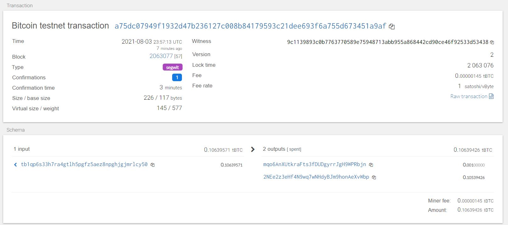
      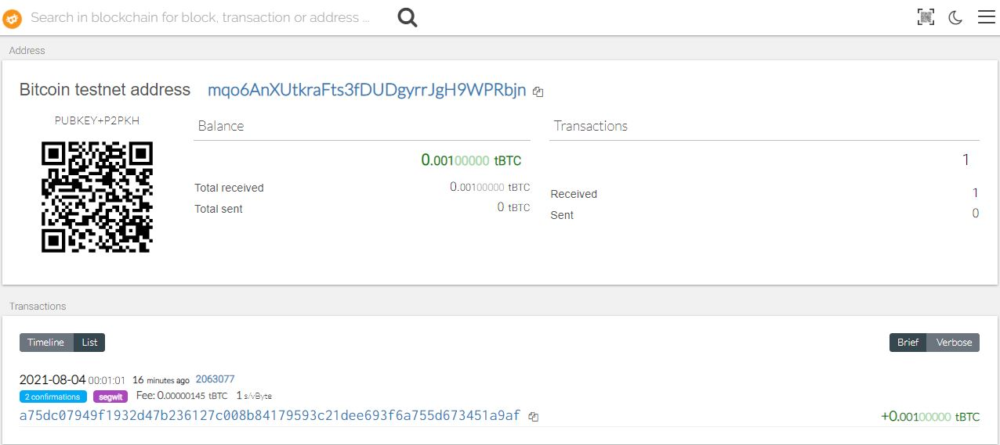

    - Send a transaction to another testnet address (either one of your own, or the faucet's).

      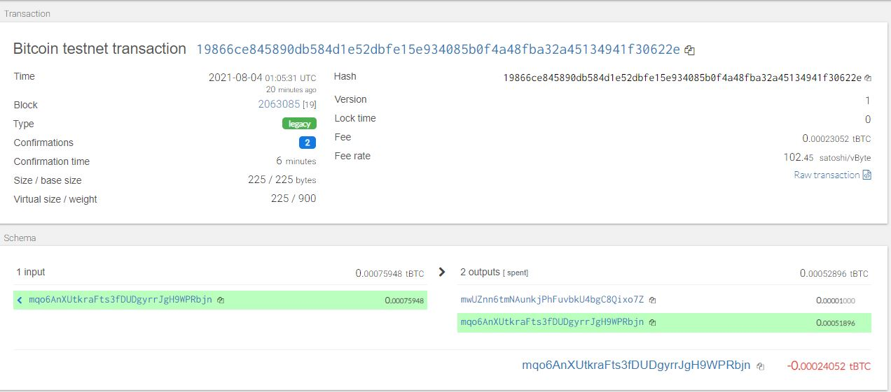
      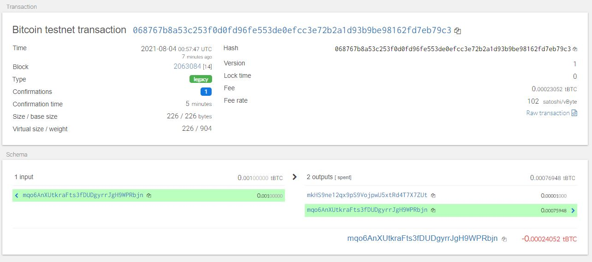


  - **Local PoA Ethereum transaction**

    - Add one of the `ETH` addresses to the pre-allocated accounts in your `networkname.json`.

    - Delete the `geth` folder in each node, then re-initialize using `geth --datadir nodeX init networkname.json`.
      This will create a new chain, and will pre-fund the new account.

      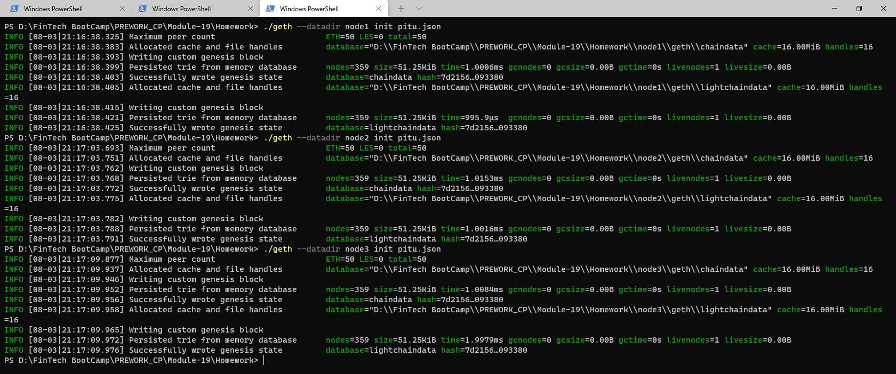

    - [Add the following middleware](https://web3py.readthedocs.io/en/stable/middleware.html#geth-style-proof-of-authority)
      to `web3.py` to support the PoA algorithm:

      ```
      from web3.middleware import geth_poa_middleware

      w3.middleware_onion.inject(geth_poa_middleware, layer=0)
      ```

    - Due to a bug in `web3.py`, you will need to send a transaction or two with MyCrypto first, since the
      `w3.eth.generateGasPrice()` function does not work with an empty chain. You can use one of the `ETH` address `privkey`,
      or one of the `node` keystore files.

    - Send a transaction from the pre-funded address within the wallet to another, then copy the `txid` into
      MyCrypto's TX Status, and screenshot the successful transaction like so:

      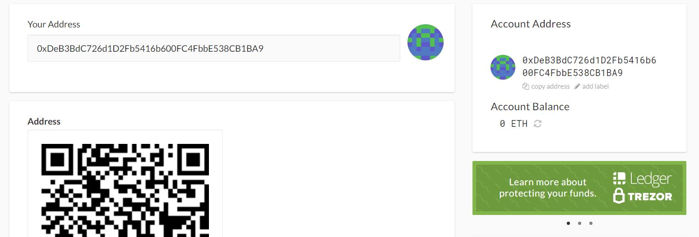
      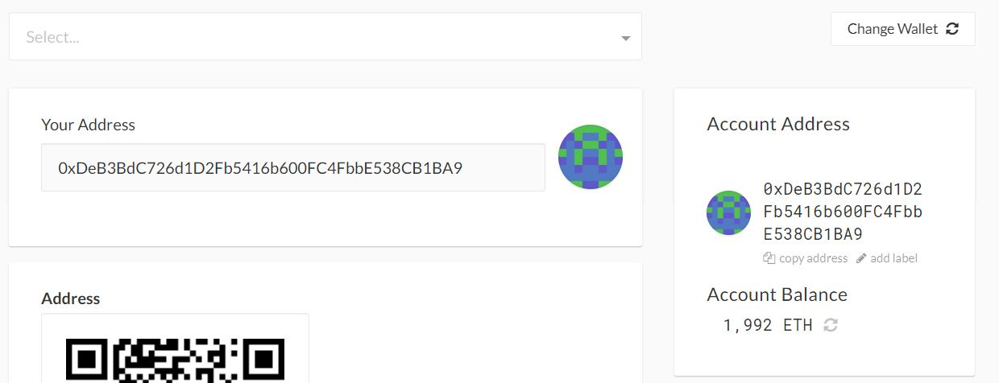
      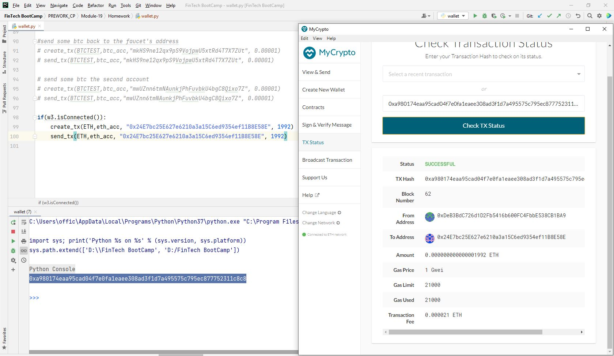
      