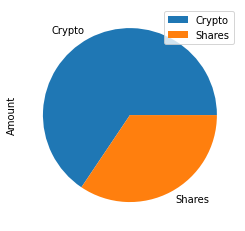
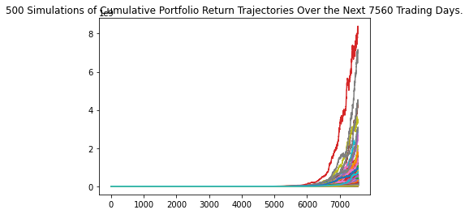
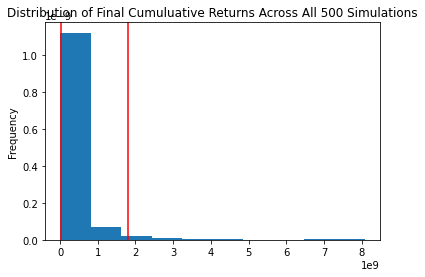
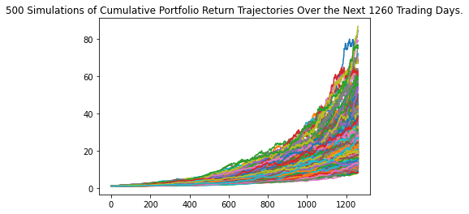
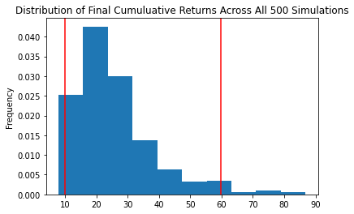
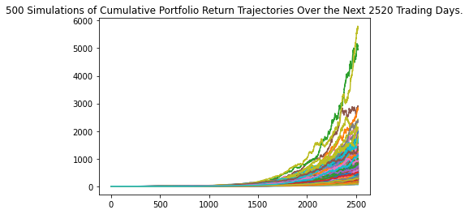
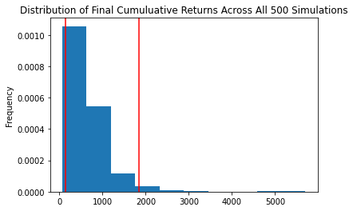

# Unit 5 - Financial Planning


```python
# Initial imports
import os
import requests
import pandas as pd
from dotenv import load_dotenv
import alpaca_trade_api as tradeapi

from MCForecastTools import MCSimulation
import json
%matplotlib inline
```


```python
# Load .env enviroment variables
load_dotenv('../../.env')
```


    True


## Part 1 - Personal Finance Planner

### Collect Crypto Prices Using the `requests` Library


```python
# Set current amount of crypto assets
my_btc = 1.2
my_eth = 5.3
```


```python
# Crypto API URLs
btc_url = "https://api.alternative.me/v2/ticker/Bitcoin/?convert=CAD"
eth_url = "https://api.alternative.me/v2/ticker/Ethereum/?convert=CAD"
```


```python
# Fetch current BTC price

my_btc_value=0
response_data = requests.get(btc_url)
btc_api_content = json.loads(json.dumps(response_data.json(), indent=4))
btc_price= btc_api_content['data']['1']['quotes']['USD']['price']
# Fetch current ETH price
response_data = requests.get(eth_url)
eth_api_content = json.loads(json.dumps(response_data.json(), indent=4))
eth_price= eth_api_content['data']['1027']['quotes']['USD']['price']
# Compute current value of my crpto
my_btc_value=my_btc*btc_price
my_eth_value=my_eth*eth_price
# Print current crypto wallet balance
print(f"The current value of your {my_btc} BTC is ${my_btc_value:0.2f}")
print(f"The current value of your {my_eth} ETH is ${my_eth_value:0.2f}")
```

    The current value of your 1.2 BTC is $63920.40
    The current value of your 5.3 ETH is $13524.43
    

### Collect Investments Data Using Alpaca: `SPY` (stocks) and `AGG` (bonds)


```python
# Current amount of shares
my_spy=50
my_agg=200
```


```python
# Set Alpaca API key and secret
alpaca_api_key = os.getenv("ALPACA_API_KEY")
alpaca_secret_key = os.getenv("ALPACA_SECRET_KEY")

# Create the Alpaca API object
api = tradeapi.REST(
    alpaca_api_key,
    alpaca_secret_key,
    api_version="v2"
)
```


```python
# Format current date as ISO format
today = pd.Timestamp("2020-10-21", tz="America/New_York").isoformat()

# Set the tickers
tickers = ["AGG", "SPY"]

# Set timeframe to '1D' for Alpaca API
timeframe = "1D"

# Get current closing prices for SPY and AGG
df_portfolio = api.get_barset(
    tickers,
    timeframe,
    start = today,
    end = today
).df

# Preview DataFrame
df_portfolio.head()
```


<div>
<style scoped>
    .dataframe tbody tr th:only-of-type {
        vertical-align: middle;
    }

    .dataframe tbody tr th {
        vertical-align: top;
    }

    .dataframe thead tr th {
        text-align: left;
    }

    .dataframe thead tr:last-of-type th {
        text-align: right;
    }
</style>
<table border="1" class="dataframe">
  <thead>
    <tr>
      <th></th>
      <th colspan="5" halign="left">AGG</th>
      <th colspan="5" halign="left">SPY</th>
    </tr>
    <tr>
      <th></th>
      <th>open</th>
      <th>high</th>
      <th>low</th>
      <th>close</th>
      <th>volume</th>
      <th>open</th>
      <th>high</th>
      <th>low</th>
      <th>close</th>
      <th>volume</th>
    </tr>
    <tr>
      <th>time</th>
      <th></th>
      <th></th>
      <th></th>
      <th></th>
      <th></th>
      <th></th>
      <th></th>
      <th></th>
      <th></th>
      <th></th>
    </tr>
  </thead>
  <tbody>
    <tr>
      <th>2020-10-21 00:00:00-04:00</th>
      <td>117.59</td>
      <td>117.64</td>
      <td>117.48</td>
      <td>117.515</td>
      <td>2910530</td>
      <td>343.33</td>
      <td>345.67</td>
      <td>342.4</td>
      <td>342.69</td>
      <td>46745662</td>
    </tr>
  </tbody>
</table>
</div>


```python
# Pick AGG and SPY close prices
agg_close_price = df_portfolio["AGG"]["close"].item()
spy_close_price = df_portfolio["SPY"]["close"].item()

# Print AGG and SPY close prices
print(f"Current AGG closing price: ${agg_close_price}")
print(f"Current SPY closing price: ${spy_close_price}")
```

    Current AGG closing price: $117.515
    Current SPY closing price: $342.69
    


```python
# Compute the current value of shares
my_spy_value = my_spy * spy_close_price
my_agg_value = my_agg * agg_close_price

# Print current value of share
print(f"The current value of your {my_spy} SPY shares is ${my_spy_value:0.2f}")
print(f"The current value of your {my_agg} AGG shares is ${my_agg_value:0.2f}")
```

    The current value of your 50 SPY shares is $17134.50
    The current value of your 200 AGG shares is $23503.00
    

### Savings Health Analysis


```python
# Set monthly household income
monthly_income = 12000

# Create savings DataFrame
total_portfolio_dictionary = {'Amount': [my_btc_value+my_eth_value, my_spy_value+my_agg_value]}
df_savings = pd.DataFrame(total_portfolio_dictionary,index=['Crypto','Shares'])

# Display savings DataFrame
display(df_savings)
```


<div>
<style scoped>
    .dataframe tbody tr th:only-of-type {
        vertical-align: middle;
    }

    .dataframe tbody tr th {
        vertical-align: top;
    }

    .dataframe thead th {
        text-align: right;
    }
</style>
<table border="1" class="dataframe">
  <thead>
    <tr style="text-align: right;">
      <th></th>
      <th>Amount</th>
    </tr>
  </thead>
  <tbody>
    <tr>
      <th>Crypto</th>
      <td>77444.834</td>
    </tr>
    <tr>
      <th>Shares</th>
      <td>40637.500</td>
    </tr>
  </tbody>
</table>
</div>


```python
# Plot savings pie chart
df_savings.plot(kind='pie', subplots=True);
```


    

    


```python
# Set ideal emergency fund
emergency_fund = monthly_income * 3

# Calculate total amount of savings
total_savings = df_savings.sum().item()

# Validate saving health
if total_savings > emergency_fund:
    print("Congratulations on having more than 3x your monthly income in your emergency fund.")
elif total_savings == emergency_fund:
    print("Congratulations on reaching your goal of 3x your monthly income in your emergency fund.")
else:
    print(f'You are ${emergency_fund - total_savings} away from reaching your goal of 3x your monthly income in your emergency fund.')
```

    Congratulations on having more than 3x your monthly income in your emergency fund.
    

## Part 2 - Retirement Planning

### Monte Carlo Simulation


```python
# Set start and end dates of five years back from today.
# Sample results may vary from the solution based on the time frame chosen
start_date = pd.Timestamp('2015-08-07', tz='America/New_York').isoformat()
end_date = pd.Timestamp('2020-08-07', tz='America/New_York').isoformat()
```


```python
# Get 5 years' worth of historical data for SPY and AGG
df_stock_data = api.get_barset(
    tickers,
    timeframe,
    start = start_date,
    end = end_date
).df

# Display sample data
df_stock_data.head()
```


<div>
<style scoped>
    .dataframe tbody tr th:only-of-type {
        vertical-align: middle;
    }

    .dataframe tbody tr th {
        vertical-align: top;
    }

    .dataframe thead tr th {
        text-align: left;
    }

    .dataframe thead tr:last-of-type th {
        text-align: right;
    }
</style>
<table border="1" class="dataframe">
  <thead>
    <tr>
      <th></th>
      <th colspan="5" halign="left">AGG</th>
      <th colspan="5" halign="left">SPY</th>
    </tr>
    <tr>
      <th></th>
      <th>open</th>
      <th>high</th>
      <th>low</th>
      <th>close</th>
      <th>volume</th>
      <th>open</th>
      <th>high</th>
      <th>low</th>
      <th>close</th>
      <th>volume</th>
    </tr>
    <tr>
      <th>time</th>
      <th></th>
      <th></th>
      <th></th>
      <th></th>
      <th></th>
      <th></th>
      <th></th>
      <th></th>
      <th></th>
      <th></th>
    </tr>
  </thead>
  <tbody>
    <tr>
      <th>2020-03-18 00:00:00-04:00</th>
      <td>109.36</td>
      <td>110.5700</td>
      <td>105.7707</td>
      <td>106.33</td>
      <td>30173684</td>
      <td>236.25</td>
      <td>248.3700</td>
      <td>228.02</td>
      <td>241.01</td>
      <td>256921808</td>
    </tr>
    <tr>
      <th>2020-03-19 00:00:00-04:00</th>
      <td>106.47</td>
      <td>109.2200</td>
      <td>105.5600</td>
      <td>108.97</td>
      <td>21031320</td>
      <td>239.25</td>
      <td>247.3800</td>
      <td>232.22</td>
      <td>241.18</td>
      <td>248430643</td>
    </tr>
    <tr>
      <th>2020-03-20 00:00:00-04:00</th>
      <td>108.46</td>
      <td>110.2399</td>
      <td>108.4600</td>
      <td>109.49</td>
      <td>28449412</td>
      <td>242.53</td>
      <td>244.4700</td>
      <td>228.50</td>
      <td>228.94</td>
      <td>286308782</td>
    </tr>
    <tr>
      <th>2020-03-23 00:00:00-04:00</th>
      <td>109.90</td>
      <td>112.9400</td>
      <td>109.0000</td>
      <td>112.55</td>
      <td>23873510</td>
      <td>228.19</td>
      <td>229.6833</td>
      <td>218.26</td>
      <td>222.51</td>
      <td>268298876</td>
    </tr>
    <tr>
      <th>2020-03-24 00:00:00-04:00</th>
      <td>111.52</td>
      <td>113.5000</td>
      <td>111.0754</td>
      <td>113.29</td>
      <td>18141498</td>
      <td>234.42</td>
      <td>244.1000</td>
      <td>233.80</td>
      <td>243.59</td>
      <td>203576470</td>
    </tr>
  </tbody>
</table>
</div>


```python
# Configuring a Monte Carlo simulation to forecast 30 years cumulative returns
MC_30_year = MCSimulation(
    portfolio_data = df_stock_data,
    weights = [.40,.60],
    num_simulation = 500,
    num_trading_days = 252*30
)
```


```python
# Printing the simulation input data
MC_30_year.portfolio_data.head()
```


<div>
<style scoped>
    .dataframe tbody tr th:only-of-type {
        vertical-align: middle;
    }

    .dataframe tbody tr th {
        vertical-align: top;
    }

    .dataframe thead tr th {
        text-align: left;
    }

    .dataframe thead tr:last-of-type th {
        text-align: right;
    }
</style>
<table border="1" class="dataframe">
  <thead>
    <tr>
      <th></th>
      <th colspan="6" halign="left">AGG</th>
      <th colspan="6" halign="left">SPY</th>
    </tr>
    <tr>
      <th></th>
      <th>open</th>
      <th>high</th>
      <th>low</th>
      <th>close</th>
      <th>volume</th>
      <th>daily_return</th>
      <th>open</th>
      <th>high</th>
      <th>low</th>
      <th>close</th>
      <th>volume</th>
      <th>daily_return</th>
    </tr>
    <tr>
      <th>time</th>
      <th></th>
      <th></th>
      <th></th>
      <th></th>
      <th></th>
      <th></th>
      <th></th>
      <th></th>
      <th></th>
      <th></th>
      <th></th>
      <th></th>
    </tr>
  </thead>
  <tbody>
    <tr>
      <th>2020-03-18 00:00:00-04:00</th>
      <td>109.36</td>
      <td>110.5700</td>
      <td>105.7707</td>
      <td>106.33</td>
      <td>30173684</td>
      <td>NaN</td>
      <td>236.25</td>
      <td>248.3700</td>
      <td>228.02</td>
      <td>241.01</td>
      <td>256921808</td>
      <td>NaN</td>
    </tr>
    <tr>
      <th>2020-03-19 00:00:00-04:00</th>
      <td>106.47</td>
      <td>109.2200</td>
      <td>105.5600</td>
      <td>108.97</td>
      <td>21031320</td>
      <td>0.024828</td>
      <td>239.25</td>
      <td>247.3800</td>
      <td>232.22</td>
      <td>241.18</td>
      <td>248430643</td>
      <td>0.000705</td>
    </tr>
    <tr>
      <th>2020-03-20 00:00:00-04:00</th>
      <td>108.46</td>
      <td>110.2399</td>
      <td>108.4600</td>
      <td>109.49</td>
      <td>28449412</td>
      <td>0.004772</td>
      <td>242.53</td>
      <td>244.4700</td>
      <td>228.50</td>
      <td>228.94</td>
      <td>286308782</td>
      <td>-0.050750</td>
    </tr>
    <tr>
      <th>2020-03-23 00:00:00-04:00</th>
      <td>109.90</td>
      <td>112.9400</td>
      <td>109.0000</td>
      <td>112.55</td>
      <td>23873510</td>
      <td>0.027948</td>
      <td>228.19</td>
      <td>229.6833</td>
      <td>218.26</td>
      <td>222.51</td>
      <td>268298876</td>
      <td>-0.028086</td>
    </tr>
    <tr>
      <th>2020-03-24 00:00:00-04:00</th>
      <td>111.52</td>
      <td>113.5000</td>
      <td>111.0754</td>
      <td>113.29</td>
      <td>18141498</td>
      <td>0.006575</td>
      <td>234.42</td>
      <td>244.1000</td>
      <td>233.80</td>
      <td>243.59</td>
      <td>203576470</td>
      <td>0.094737</td>
    </tr>
  </tbody>
</table>
</div>


```python
# Running a Monte Carlo simulation to forecast 30 years cumulative returns
MC_30_year.calc_cumulative_return()
```

    Running Monte Carlo simulation number 0.
    Running Monte Carlo simulation number 10.
    Running Monte Carlo simulation number 20.
    Running Monte Carlo simulation number 30.
    Running Monte Carlo simulation number 40.
    Running Monte Carlo simulation number 50.
    Running Monte Carlo simulation number 60.
    Running Monte Carlo simulation number 70.
    Running Monte Carlo simulation number 80.
    Running Monte Carlo simulation number 90.
    Running Monte Carlo simulation number 100.
    Running Monte Carlo simulation number 110.
    Running Monte Carlo simulation number 120.
    Running Monte Carlo simulation number 130.
    Running Monte Carlo simulation number 140.
    Running Monte Carlo simulation number 150.
    Running Monte Carlo simulation number 160.
    Running Monte Carlo simulation number 170.
    Running Monte Carlo simulation number 180.
    Running Monte Carlo simulation number 190.
    Running Monte Carlo simulation number 200.
    Running Monte Carlo simulation number 210.
    Running Monte Carlo simulation number 220.
    Running Monte Carlo simulation number 230.
    Running Monte Carlo simulation number 240.
    Running Monte Carlo simulation number 250.
    Running Monte Carlo simulation number 260.
    Running Monte Carlo simulation number 270.
    Running Monte Carlo simulation number 280.
    Running Monte Carlo simulation number 290.
    Running Monte Carlo simulation number 300.
    Running Monte Carlo simulation number 310.
    Running Monte Carlo simulation number 320.
    Running Monte Carlo simulation number 330.
    Running Monte Carlo simulation number 340.
    Running Monte Carlo simulation number 350.
    Running Monte Carlo simulation number 360.
    Running Monte Carlo simulation number 370.
    Running Monte Carlo simulation number 380.
    Running Monte Carlo simulation number 390.
    Running Monte Carlo simulation number 400.
    Running Monte Carlo simulation number 410.
    Running Monte Carlo simulation number 420.
    Running Monte Carlo simulation number 430.
    Running Monte Carlo simulation number 440.
    Running Monte Carlo simulation number 450.
    Running Monte Carlo simulation number 460.
    Running Monte Carlo simulation number 470.
    Running Monte Carlo simulation number 480.
    Running Monte Carlo simulation number 490.
    


<div>
<style scoped>
    .dataframe tbody tr th:only-of-type {
        vertical-align: middle;
    }

    .dataframe tbody tr th {
        vertical-align: top;
    }

    .dataframe thead th {
        text-align: right;
    }
</style>
<table border="1" class="dataframe">
  <thead>
    <tr style="text-align: right;">
      <th></th>
      <th>0</th>
      <th>1</th>
      <th>2</th>
      <th>3</th>
      <th>4</th>
      <th>5</th>
      <th>6</th>
      <th>7</th>
      <th>8</th>
      <th>9</th>
      <th>...</th>
      <th>490</th>
      <th>491</th>
      <th>492</th>
      <th>493</th>
      <th>494</th>
      <th>495</th>
      <th>496</th>
      <th>497</th>
      <th>498</th>
      <th>499</th>
    </tr>
  </thead>
  <tbody>
    <tr>
      <th>0</th>
      <td>1.000000e+00</td>
      <td>1.000000e+00</td>
      <td>1.000000e+00</td>
      <td>1.000000e+00</td>
      <td>1.000000e+00</td>
      <td>1.000000e+00</td>
      <td>1.000000e+00</td>
      <td>1.000000e+00</td>
      <td>1.000000e+00</td>
      <td>1.000000e+00</td>
      <td>...</td>
      <td>1.000000e+00</td>
      <td>1.000000e+00</td>
      <td>1.000000e+00</td>
      <td>1.000000e+00</td>
      <td>1.000000e+00</td>
      <td>1.000000e+00</td>
      <td>1.000000e+00</td>
      <td>1.000000e+00</td>
      <td>1.000000e+00</td>
      <td>1.000000e+00</td>
    </tr>
    <tr>
      <th>1</th>
      <td>1.026660e+00</td>
      <td>9.957275e-01</td>
      <td>9.883107e-01</td>
      <td>1.003435e+00</td>
      <td>9.855525e-01</td>
      <td>9.872987e-01</td>
      <td>1.026261e+00</td>
      <td>9.856733e-01</td>
      <td>9.859818e-01</td>
      <td>9.906596e-01</td>
      <td>...</td>
      <td>9.896786e-01</td>
      <td>1.019478e+00</td>
      <td>1.002997e+00</td>
      <td>1.004139e+00</td>
      <td>9.843485e-01</td>
      <td>1.013139e+00</td>
      <td>9.987105e-01</td>
      <td>1.007223e+00</td>
      <td>1.002074e+00</td>
      <td>1.008353e+00</td>
    </tr>
    <tr>
      <th>2</th>
      <td>1.014338e+00</td>
      <td>9.882326e-01</td>
      <td>9.877713e-01</td>
      <td>9.886173e-01</td>
      <td>9.851019e-01</td>
      <td>9.899866e-01</td>
      <td>1.027394e+00</td>
      <td>9.924349e-01</td>
      <td>9.918177e-01</td>
      <td>9.821987e-01</td>
      <td>...</td>
      <td>9.864533e-01</td>
      <td>1.035002e+00</td>
      <td>9.817025e-01</td>
      <td>1.015413e+00</td>
      <td>9.994986e-01</td>
      <td>1.022116e+00</td>
      <td>1.031433e+00</td>
      <td>1.001369e+00</td>
      <td>1.000070e+00</td>
      <td>1.005032e+00</td>
    </tr>
    <tr>
      <th>3</th>
      <td>1.020472e+00</td>
      <td>1.009177e+00</td>
      <td>9.543211e-01</td>
      <td>9.841644e-01</td>
      <td>9.936457e-01</td>
      <td>9.945813e-01</td>
      <td>1.014355e+00</td>
      <td>9.778665e-01</td>
      <td>1.000262e+00</td>
      <td>9.937597e-01</td>
      <td>...</td>
      <td>9.644319e-01</td>
      <td>1.032591e+00</td>
      <td>9.578072e-01</td>
      <td>1.026964e+00</td>
      <td>9.859656e-01</td>
      <td>1.025230e+00</td>
      <td>1.030518e+00</td>
      <td>9.817512e-01</td>
      <td>1.015995e+00</td>
      <td>1.013917e+00</td>
    </tr>
    <tr>
      <th>4</th>
      <td>1.007072e+00</td>
      <td>1.001861e+00</td>
      <td>9.291577e-01</td>
      <td>9.758220e-01</td>
      <td>9.895868e-01</td>
      <td>1.000128e+00</td>
      <td>1.016001e+00</td>
      <td>9.870246e-01</td>
      <td>1.003273e+00</td>
      <td>1.015292e+00</td>
      <td>...</td>
      <td>9.299887e-01</td>
      <td>1.025083e+00</td>
      <td>9.489843e-01</td>
      <td>1.035734e+00</td>
      <td>9.880026e-01</td>
      <td>1.045486e+00</td>
      <td>1.034789e+00</td>
      <td>9.827283e-01</td>
      <td>1.013604e+00</td>
      <td>1.009524e+00</td>
    </tr>
    <tr>
      <th>...</th>
      <td>...</td>
      <td>...</td>
      <td>...</td>
      <td>...</td>
      <td>...</td>
      <td>...</td>
      <td>...</td>
      <td>...</td>
      <td>...</td>
      <td>...</td>
      <td>...</td>
      <td>...</td>
      <td>...</td>
      <td>...</td>
      <td>...</td>
      <td>...</td>
      <td>...</td>
      <td>...</td>
      <td>...</td>
      <td>...</td>
      <td>...</td>
    </tr>
    <tr>
      <th>7556</th>
      <td>8.679403e+07</td>
      <td>7.206862e+08</td>
      <td>3.503643e+08</td>
      <td>2.158868e+08</td>
      <td>7.952945e+07</td>
      <td>4.933779e+07</td>
      <td>3.402500e+08</td>
      <td>1.656661e+08</td>
      <td>3.207565e+08</td>
      <td>1.187228e+08</td>
      <td>...</td>
      <td>9.272403e+08</td>
      <td>2.887972e+08</td>
      <td>1.024592e+08</td>
      <td>2.045563e+08</td>
      <td>5.475597e+08</td>
      <td>1.538999e+08</td>
      <td>8.712308e+07</td>
      <td>1.091970e+08</td>
      <td>2.354535e+07</td>
      <td>7.268396e+08</td>
    </tr>
    <tr>
      <th>7557</th>
      <td>8.836850e+07</td>
      <td>7.277064e+08</td>
      <td>3.446222e+08</td>
      <td>2.140525e+08</td>
      <td>8.025776e+07</td>
      <td>5.021486e+07</td>
      <td>3.405735e+08</td>
      <td>1.603120e+08</td>
      <td>3.247130e+08</td>
      <td>1.178274e+08</td>
      <td>...</td>
      <td>9.213694e+08</td>
      <td>2.878249e+08</td>
      <td>1.021307e+08</td>
      <td>2.061578e+08</td>
      <td>5.543423e+08</td>
      <td>1.519378e+08</td>
      <td>8.982050e+07</td>
      <td>1.132237e+08</td>
      <td>2.372784e+07</td>
      <td>7.368329e+08</td>
    </tr>
    <tr>
      <th>7558</th>
      <td>8.779591e+07</td>
      <td>7.107689e+08</td>
      <td>3.493845e+08</td>
      <td>2.182309e+08</td>
      <td>8.012233e+07</td>
      <td>4.978879e+07</td>
      <td>3.389991e+08</td>
      <td>1.633914e+08</td>
      <td>3.286512e+08</td>
      <td>1.195214e+08</td>
      <td>...</td>
      <td>9.119393e+08</td>
      <td>2.847550e+08</td>
      <td>1.041733e+08</td>
      <td>2.022606e+08</td>
      <td>5.585479e+08</td>
      <td>1.536287e+08</td>
      <td>8.885381e+07</td>
      <td>1.143878e+08</td>
      <td>2.389722e+07</td>
      <td>7.448166e+08</td>
    </tr>
    <tr>
      <th>7559</th>
      <td>8.818373e+07</td>
      <td>7.201610e+08</td>
      <td>3.557585e+08</td>
      <td>2.183083e+08</td>
      <td>7.960460e+07</td>
      <td>4.978826e+07</td>
      <td>3.262838e+08</td>
      <td>1.637609e+08</td>
      <td>3.269681e+08</td>
      <td>1.189723e+08</td>
      <td>...</td>
      <td>9.190867e+08</td>
      <td>2.934461e+08</td>
      <td>1.026971e+08</td>
      <td>2.007122e+08</td>
      <td>5.658871e+08</td>
      <td>1.537885e+08</td>
      <td>9.088852e+07</td>
      <td>1.141564e+08</td>
      <td>2.360488e+07</td>
      <td>7.521030e+08</td>
    </tr>
    <tr>
      <th>7560</th>
      <td>8.992833e+07</td>
      <td>7.194458e+08</td>
      <td>3.600788e+08</td>
      <td>2.191112e+08</td>
      <td>7.989967e+07</td>
      <td>4.950900e+07</td>
      <td>3.261160e+08</td>
      <td>1.626633e+08</td>
      <td>3.392990e+08</td>
      <td>1.197177e+08</td>
      <td>...</td>
      <td>9.239108e+08</td>
      <td>2.942532e+08</td>
      <td>1.028455e+08</td>
      <td>1.977307e+08</td>
      <td>5.671208e+08</td>
      <td>1.573115e+08</td>
      <td>8.920622e+07</td>
      <td>1.141434e+08</td>
      <td>2.429131e+07</td>
      <td>7.692282e+08</td>
    </tr>
  </tbody>
</table>
<p>7561 rows × 500 columns</p>
</div>


```python
# Plot simulation outcomes
line_plot = MC_30_year.plot_simulation()
```


    

    


```python
# Plot probability distribution and confidence intervals
dist_plot = MC_30_year.plot_distribution()
```


    

    


### Retirement Analysis


```python
# Fetch summary statistics from the Monte Carlo simulation results
tbl = MC_30_year.summarize_cumulative_return()

# Print summary statistics
print(tbl)
```

    count           5.000000e+02
    mean            3.717616e+08
    std             6.863709e+08
    min             8.269633e+06
    25%             8.192232e+07
    50%             1.882649e+08
    75%             3.738109e+08
    max             8.073357e+09
    95% CI Lower    2.262583e+07
    95% CI Upper    1.807591e+09
    Name: 7560, dtype: float64
    

### Calculate the expected portfolio return at the 95% lower and upper confidence intervals based on a `$20,000` initial investment.


```python
# Set initial investment
initial_investment = 20000

# Use the lower and upper `95%` confidence intervals to calculate the range of the possible outcomes of our $20,000
ci_lower = round(tbl[8]*initial_investment,2)
ci_upper = round(tbl[9]*initial_investment,2)

# Print results
print(f"There is a 95% chance that an initial investment of ${initial_investment} in the portfolio"
      f" over the next 30 years will end within in the range of"
      f" ${ci_lower} and ${ci_upper}")
```

    There is a 95% chance that an initial investment of $20000 in the portfolio over the next 30 years will end within in the range of $452516689735.76 and $36151823408333.56
    

### Calculate the expected portfolio return at the `95%` lower and upper confidence intervals based on a `50%` increase in the initial investment.


```python
# Set initial investment
initial_investment = 20000 * 1.5

# Use the lower and upper `95%` confidence intervals to calculate the range of the possible outcomes of our $30,000
ci_lower = round(tbl[8]*initial_investment,2)
ci_upper = round(tbl[9]*initial_investment,2)

# Print results
print(f"There is a 95% chance that an initial investment of ${initial_investment} in the portfolio"
      f" over the next 30 years will end within in the range of"
      f" ${ci_lower} and ${ci_upper}")
```

    There is a 95% chance that an initial investment of $30000.0 in the portfolio over the next 30 years will end within in the range of $678775034603.63 and $54227735112500.33
    

## Optional Challenge - Early Retirement


### Five Years Retirement Option


```python
# Configuring a Monte Carlo simulation to forecast 5 years cumulative returns
MC_5_year = MCSimulation(
    portfolio_data = df_stock_data,
    weights = [.40,.60],
    num_simulation = 500,
    num_trading_days = 252*5
)
```


```python
# Running a Monte Carlo simulation to forecast 5 years cumulative returns
MC_5_year.calc_cumulative_return()
```

    Running Monte Carlo simulation number 0.
    Running Monte Carlo simulation number 10.
    Running Monte Carlo simulation number 20.
    Running Monte Carlo simulation number 30.
    Running Monte Carlo simulation number 40.
    Running Monte Carlo simulation number 50.
    Running Monte Carlo simulation number 60.
    Running Monte Carlo simulation number 70.
    Running Monte Carlo simulation number 80.
    Running Monte Carlo simulation number 90.
    Running Monte Carlo simulation number 100.
    Running Monte Carlo simulation number 110.
    Running Monte Carlo simulation number 120.
    Running Monte Carlo simulation number 130.
    Running Monte Carlo simulation number 140.
    Running Monte Carlo simulation number 150.
    Running Monte Carlo simulation number 160.
    Running Monte Carlo simulation number 170.
    Running Monte Carlo simulation number 180.
    Running Monte Carlo simulation number 190.
    Running Monte Carlo simulation number 200.
    Running Monte Carlo simulation number 210.
    Running Monte Carlo simulation number 220.
    Running Monte Carlo simulation number 230.
    Running Monte Carlo simulation number 240.
    Running Monte Carlo simulation number 250.
    Running Monte Carlo simulation number 260.
    Running Monte Carlo simulation number 270.
    Running Monte Carlo simulation number 280.
    Running Monte Carlo simulation number 290.
    Running Monte Carlo simulation number 300.
    Running Monte Carlo simulation number 310.
    Running Monte Carlo simulation number 320.
    Running Monte Carlo simulation number 330.
    Running Monte Carlo simulation number 340.
    Running Monte Carlo simulation number 350.
    Running Monte Carlo simulation number 360.
    Running Monte Carlo simulation number 370.
    Running Monte Carlo simulation number 380.
    Running Monte Carlo simulation number 390.
    Running Monte Carlo simulation number 400.
    Running Monte Carlo simulation number 410.
    Running Monte Carlo simulation number 420.
    Running Monte Carlo simulation number 430.
    Running Monte Carlo simulation number 440.
    Running Monte Carlo simulation number 450.
    Running Monte Carlo simulation number 460.
    Running Monte Carlo simulation number 470.
    Running Monte Carlo simulation number 480.
    Running Monte Carlo simulation number 490.
    


<div>
<style scoped>
    .dataframe tbody tr th:only-of-type {
        vertical-align: middle;
    }

    .dataframe tbody tr th {
        vertical-align: top;
    }

    .dataframe thead th {
        text-align: right;
    }
</style>
<table border="1" class="dataframe">
  <thead>
    <tr style="text-align: right;">
      <th></th>
      <th>0</th>
      <th>1</th>
      <th>2</th>
      <th>3</th>
      <th>4</th>
      <th>5</th>
      <th>6</th>
      <th>7</th>
      <th>8</th>
      <th>9</th>
      <th>...</th>
      <th>490</th>
      <th>491</th>
      <th>492</th>
      <th>493</th>
      <th>494</th>
      <th>495</th>
      <th>496</th>
      <th>497</th>
      <th>498</th>
      <th>499</th>
    </tr>
  </thead>
  <tbody>
    <tr>
      <th>0</th>
      <td>1.000000</td>
      <td>1.000000</td>
      <td>1.000000</td>
      <td>1.000000</td>
      <td>1.000000</td>
      <td>1.000000</td>
      <td>1.000000</td>
      <td>1.000000</td>
      <td>1.000000</td>
      <td>1.000000</td>
      <td>...</td>
      <td>1.000000</td>
      <td>1.000000</td>
      <td>1.000000</td>
      <td>1.000000</td>
      <td>1.000000</td>
      <td>1.000000</td>
      <td>1.000000</td>
      <td>1.000000</td>
      <td>1.000000</td>
      <td>1.000000</td>
    </tr>
    <tr>
      <th>1</th>
      <td>1.009955</td>
      <td>1.000250</td>
      <td>0.990291</td>
      <td>1.023240</td>
      <td>0.994652</td>
      <td>1.016892</td>
      <td>0.970851</td>
      <td>1.000624</td>
      <td>1.010139</td>
      <td>1.001760</td>
      <td>...</td>
      <td>1.000473</td>
      <td>0.997842</td>
      <td>0.987878</td>
      <td>1.002880</td>
      <td>1.005459</td>
      <td>1.013533</td>
      <td>1.009247</td>
      <td>1.001452</td>
      <td>0.998630</td>
      <td>1.020229</td>
    </tr>
    <tr>
      <th>2</th>
      <td>1.029511</td>
      <td>0.991557</td>
      <td>0.996452</td>
      <td>1.018510</td>
      <td>0.982223</td>
      <td>1.018143</td>
      <td>0.981495</td>
      <td>1.024435</td>
      <td>1.014160</td>
      <td>1.028195</td>
      <td>...</td>
      <td>0.995528</td>
      <td>1.000532</td>
      <td>0.995929</td>
      <td>1.018064</td>
      <td>1.020351</td>
      <td>1.014060</td>
      <td>0.992463</td>
      <td>1.001323</td>
      <td>0.992802</td>
      <td>1.017815</td>
    </tr>
    <tr>
      <th>3</th>
      <td>1.044177</td>
      <td>0.984402</td>
      <td>1.002793</td>
      <td>1.002569</td>
      <td>0.996232</td>
      <td>1.029985</td>
      <td>0.985098</td>
      <td>1.037315</td>
      <td>1.012371</td>
      <td>1.002362</td>
      <td>...</td>
      <td>1.011212</td>
      <td>0.997896</td>
      <td>0.996945</td>
      <td>1.022930</td>
      <td>1.031931</td>
      <td>1.013774</td>
      <td>1.001766</td>
      <td>0.993085</td>
      <td>0.978084</td>
      <td>1.011337</td>
    </tr>
    <tr>
      <th>4</th>
      <td>1.050614</td>
      <td>0.976614</td>
      <td>1.006790</td>
      <td>1.030065</td>
      <td>0.997432</td>
      <td>1.040905</td>
      <td>0.989569</td>
      <td>1.058033</td>
      <td>1.025174</td>
      <td>1.024473</td>
      <td>...</td>
      <td>1.013896</td>
      <td>0.985109</td>
      <td>0.983039</td>
      <td>1.018861</td>
      <td>1.014624</td>
      <td>1.021762</td>
      <td>1.007433</td>
      <td>0.998504</td>
      <td>0.975299</td>
      <td>0.974301</td>
    </tr>
    <tr>
      <th>...</th>
      <td>...</td>
      <td>...</td>
      <td>...</td>
      <td>...</td>
      <td>...</td>
      <td>...</td>
      <td>...</td>
      <td>...</td>
      <td>...</td>
      <td>...</td>
      <td>...</td>
      <td>...</td>
      <td>...</td>
      <td>...</td>
      <td>...</td>
      <td>...</td>
      <td>...</td>
      <td>...</td>
      <td>...</td>
      <td>...</td>
      <td>...</td>
    </tr>
    <tr>
      <th>1256</th>
      <td>26.019777</td>
      <td>15.391822</td>
      <td>11.870367</td>
      <td>37.646832</td>
      <td>16.247034</td>
      <td>22.338231</td>
      <td>32.826774</td>
      <td>19.764221</td>
      <td>19.226206</td>
      <td>16.172609</td>
      <td>...</td>
      <td>37.732713</td>
      <td>24.341726</td>
      <td>76.780903</td>
      <td>37.337218</td>
      <td>13.482389</td>
      <td>24.418525</td>
      <td>13.043137</td>
      <td>10.308216</td>
      <td>19.875627</td>
      <td>26.683696</td>
    </tr>
    <tr>
      <th>1257</th>
      <td>26.412045</td>
      <td>15.654426</td>
      <td>11.652271</td>
      <td>37.386325</td>
      <td>16.391363</td>
      <td>22.235479</td>
      <td>33.219327</td>
      <td>19.245933</td>
      <td>19.292429</td>
      <td>16.344493</td>
      <td>...</td>
      <td>38.851552</td>
      <td>24.803294</td>
      <td>76.208179</td>
      <td>37.267057</td>
      <td>13.370958</td>
      <td>24.731821</td>
      <td>13.573959</td>
      <td>10.309580</td>
      <td>20.056803</td>
      <td>26.688159</td>
    </tr>
    <tr>
      <th>1258</th>
      <td>26.608662</td>
      <td>15.587779</td>
      <td>11.675780</td>
      <td>37.757420</td>
      <td>16.439236</td>
      <td>22.117147</td>
      <td>32.819721</td>
      <td>19.528055</td>
      <td>18.976190</td>
      <td>16.546617</td>
      <td>...</td>
      <td>38.589666</td>
      <td>25.161877</td>
      <td>76.916199</td>
      <td>36.612273</td>
      <td>13.443513</td>
      <td>24.738205</td>
      <td>13.116826</td>
      <td>10.674766</td>
      <td>19.987958</td>
      <td>26.312302</td>
    </tr>
    <tr>
      <th>1259</th>
      <td>26.350667</td>
      <td>15.513109</td>
      <td>11.572107</td>
      <td>38.913886</td>
      <td>16.386287</td>
      <td>22.142745</td>
      <td>33.413796</td>
      <td>19.502960</td>
      <td>19.343159</td>
      <td>16.409756</td>
      <td>...</td>
      <td>38.750394</td>
      <td>25.217225</td>
      <td>75.171308</td>
      <td>37.446610</td>
      <td>13.385738</td>
      <td>24.234038</td>
      <td>12.990335</td>
      <td>10.848689</td>
      <td>19.943033</td>
      <td>26.487031</td>
    </tr>
    <tr>
      <th>1260</th>
      <td>26.759172</td>
      <td>15.616255</td>
      <td>11.386092</td>
      <td>38.987399</td>
      <td>16.217951</td>
      <td>22.378793</td>
      <td>33.217073</td>
      <td>20.002335</td>
      <td>19.319926</td>
      <td>16.422527</td>
      <td>...</td>
      <td>38.370221</td>
      <td>25.377026</td>
      <td>74.977547</td>
      <td>38.102454</td>
      <td>13.566584</td>
      <td>23.830342</td>
      <td>12.605868</td>
      <td>11.150389</td>
      <td>20.041077</td>
      <td>26.214849</td>
    </tr>
  </tbody>
</table>
<p>1261 rows × 500 columns</p>
</div>


```python
# Plot simulation outcomes
line_plot = MC_5_year.plot_simulation()

```


    

    


```python
# Plot probability distribution and confidence intervals
dist_plot = MC_5_year.plot_distribution()
```


    

    


```python
# Fetch summary statistics from the Monte Carlo simulation results
tbl = MC_5_year.summarize_cumulative_return()

# Print summary statistics
print(tbl)
```

    count           500.000000
    mean             25.727348
    std              12.789906
    min               7.896303
    25%              17.049888
    50%              22.830346
    75%              30.314580
    max              86.816135
    95% CI Lower      9.947538
    95% CI Upper     59.815224
    Name: 1260, dtype: float64
    


```python
# Set initial investment
initial_investment = 40000 * 1.5

# Use the lower and upper `95%` confidence intervals to calculate the range of the possible outcomes of our $30,000
ci_lower_five = round(tbl[8]*initial_investment,2)
ci_upper_five = round(tbl[9]*initial_investment,2)

# Print results
print(f"There is a 95% chance that an initial investment of ${initial_investment} in the portfolio"
      f" over the next 5 years will end within in the range of"
      f" ${ci_lower_five} and ${ci_upper_five}")
```

    There is a 95% chance that an initial investment of $60000.0 in the portfolio over the next 5 years will end within in the range of $596852.29 and $3588913.45
    

### Ten Years Retirement Option


```python
# Configuring a Monte Carlo simulation to forecast 10 years cumulative returns
MC_10_year = MCSimulation(
    portfolio_data = df_stock_data,
    weights = [.40,.60],
    num_simulation = 500,
    num_trading_days = 252*10
)
```


```python
# Running a Monte Carlo simulation to forecast 10 years cumulative returns
MC_10_year.calc_cumulative_return()

```

    Running Monte Carlo simulation number 0.
    Running Monte Carlo simulation number 10.
    Running Monte Carlo simulation number 20.
    Running Monte Carlo simulation number 30.
    Running Monte Carlo simulation number 40.
    Running Monte Carlo simulation number 50.
    Running Monte Carlo simulation number 60.
    Running Monte Carlo simulation number 70.
    Running Monte Carlo simulation number 80.
    Running Monte Carlo simulation number 90.
    Running Monte Carlo simulation number 100.
    Running Monte Carlo simulation number 110.
    Running Monte Carlo simulation number 120.
    Running Monte Carlo simulation number 130.
    Running Monte Carlo simulation number 140.
    Running Monte Carlo simulation number 150.
    Running Monte Carlo simulation number 160.
    Running Monte Carlo simulation number 170.
    Running Monte Carlo simulation number 180.
    Running Monte Carlo simulation number 190.
    Running Monte Carlo simulation number 200.
    Running Monte Carlo simulation number 210.
    Running Monte Carlo simulation number 220.
    Running Monte Carlo simulation number 230.
    Running Monte Carlo simulation number 240.
    Running Monte Carlo simulation number 250.
    Running Monte Carlo simulation number 260.
    Running Monte Carlo simulation number 270.
    Running Monte Carlo simulation number 280.
    Running Monte Carlo simulation number 290.
    Running Monte Carlo simulation number 300.
    Running Monte Carlo simulation number 310.
    Running Monte Carlo simulation number 320.
    Running Monte Carlo simulation number 330.
    Running Monte Carlo simulation number 340.
    Running Monte Carlo simulation number 350.
    Running Monte Carlo simulation number 360.
    Running Monte Carlo simulation number 370.
    Running Monte Carlo simulation number 380.
    Running Monte Carlo simulation number 390.
    Running Monte Carlo simulation number 400.
    Running Monte Carlo simulation number 410.
    Running Monte Carlo simulation number 420.
    Running Monte Carlo simulation number 430.
    Running Monte Carlo simulation number 440.
    Running Monte Carlo simulation number 450.
    Running Monte Carlo simulation number 460.
    Running Monte Carlo simulation number 470.
    Running Monte Carlo simulation number 480.
    Running Monte Carlo simulation number 490.
    


<div>
<style scoped>
    .dataframe tbody tr th:only-of-type {
        vertical-align: middle;
    }

    .dataframe tbody tr th {
        vertical-align: top;
    }

    .dataframe thead th {
        text-align: right;
    }
</style>
<table border="1" class="dataframe">
  <thead>
    <tr style="text-align: right;">
      <th></th>
      <th>0</th>
      <th>1</th>
      <th>2</th>
      <th>3</th>
      <th>4</th>
      <th>5</th>
      <th>6</th>
      <th>7</th>
      <th>8</th>
      <th>9</th>
      <th>...</th>
      <th>490</th>
      <th>491</th>
      <th>492</th>
      <th>493</th>
      <th>494</th>
      <th>495</th>
      <th>496</th>
      <th>497</th>
      <th>498</th>
      <th>499</th>
    </tr>
  </thead>
  <tbody>
    <tr>
      <th>0</th>
      <td>1.000000</td>
      <td>1.000000</td>
      <td>1.000000</td>
      <td>1.000000</td>
      <td>1.000000</td>
      <td>1.000000</td>
      <td>1.000000</td>
      <td>1.000000</td>
      <td>1.000000</td>
      <td>1.000000</td>
      <td>...</td>
      <td>1.000000</td>
      <td>1.000000</td>
      <td>1.000000</td>
      <td>1.000000</td>
      <td>1.000000</td>
      <td>1.000000</td>
      <td>1.000000</td>
      <td>1.000000</td>
      <td>1.000000</td>
      <td>1.000000</td>
    </tr>
    <tr>
      <th>1</th>
      <td>1.015026</td>
      <td>0.995084</td>
      <td>1.018588</td>
      <td>0.984472</td>
      <td>1.021374</td>
      <td>1.005134</td>
      <td>1.003543</td>
      <td>1.015353</td>
      <td>1.018724</td>
      <td>0.970612</td>
      <td>...</td>
      <td>0.993852</td>
      <td>0.991071</td>
      <td>0.995542</td>
      <td>1.010184</td>
      <td>0.993546</td>
      <td>0.982618</td>
      <td>1.013054</td>
      <td>0.991148</td>
      <td>0.989719</td>
      <td>0.993321</td>
    </tr>
    <tr>
      <th>2</th>
      <td>1.011591</td>
      <td>0.992927</td>
      <td>1.004728</td>
      <td>0.981629</td>
      <td>1.013908</td>
      <td>1.020614</td>
      <td>0.972488</td>
      <td>1.017117</td>
      <td>1.010385</td>
      <td>0.961189</td>
      <td>...</td>
      <td>0.983138</td>
      <td>1.007821</td>
      <td>1.009186</td>
      <td>0.989815</td>
      <td>0.986092</td>
      <td>0.976457</td>
      <td>1.037542</td>
      <td>1.004360</td>
      <td>0.996238</td>
      <td>1.020728</td>
    </tr>
    <tr>
      <th>3</th>
      <td>1.013426</td>
      <td>0.987078</td>
      <td>1.001970</td>
      <td>0.991402</td>
      <td>1.007981</td>
      <td>1.024987</td>
      <td>0.963961</td>
      <td>1.043058</td>
      <td>1.005713</td>
      <td>0.965899</td>
      <td>...</td>
      <td>0.987162</td>
      <td>0.999001</td>
      <td>1.002751</td>
      <td>0.986523</td>
      <td>0.959351</td>
      <td>0.989132</td>
      <td>1.063706</td>
      <td>0.998624</td>
      <td>0.986836</td>
      <td>1.026898</td>
    </tr>
    <tr>
      <th>4</th>
      <td>1.022130</td>
      <td>0.977104</td>
      <td>1.001165</td>
      <td>0.997048</td>
      <td>1.005029</td>
      <td>1.022587</td>
      <td>0.959659</td>
      <td>1.029036</td>
      <td>0.983642</td>
      <td>0.971895</td>
      <td>...</td>
      <td>0.997551</td>
      <td>0.988027</td>
      <td>1.009538</td>
      <td>1.008355</td>
      <td>0.966917</td>
      <td>0.995179</td>
      <td>1.065005</td>
      <td>1.012984</td>
      <td>1.000915</td>
      <td>1.010713</td>
    </tr>
    <tr>
      <th>...</th>
      <td>...</td>
      <td>...</td>
      <td>...</td>
      <td>...</td>
      <td>...</td>
      <td>...</td>
      <td>...</td>
      <td>...</td>
      <td>...</td>
      <td>...</td>
      <td>...</td>
      <td>...</td>
      <td>...</td>
      <td>...</td>
      <td>...</td>
      <td>...</td>
      <td>...</td>
      <td>...</td>
      <td>...</td>
      <td>...</td>
      <td>...</td>
    </tr>
    <tr>
      <th>2516</th>
      <td>700.470975</td>
      <td>267.834097</td>
      <td>1047.717394</td>
      <td>703.648340</td>
      <td>396.378772</td>
      <td>1035.521488</td>
      <td>308.128634</td>
      <td>624.673251</td>
      <td>1383.913423</td>
      <td>119.773979</td>
      <td>...</td>
      <td>436.318172</td>
      <td>159.294517</td>
      <td>792.495526</td>
      <td>503.408590</td>
      <td>716.889528</td>
      <td>1340.464932</td>
      <td>916.934697</td>
      <td>343.217001</td>
      <td>274.021002</td>
      <td>1119.613843</td>
    </tr>
    <tr>
      <th>2517</th>
      <td>704.498821</td>
      <td>266.698364</td>
      <td>1054.363885</td>
      <td>699.352165</td>
      <td>397.838102</td>
      <td>1047.612459</td>
      <td>313.523809</td>
      <td>626.238804</td>
      <td>1397.356715</td>
      <td>118.302401</td>
      <td>...</td>
      <td>435.874849</td>
      <td>159.028042</td>
      <td>799.074570</td>
      <td>502.633483</td>
      <td>713.624708</td>
      <td>1371.861813</td>
      <td>917.210907</td>
      <td>353.762966</td>
      <td>274.158438</td>
      <td>1101.133049</td>
    </tr>
    <tr>
      <th>2518</th>
      <td>701.799465</td>
      <td>263.035597</td>
      <td>1050.013429</td>
      <td>722.171960</td>
      <td>397.054162</td>
      <td>1087.790187</td>
      <td>316.745669</td>
      <td>632.113175</td>
      <td>1410.977738</td>
      <td>119.333145</td>
      <td>...</td>
      <td>444.822093</td>
      <td>163.433750</td>
      <td>815.103939</td>
      <td>504.752240</td>
      <td>709.010950</td>
      <td>1393.909026</td>
      <td>934.332633</td>
      <td>364.413037</td>
      <td>278.903576</td>
      <td>1128.481747</td>
    </tr>
    <tr>
      <th>2519</th>
      <td>712.951908</td>
      <td>257.401399</td>
      <td>1062.668275</td>
      <td>745.290912</td>
      <td>408.564349</td>
      <td>1094.478949</td>
      <td>319.013647</td>
      <td>627.232268</td>
      <td>1408.200691</td>
      <td>122.572447</td>
      <td>...</td>
      <td>452.977289</td>
      <td>161.509122</td>
      <td>828.155100</td>
      <td>511.548828</td>
      <td>725.617947</td>
      <td>1420.035433</td>
      <td>930.717086</td>
      <td>370.554109</td>
      <td>285.674058</td>
      <td>1132.856583</td>
    </tr>
    <tr>
      <th>2520</th>
      <td>704.313877</td>
      <td>262.524761</td>
      <td>1070.377294</td>
      <td>755.689208</td>
      <td>414.392217</td>
      <td>1104.699667</td>
      <td>319.142052</td>
      <td>636.788671</td>
      <td>1420.317627</td>
      <td>123.571863</td>
      <td>...</td>
      <td>454.510663</td>
      <td>158.072296</td>
      <td>820.068344</td>
      <td>514.844980</td>
      <td>724.916441</td>
      <td>1442.998708</td>
      <td>928.357476</td>
      <td>369.945277</td>
      <td>290.015298</td>
      <td>1125.954537</td>
    </tr>
  </tbody>
</table>
<p>2521 rows × 500 columns</p>
</div>


```python
# Plot simulation outcomes
line_plot = MC_10_year.plot_simulation()
```


    

    


```python
# Plot probability distribution and confidence intervals
dist_plot = MC_10_year.plot_distribution()
```


    

    


```python
# Fetch summary statistics from the Monte Carlo simulation results
tbl = MC_10_year.summarize_cumulative_return()

# Print summary statistics
print(tbl)
```

    count            500.000000
    mean             664.286574
    std              519.558470
    min               67.967862
    25%              352.195304
    50%              542.500234
    75%              825.870231
    max             5705.863243
    95% CI Lower     147.378931
    95% CI Upper    1845.903216
    Name: 2520, dtype: float64
    


```python
# Set initial investment
initial_investment = 90000 * 1.5


# Use the lower and upper `95%` confidence intervals to calculate the range of the possible outcomes of our $30,000
ci_lower_ten = round(tbl[8]*initial_investment,2)
ci_upper_ten = round(tbl[9]*initial_investment,2)

# Print results
print(f"There is a 95% chance that an initial investment of ${initial_investment} in the portfolio"
      f" over the next 10 years will end within in the range of"
      f" ${ci_lower_ten} and ${ci_upper_ten}")
```

    There is a 95% chance that an initial investment of $135000.0 in the portfolio over the next 10 years will end within in the range of $19896155.68 and $249196934.16
    
